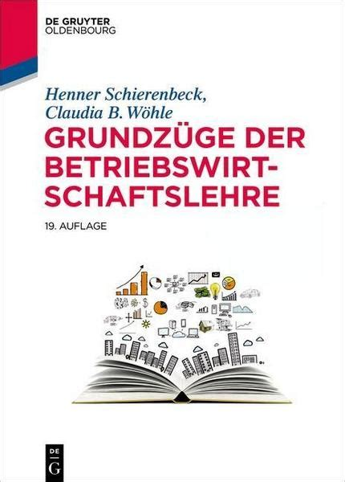
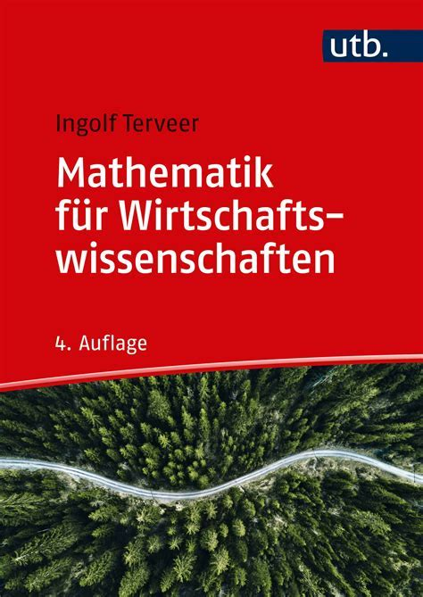

*99 Cent* by Andreas Gursky

# Volkswirtschaftslehre

> alle Notizen zu meinem Studium der Volkswirtschaftslehre in Halle
> 

## Module

| Modul | Professor | StudIP | Übersicht | Zusammenfassung |
| --------------------- | ------------------------ | ------------------------------------------------------------ | ----------------------------------------------- | ------------------------------------------------------------ |
| Buchführung | Dr. Bernd Schuster | [Link](https://studip.uni-halle.de/dispatch.php/course/overview?cid=947233852d97a6d1b73e10e284b0daa0) | [Übersicht](VL_Buchfuehrung/README.md) | [Buchungsaetze](VL_Buchfuehrung/2021-10-00-Buchungsaetze.md) |
| BWL | Prof. Dr. Julia Seeger | [Link](https://studip.uni-halle.de/dispatch.php/course/overview?cid=113433db124a2ae1dd9c68650141c7ac) | [Übersicht](VL_BWL/README.md) | [Zusammenfassung](VL_BWL/2021-10-00-Zusammenfassung.md) |
| Mathematik I | PD. Maren Hantke | [Link](https://studip.uni-halle.de/dispatch.php/course/overview?cid=e40de35dc0052790d6339e9b1bdf7e0c) | [Übersicht](VL_Mathe1/README.md) | |
| Statistik I | Prof. Dr. Claudia Decker | [Link](https://studip.uni-halle.de/dispatch.php/course/overview?cid=f69e6edd60aa482027bace682879a7bf) | [Übersicht](VL_Statistik1/README.md) | [Zusammenfassung](VL_Statistik1/2021-10-00-Zusammenfassung.md) |
| VWL | Prof. Dr. Lars Börner | [Link](https://studip.uni-halle.de/dispatch.php/course/overview?cid=cbc118b597a7b750d1503bfb3191295c) | [Übersicht](VL_VWL/README.md) | [Zusammenfassung](VL_VWL/2021-10-00-Zusammenfassung.md) |
| Wirtschaftsinformatik | Prof. Dr. Taieb Mellouli | [Link](https://studip.uni-halle.de/dispatch.php/course/overview?cid=df0f041ad274fc2c80bd4cb393912a92) | [Übersicht](VL_Wirtschaftsinformatik/README.md) | [Zusammenfassung](VL_Wirtschaftsinformatik/2021-10-00-Zusammenfassung.md) |

## Bücher

| VWL | BWL | Mathe | 
| ------------------------------------------------------------ | ------------------------------------------------------------ | ------------------------------------------------------------ |
|  |  |  |

## Überblick

Wöchentliche Aufgaben in allen Modulen mit Links zur entsprechenden Seite in ILIAS/STUDIP/OPENCAST oder der Link zu den Meetings (Zeiten beachten)

* **Statistik**
  * Vorlesung [STUDIP](https://studip.uni-halle.de/dispatch.php/course/files/index/bb255f3166409ca6bf427d62d38a639e?cid=f69e6edd60aa482027bace682879a7bf)
  * Übungsblätter [STUDIP](https://studip.uni-halle.de/dispatch.php/course/files/index/8b0dce8c3c007b340cc25ab896ad3f87?cid=f69e6edd60aa482027bace682879a7bf)
  * Übungsmaterialien in [ILIAS](https://ilias.uni-halle.de/goto.php?target=crs_220184&client_id=unihalle)
  * Synchron Online-Termin [STUDIP-MEETINGS](https://studip.uni-halle.de/plugins.php/meetingplugin/index?cid=6aa77b737e69c82a81d93ff7c7a410c6#/)
* **VWL**
  * Vorlesung [STUDIP](https://studip.uni-halle.de/dispatch.php/course/files?cid=cbc118b597a7b750d1503bfb3191295c)
  * synchrone Übung [Meetings](https://studip.uni-halle.de/plugins.php/meetingplugin/index?cid=12f91aa567b01ea251408fd2c4a6c455#/)
* **Wirtschafstinformatik**
  * VL [OPENCAST](https://studip.uni-halle.de/plugins.php/opencast/course/index?cid=df0f041ad274fc2c80bd4cb393912a92)
  * Übungsmaterialien [STUDIP](https://studip.uni-halle.de/dispatch.php/course/files?cid=df0f041ad274fc2c80bd4cb393912a92)
* **BWL** VL + Übung [ILIAS](https://ilias.uni-halle.de/ilias.php?ref_id=217678&cmdClass=ilrepositorygui&cmdNode=us&baseClass=ilrepositorygui)
* **Mathe**
  * Vorlesung [STUDIP](https://studip.uni-halle.de/dispatch.php/course/files/index/37b1366b8d66a8d7020d870d0e2ec49a?cid=e40de35dc0052790d6339e9b1bdf7e0c)
  * Selbstest [ILIAS](https://ilias.uni-halle.de/ilias.php?ref_id=220211&cmdClass=ilrepositorygui&cmdNode=us&baseClass=ilrepositorygui)
  * Übungsblätter [STUDIP](https://studip.uni-halle.de/dispatch.php/course/files/index/92d368b2368f95cb792fd7a09bdddf78?cid=e40de35dc0052790d6339e9b1bdf7e0c)
* **Buchführung**
  * Vorlesung [OPENCAST](https://studip.uni-halle.de/plugins.php/opencast/course/index?cid=9621ab9e6f480ff17e4a751b9ccc59d4)