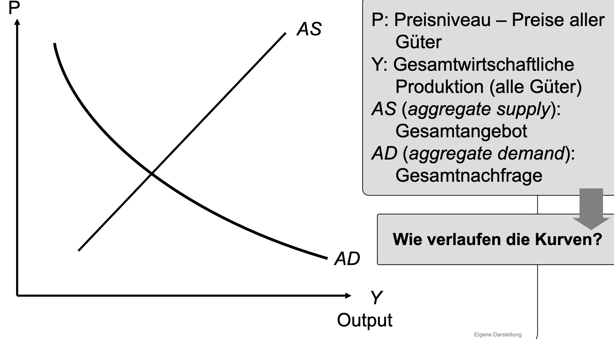
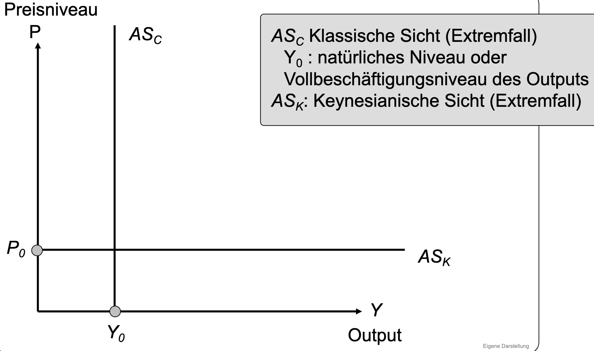
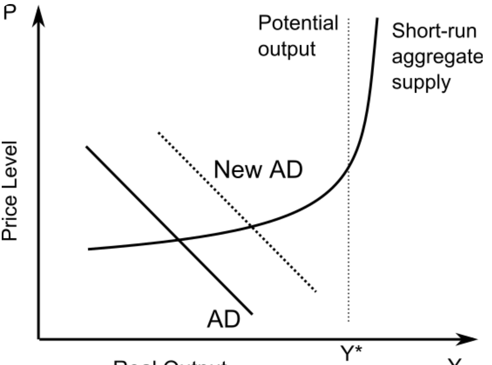

# 19.04.2023 Einführung

## Makroökonomik

Modell der Makro: Aggregate Supply, Aggregate Demand

### Nachfrage

Quantitätsgleichung des Geldes
$$
M \cdot \underset{velocity}{V} = \underset{Preise}{P} \cdot \underset{Einkommen}{Y}
$$
=> geneigter Verlauf der Nachfragekurve

### Angebot

Unterscheidung zwischen keynesianischer und klassischer Sicht

Klassiker:

- Geld ist nicht relevant
- Inflation ist nur für Staat gut
- Trennung von Geld und Warensektor (keine Beinflussung)

Keynesianer:

- Preisstarrheit bei Lohn / Gütern
- Modell der unvollkommenen Information

## New Macroeconomic Consensus

Kombination beider Schulen

- **Langfristig**: klassische Sicht und Preisanpassung (LRAS)
- **kurzfristig**: Starrheit, fast horizontal (SRAS)

Maßnahmen:

- langfristig: Strukturpolitik
- kurzfristig: Konjunkturpolitik

## Maßnahmen

Beispiel: Abwrackprämie

- Geld für Verschrottung altes Auto + Kauf neues
- als Umweltprämie

Folge:

- Verschrottung statt Export
- Mitnahmeeffekte
- Geldverschwendung
- Umschichtung der Nachfrage (weniger Einzelhandel, Reparatur etc.)

