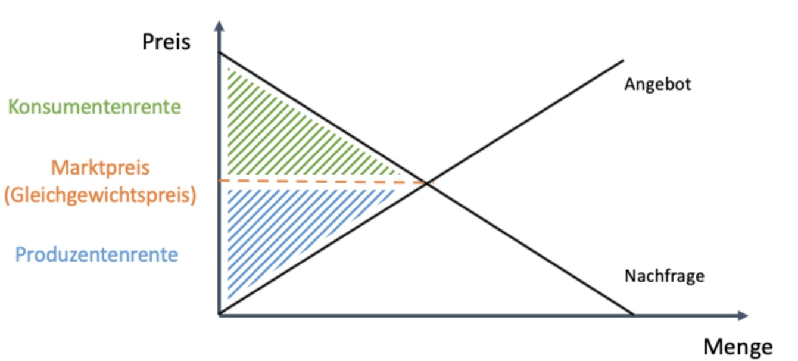

# 03.05.2023 Wert

Arten:

- objektive Wertlehre
- Arbeitswertlehre
- Subjektive Wertlehre


## Arbeitswertlehre

*"Arbeit verursacht Wert"*

- empirisch für viele Güter nachweisbar
- intuitiv einleuchtend

Anomalien: Wasser, Diamanten


## Subjektive Wertlehre

nach H. Gossen

```
"Größe ihres Werthes genau gemessen wird durch die Größe des Lebensgenusses, den sie uns verschafft"
```

- mit abnehmendem Grenznutzen
- und Grenzwert = Preis

erklärt:

- Diamanten = selten = hoher Grenzwert
- Wasser = viel verfügbar = niedriger Grenzwert

=> Wert entsteht aus Subjektiver Einschätzung

## Renten

= Messung von Werten

berechnet sich aus Grenzwerten

- aufgespaltet in Konsumentenrente
- und Produzentenrente



## Anwendung

### Smog in Innenstädten

Die Luft in Innenstädten wird sauberer

- Reaktion der Nachfrage: 
    - mehr Marginale Zahlungsbereitschaft => N $\uparrow$
    - Mehr Nachfrager => $N \to$
- Angebotsreaktion
    - Kurzfristig: Preise steigen
    - Lanfgristig: Ausweitung des Angebots (wenn möglich)

