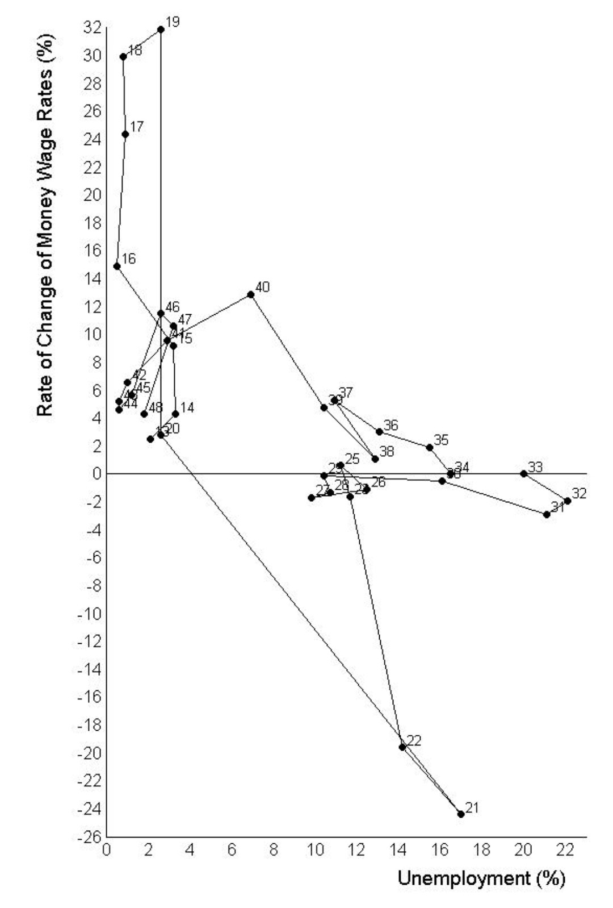
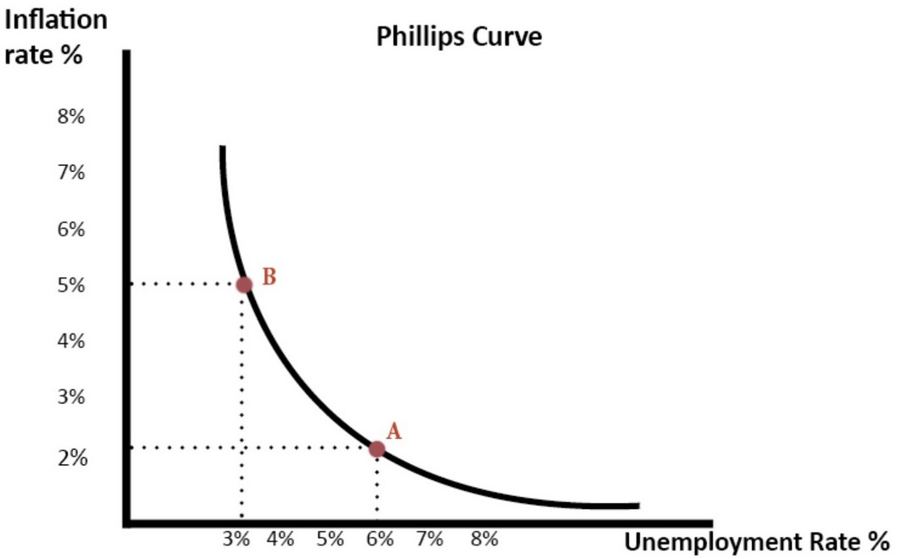
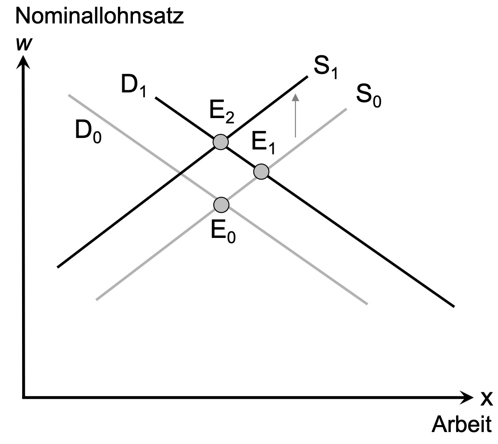

# 17.05.2023 Geldpolitik

## Bedeutung

- Bereitstellung von Geldmittel für Wirtschaft
- immens wichtig für Konjunktur

## Steuerung

von Zentralbanken 

- unabhängige Institutionen
- ohne direkte politische Kontrolle

=> politik ohne demokratischen Einfluss

## Geschichte

ideentheoretische Geschichte

| Erklärung                                                    | Bild                                      |
| ------------------------------------------------------------ | ----------------------------------------- |
| **Philipps** Kurve: Zusammenhang Arbeitslosigkeit & Lohnwachstum |  |
| **Samuelson / Solow:** modifizierte Philipps-Kurve: Inflation & AL |  |
| **Friedman / Phelps**: geringe Inflation und AL = Vereinbar  |  |

=> Inflation hat keine langfristigen Beschäftigungseffekte

> **Zeitinkosistenz**: Versprechen sind nicht über Zeit hinweg konsistent

- Ankündigungen sind nicht gleich Umsetzungen
- relevant für Inflationsankündigungen der Regierung

=> deswgen Zentralbankunabhänigkeit

- Anreiz Wahrheit zu sagen
- und nicht kurzfristig Geldpoliti zu ändern
- Vertraun in ZB = wertvoll und schwer zu erhalten

