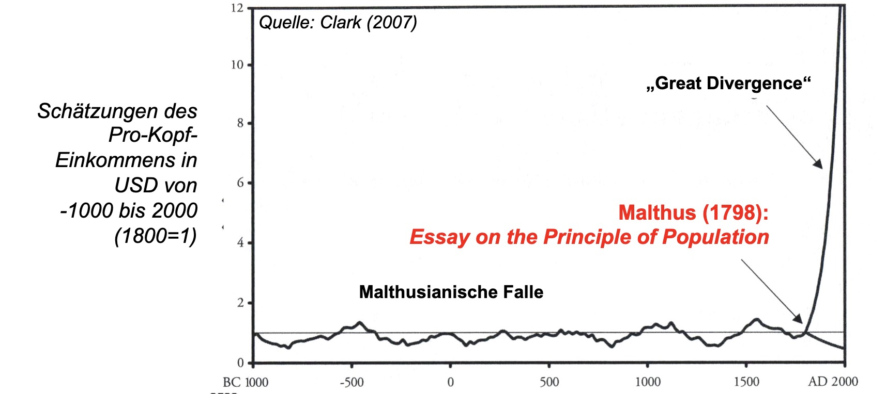
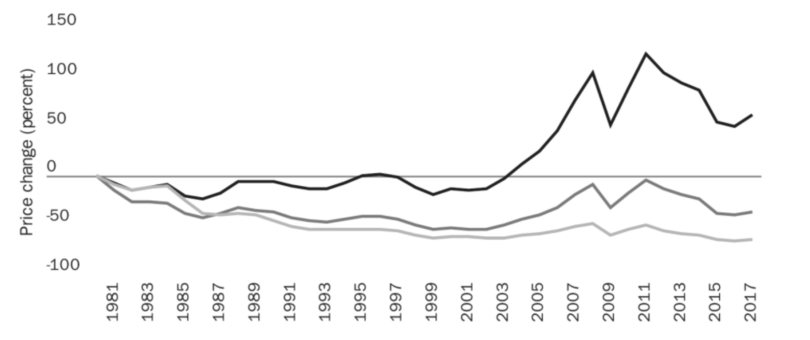
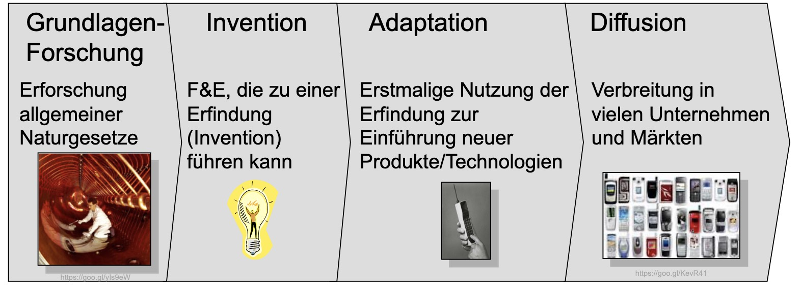

# 26.05.2023 Innovation

## Malthusianische Falle

Analyse:

- Anstieg der Bevölkerung führt zu mehr Essensnachfrage
- mehr Nachrfrage kann nicht versorgt werden, Reallohn sinkt unter Existenzminimum
- mehr Menschen verhungern, wieder auf Ausgangsniveau

## Rebound Effekt

Beobachtung, dass Effizienzsteigerungen zu verstärkter Nutzung eines Gutes führen

nach Jevons:

- Kohleneffizienzsteigerung, aber trotzdem Mengenausweitung
- Annahme, dass Kohlenvorräte bald erschöpft

Realität:

- neue Energieträger und Substitution
- Ausweitung der Suche bei steigendem Preis

## Club of Rome

Annahme: 

- steigende Ressourcennutzung führt zu Erschöpfung
- diese zur Katastrophe
- Kein unendliches Wachstum

Realität:

- Ressourcenumnutzung
- aber trotzdem Klimawandel...

## Innovationen

Der Preis von Ressourcen sinkt absehbar, da sie effizienter Eingesetzt werden

- trotz Nominalpreisteigerungen
- und eingerechnet der benötigten arbeitszeit für 1kg noch stärker

### Innovationsprozess

Prozess: Grundlagen, Invention, Adaption, Diffusion

Problem: 

- Wissen ist öffentliches Gut
- Spillover auf Gesellschaft und Wettbewerber

Reaktion auf Marktversagen

- Kollektive Bereitstellung (Grundlagenforschung Unis)
    - Best Shot
    - Weaekest Link
    - Summation
- Marktinkraftsetzen (Anwendungsforschung Corp.)
    - mithilfe von Patentrecht
    - Forschungsförderung bei Unternehmen
    - am besten im Oligopol

