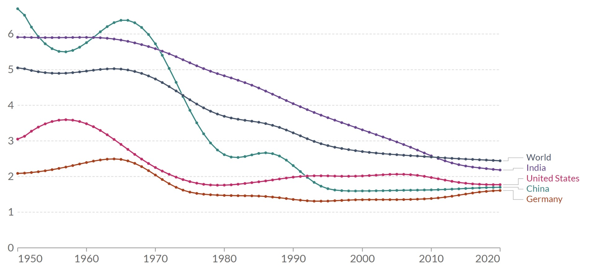
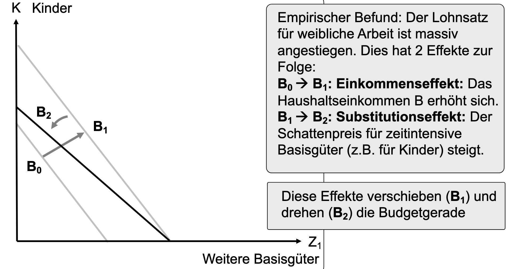
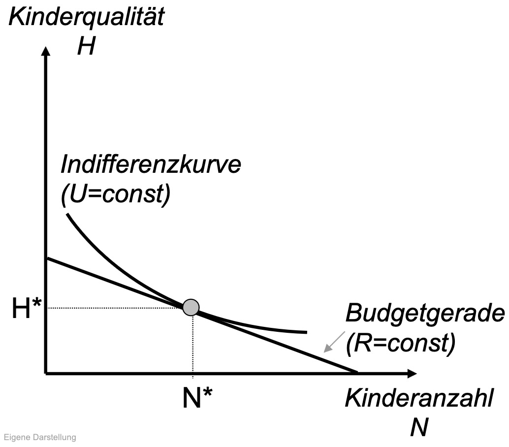

# 21.06.2023 Familienökonomik nach Becker

Becker: *Familie als Fabrik - Kinder als Kosten-Nutzen-Berechnung*

Früher: 

- viele Kinder
- als Versicherung im Krankheitsfall
- und Arbeitskräfte im Subsitenzbauernhof

Heute:

- wenig Kinder
- (Fast) keinen direkten ökonomischen Nutzen

## Opportunitätskosten

Moderne:

- Lohnsatz für Frauen steigt an
- Opportunitätskosten für Kinder steigen an

=> Kinder als langlebige Konsumgüter

- Nutzen: Affektiver Ntuzen (Liebe, Emotionen)
- Kosten: Ausgaben für Kinder und OK

wenn Substitionseffekt > Einkommenseffekt => HH nimmt Kinder

## Qualität von Kindern

Entscheidung: viele Kinder oder wenige mit hohem Humankapital?

- Budgetgerade: maximale Anzahl Kinder, die "hergestellt" werden können
- IDK: Kombination mit gleichem Nutzen

Sozialstaat:

- kostenlose Bildung = einfachere Qualitätsteigerung
- dadurch Anreizverschiebung

Modell von Becker:

**ACHTUNG!!:**

- Becker kann modernen Pillenknick nicht erklären?
    - was soll sich innerhalb weniger Jahre an den ökon. Umständen so verändert haben??!!
    - das 1,4 Mio auf 800k Geburten zurückgegangen ist
- außerdem: Kinderplanung ist oft nicht rational!
- Mikromodelle mit repr. Akteur für Makroerklärungen = **Müll**
    - kann offensichtliche Zusammenhänge nicht erklären

## Polygamie

= Vielehe (sowohl männlich als auch weiblich)

Betrachtung: vielen Gesellschaften = Aussteuer / Brautpreis etc.

Heiratsmarkt:

Krieg:

- weniger Männder
- überlebende = geringerer Preis für Frauen
- weniger PR für Frauen

Warum ist Polygamie dann in sexistischen Gesellschaften Standard?

- Rente der Frau geht an Familie (Patriarch / Vater)
- Frau profitiert nicht von Polygamie

