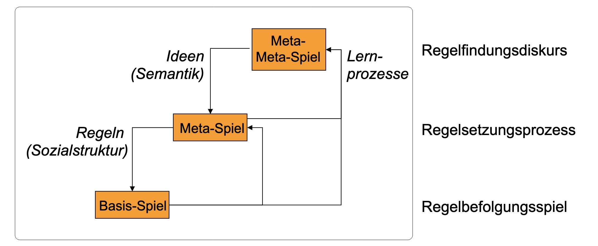
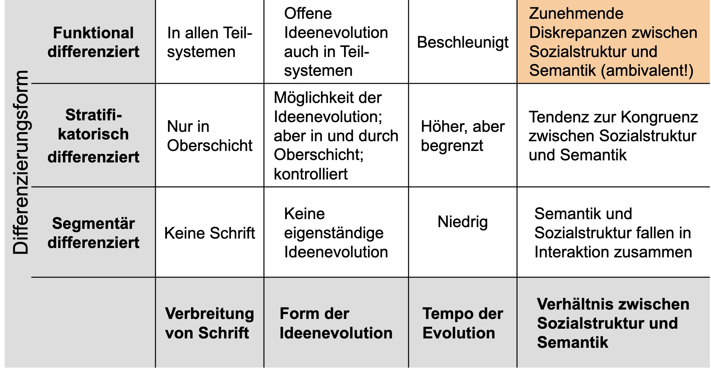

# 05.07.2023 Geschichte

## Historische Entwicklung

1500: Moderisierung

- Entdeckung Amerikas
- Reformation
- moderne Wissenschaften

bis dahin: *Malthusianische Falle* 

Wieso?

- Gesetze und Regeln für alle
- Weiterwntwicklung des Diskurses 
- Demokratisierung

Drei Ebenen Prozess

## Institutionenwandel (Douglass North)

> Ausgangsproblem nach Hobbes: every society has to solve the fundamentla problem of providing social order

mögliche Soziale Ordnungen

1. Primitive order
    - Jäger-Sammler Gesellschaften (etwa 150 Leute)
    - keine Ausdifferenzierung / Arbeitsteilung
2. limited access o.
    - traditionelle Gesellschaft
    - Renten und Privilegien für Eliten
    - bspw. Adelsgesellschaft
3. Open-access o.
    - moderne Gesellschaft
    - Abschaffung von Eliten (Adel)
    - Wettbewerb auf Markt und Politik (Demokratie)

Norths These:

- Politische Ordnung und Wirtschaftliche Ordnung müssen gleich sein
- für Stabilität des Systems

=> Gesellschaften müssen im Gleichschritt gehen (beide Ordnungen)

Strategien für Entwicklung:

- Demokratieförderung
- Wirtschaftsliberalisierung (*Washington Consensus*)

Wenn letzter Schritt vor erstem kein Erfolg (zuerst Konsolidierung)

## Systemtheorie (Niklas Luhmann)

Formen gesellschaftlicher Differenzierung

1. Segmentär differenzierte Gesellschaft
2. stratifikatorisch differenzierte Gesellschaft (vormoderne Hochkulturen)
3. funktional differenzierte Weltgesellschaft (Moderne)

Moderne: Subsysteme mit eigenen Logiken

- Politik: Wiederwahl
- Wirtschaft: Geld verdienen
- Wissenschaft: Wahrehitsproduktion 
- Öffentlichkeit 

aber: Diskrepanz zwischen Sozialstruktur und Semantik!

- Moral aus der Stammesgesellschaft
- Sozialstruktur des Kapitalismus

## Vergleich

Zwischen North und Luhmann

Moderne:

- unpersönliche Interaktion
- beschleunigte Wahstumsgesellschaft
- Organisation von Komplexität

**North:** mental models

**Luhmann:** Semantik

## malthusianische Falle

- Kein Bevölkerungswachstum
- kein Wirtschaftswachstum

einziger Effekt von Wohlstand = mehr Menschen

