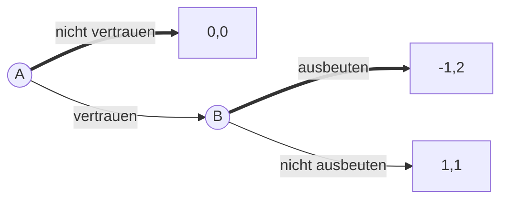

# 12.07.2023 Ordonomik

Rent Seeking:

- Angebotskurve vertikal = lohnenswert (Gaslobby)
- Angebotskurve horizontal = nicht lohnenswert (Gastwirte)

anderes Beispiel:

- Beimischungsquoten Kraftstoffe (per Gesetz verordnet)
- entstanden durch Lobbying der Landwirtschaft

Dilemma

- Gleihgewicht = 0,0
- Möglichkeiten
    - Strafe = kostenlos, muss nur plausibel sein
    - Belohnung = kostenintensiv

Strafe kann auch Selbststrafe von B sein (Code of Conduct, Garantie etc.)