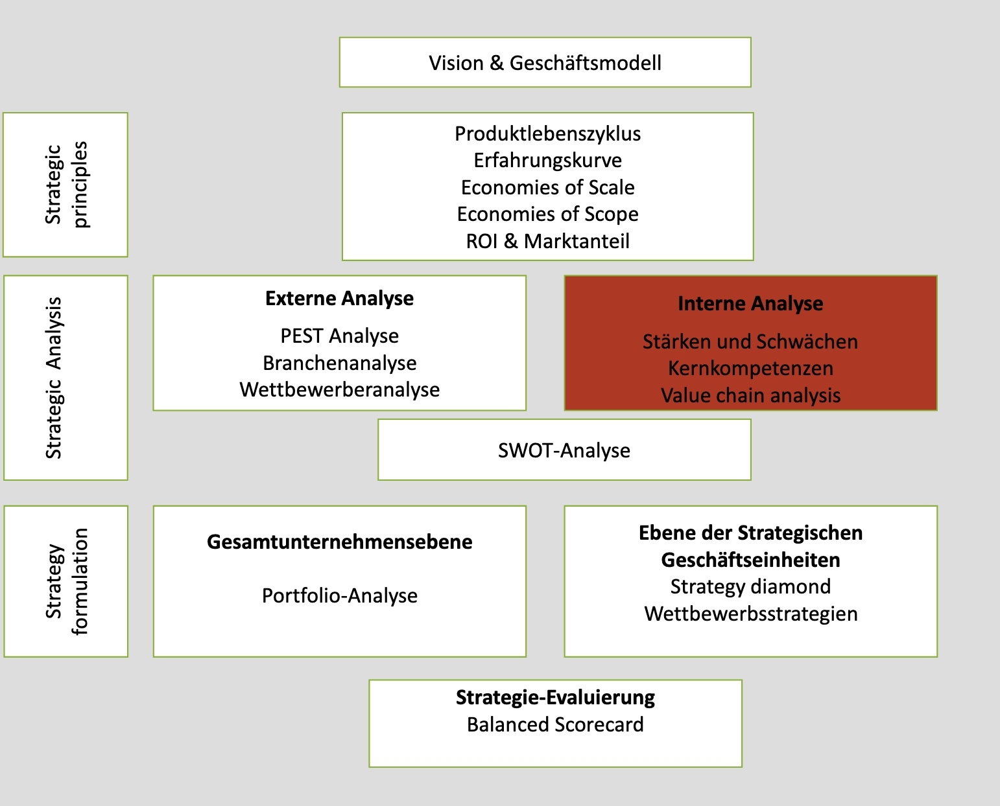

# 14.10.21 Grundlagen BWL

### Wirtschaften

> **Wirtschaften**: Disponieren über knappe Güter, die Gegenstand von Marktprozessen sind (*Wirtschaftsgüter*)

Klassifizierungen von Wirtschaftsgütern:

- Input - Output
- Produktion - Konsum
- Verbrauch (einmalig) - Gebrauch (längerfristig)
- Real - Nominal

Wirtschaftsprinzipien:

- Maximumprinzip = Output maximieren
- Minimumprinzip = Input minimieren
- Extremumprinzip = günstiges Verhältnis von Aufwand + Ertrag

Problem: unvollkommene Informationen

### Rechtsformen

> **Rechtsform:** rechtliche Regelungen, die Betrieb rechtlich fassbar machen

Arten privatrechtlicher Rechtsformen:

- Einzelunternehmungen:
- Personengesellschaften: OHG, KG
- Kapitalgesellschaften: AG, GmbH, Ltd,...
- Mischformen, öffentliche Formen, ...

### Gliederung von Unternehmen 

- nach Art der Produkte
    - Sachleistungsunternehmen
    - Dienstleistungsunternehmen
- nach Wirtschaftszweigen
- nach Größe
    - Klein, Mittel, Groß
- nach Räumlicher Strukturmerkmalen
    - National = Produktion + Absatz Inland
    - international = Produktion Inland + Absatz Ausland
    - multinational = internationale Produktion + Absatz
    - regional
    - Lokale 

### Internationale Unternehmen

Vorteile:

- Besserer Zugang zu intntl. Faktormärkten
- Ausnuttzung Kostenvorteile verschiedener Länder
- Skaleneffekte
- Steuerminimierung

Nachteile:

- unterschiedliche politische rechtliche Gegebenheiten
- unterschiede Infrastruktur
- Koordinierungsprobleme

Möglichkeiten des Auslandseinsatzes (steigender Einfluss Ausland):

Export < Lizenzierung < Direktinvestition < Joint Venture < Auslandsniederlassung

### Prozess des strategischen Managements

