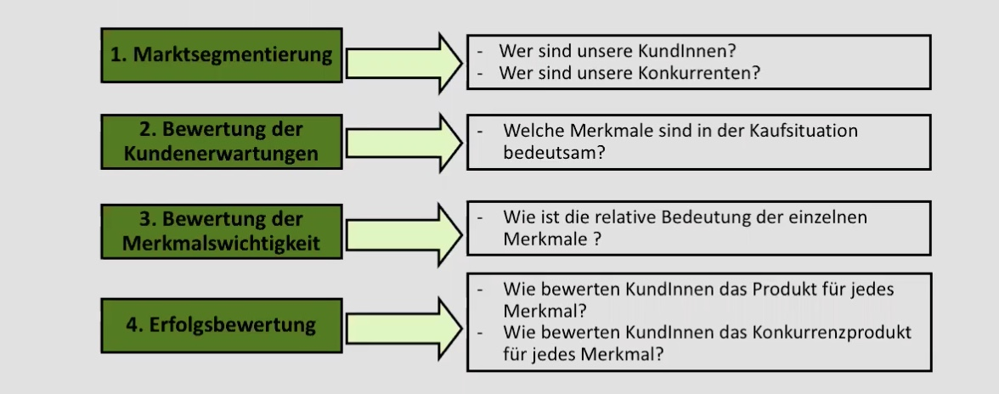
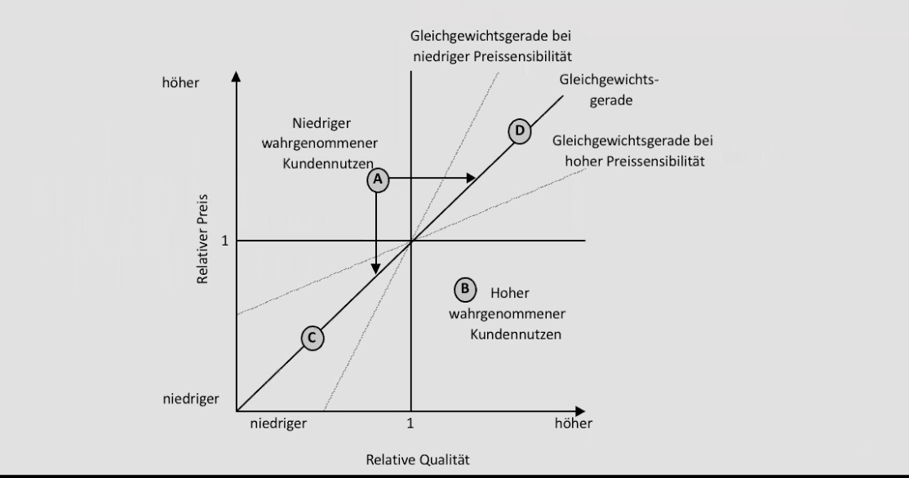
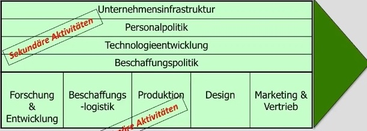
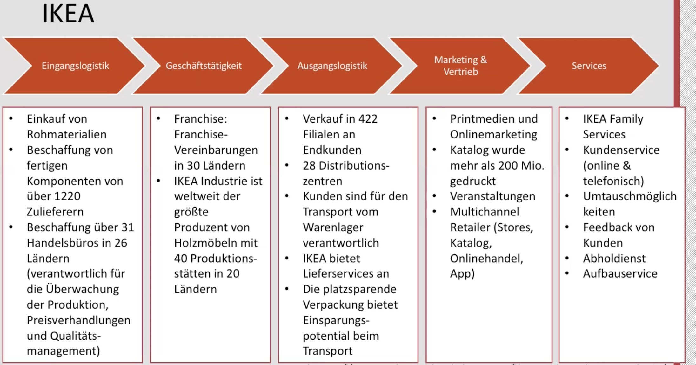
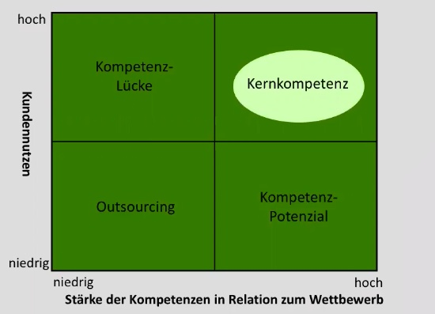

# 20.11.21 Strategische Unternehmensanalyse

### Kundennutzenanalyse

auch Customer Value Analyse (CVA)

Analyse der Kunden und ihrer Verlangen

1. **Marktsegmentierung**: Wer sind Kunden / konkurrenten
2. **Kundenerwartungen**: Merkmale des Produktes
3. **Merkmalswichtigkeit:** welche Merkmale kaufentscheidend
4. **Erfolgsbewertung**: Vergleich zwischen Konkurrenten

Beispiel **iPhone** 

| Kaufkriterien | Gewichtung | iPhone Punkte | gewichtete Punkte | Samsung Punkte | gewichtete Punkte |
| ------------- | :--------: | ------------: | ----------------- | -------------: | ----------------- |
| Kamera        |    0.3     |             4 | 1,2               |              3 | 0,9               |
| Akku          |    0.1     |             3 | 0,3               |              4 | 0,4               |
| Bedienbarkeit |    0.3     |             5 | 1,5               |              2 | 0,6               |
| Preis         |    0.2     |             2 | 0,4               |              3 | 0,6               |
| **gesamt**    |     1      |               | *3,4*             |                | *2,5*             |

Jetzt: Punkte gewichten etc

> **relative Qualität:** gewichtete Punkte / Mittelwert 

> **relativer Preis**: gewichtete Punkte / Mittelwert Preis

|                       | iPhone                | Samsung |
| --------------------- | --------------------- | ------- |
| **gewichtete Punkte** | 3,4                   | 2,5     |
| **relative Qualität** | 3,4/2,95 = 1,15       | 0,8     |
| **Preis**             | 1000                  | 600     |
| **relativer Preis**   | 1,25 (25% überteuert) | 0,75    |

Optional Customer Value Map: (wie Preissensibel sind die Kunden)? 

und Importance Perfomance Analysis: (Bewertung der Merkmale)

### Wertschöpfungsanalyse 

Analyse des eigenen Unternehmens zum Vergleich mit Konkurrenten

1. Primäre Aktivitäten
    - Forschung & Entwicklung
    - Logistik
    - Produktion
    - Design
    - Vertrieb
2. Sekundäre Aktivitäten
    - Personalpolitik
    - Unternehmensinfrastruktur
    - Technologieentwicklung
    - Beschaffungspolitik

zu jedem Faktor Punkte vergeben und Gewichten !

`Anpassung an Unternehmen und zentrale Wertschöpfung!` 

- Bsp: bei Autobauern wird Fokus auf Produktion gelegt und dementsprechend gewichtet

Beispiel Wertschöpfungskette IKEA

### Kompetenzanalyse

Analyse um zu sehen, wo man für den Kundennutzen ist und was man verbessern kann

> **Kernkomeptenz:** Technologien, Know-hows, Prozesse mit
>
> - Einzigartigkeit für Kunden
> - einmalig ggü Konkurrenz
> - Schwer imitierbar

Bsp.: Tesla:Batterielösungen 

