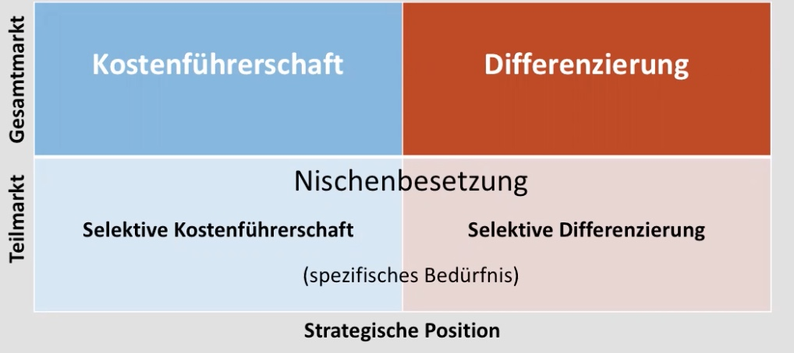

# 07.12.2021 Strategieformulierung BCG + Ansoff-Matrizen

### Ebenen der Strategieformulierung

### BCG-Methode

Matrix hilft bei Formulierung von Strategien und Ideen von Produkten

#### Produktphasen

1. Produkt in Einführungsphase: 
    - Marktwachstum hoch, Anteil gering
    - Offensivstrategie: hohe Investition (linker Balken) + niedrige Rendite ( rechter Balken)
2. Wachstumsphase
    - steigende Gewinne
    - Investitionstrategie benötigt
3. Reifephase
    - hohe Gewinne, Cash-Cows , Refinanzierung der Investitionen
    - Defensivstrategie: Verteiduigung gegen Konkurrenten
4. Sättigungsphase
    - wenig Rendite mehr
    - Geld rausziehen (desinvestieren)

### Ansoff Matrix

beschreibt Strategien im Wettbewerb mithilfe einer Matrix

1. **Kostenführerschaft**: niedrige Preise, hoher Absatz (Bsp.: Discounter)
2. **Differenzierung** : über Qualität/Leistung/... (Bsp.: LaFayette)
3. **Nischenbesetzung**: Selektiv Kostenführerschaft, selektive Differenzierung (Bsp: Rewe mit sowohl *Ja* als auch *Feine Welt*)

erfolgreiche Unternehmen: **müssen sich positionieren!** 

- nicht in der Mitte steckenbleiben ! 

### Wachstumstrategien

#### 1 ) Marktpenetration

> Wachstum zur Erhöhung des Marktanteils bestehender Produkte

Durch:

- Erhöhung Verwendung bei Bestandskunden
- Gewinnung neuer Kundinnen der Konkurrenz
- Erschließung neuer Kundensegmente

#### 2) Marktentwicklung/ Erschließung

> Erschließung neuer Marktsegmente / Regionen mit vorhandenen Produkten

empfehlenswert für bestehende Produkte 

erhöht Risiko

#### 3) Produktentwicklung

> Befriedigung der Bedürfnissde des bestehenden Marktes mit neuen Produkten

- geeignet für innovationstarke Unternehmen
- sehr riskant

#### 4) Diversifikation

> Strategie der Absetzung von Mitbewerbern durch: 

1. Horizontale Diversifikation:
    - Erweiterung der Produktpalette in bestehendem Markt
    - Nutzung von Synergieeffekten
    - Bsp: Fahrradhersteller baut E-Bikes
2. Vertikale Diversifikation:
    - Integration von vor/nachgelagerten Tätigkeiten
    - Sicherung Unabhängigkeit
    - Bsp: Amazon baut Shipping und Warehousing aus
3. Laterale Diversifikation
    - Erschließung neuer Märkte
