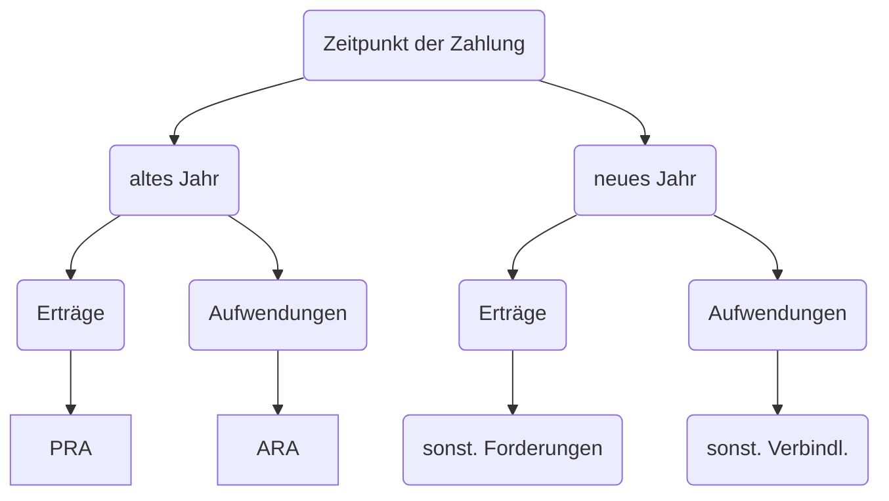

### Übersicht

- [Industriekontenrahmen](#industriekontenrahmen)
- [Standardbuchungssätze](#standardbuchungssätze)
    - [Roh / Hilf / Betriebsstoffe](#roh-hilf-betriebstoffe)
    - [Handelsware](#handelsware)
    - [Rücksendungen](#rücksendungen)
    - [Nachlässe](#nachlässe)
    - [Skonto](#skonto)
    - [Löhne](#löhne)
    - [Anlagen](#anlagen)
    - [Geringwertige Güter GWG](#geringwertige-wirtschaftsgüter-gwg)
    - [Innerbetriebliche Leistungen](#innerbetriebliche-leistungen)
    - [Steuern](#steuern)
    - [Zinsen](#zinsen)
    - [Privatkonto](#privatkonto)
    - [Jahresabgrenzung](#jahresabgrenzung)
    - [Jahresabschluss/eröffnung](#jahresabschlusseröffnung)
- [Buchführungspflicht](#buchführungspflicht)

# Industriekontenrahmen

> **IKR:**  einheitliches übersichtliches Kontenordnungssystem, nicht gestzl. Verpflichtet

Aufbau mit Beispielkonten

| 0-2 Aktivkonten           | 3-4 Passivkonten           | 5 Ertragskonten           | 6-7 Aufwandskonten         | 8 Abschlusskonten |
| ------------------------- | -------------------------- | ------------------------- | -------------------------- | ----------------- |
| *05* Grundstücke          | *300* Eigenkapital         | *510* Umsatzerlöse        | *62* Löhne                 | *800* EBK         |
| *088* BGA                 | *480* USt.                 | *540* Mieterträge         | *670* Mieten               | *801* SBK         |
| *200* Rohstoffe           | *44* Verbindlichkeiten     | *571* Zinserträge         | *703* Kfz-Steuer           | *802* GuV         |
| Aschluss mit **SBK-Soll** | Aschluss mit **SBK-Haben** | Aschluss mit **GuV-Soll** | Aschluss mit **GuV-Haben** |                   |


# Standardbuchungssätze


## Roh / Hilf / Betriebstoffe

### Einkauf (auf Ziel)

```
200 Rohstoffe (oder 202 oder 203)
260 Vorsteuer
an
44 Verbindlichkeiten
```

mit Bezugskosten (Transport, Zoll, etc)

1. buchung der bezugskosten
```
2001 Bezugskosten Rohstoffe
260 Vorsteuer 
an 
44 Verbindlichkeiten
```

2. umbuchung auf hauptkonto zum abschluss

```
200 Rohstoffe
an 2001 Bezugskosten 
```

### Verbrauch
```
600 Aufwendung für Rohstoffe (oder 602 oder 603)
an 200 Rohstoffe
```

### Verkauf (von Fertigerzeugnissen)

```
240 Forderungen
an
500 Umsatzerloese
480 Umsatzsteuer
```


## Handelsware

### Einkauf

```
228 Handelswaren
260 Vorsteuern 
an 
44 Verbindlichkeiten / 280 Bank / ...
```

### Wareineinsatz (Entnahme aus Lager)

```
608 Aufwendungen Fuer Handelswaren
an 
228 Handelswaren
```

### Verkauf

```
240 Forderungen
an
510 Umsatzerloese Für Waren
480 Umsatzsteuer
```


## Rücksendungen

einfach nur Umdrehen des entgegengesetzten Buchungssatzes

### an Lieferanten

1) Einkauf von Lieferanten`
```
200 Rohstoffe
260 Vorsteuer
an
44 Verbindlichkeiten
```
2) Rücksendung eines Teil`
```
44 Verbindlichkeiten
an
200 Rohstoffe
260 Vorsteuer
```

### von Kunden

1. Original Buchung

```
240 Forderungen
an
500 Umsatzerloese
480 Umsatzsteuer
```

2. Rücksendung
   
```
500 Umsatzerloese
480 Umsatzsteuer
an
240 Forderungen
```


## Nachlässe

### im Einkauf

1. Einkaufsbuchung

```
200 Rohstoffe
260 Vorsteuer
an
44 Verbindlichkeiten
```

2. Nettobuchung des Nachlasses

```
44 Verbindlichkeiten
an
2002 Nachlaesse Rohstoffe
260 Vorsteuer
```

3. am Monatsende Umbuchung
   
```
2002 Nachlaesse Rohstoffe
an 
200 Rohstoffe
```

### im Verkauf

1. Verkaufsbuchung

```
240 Forderungen
an
500 Umsatzerloese
480 Umsatzsteuer
```

2. Nachlass buchen
   
```
5001 Erloesberichtigung
480 Umsatzsteuer
an
240 Forderungen
```

3. Abschluss des Unterkontos

```
500 Umsatzerloese
an 
5001 Erloesberichtigung
```


## Skonto

### Lieferantenskonto

= Minderung der Anschaffungskosten

Buchung bei Zahlung

```
44 Verbindlichkeiten
an
2002 Nachlässe für Rohstoffe
260 Vorsteuer
280 Bank
```

### Kundenskonto

= Schmälerung der Umsatzerlöse

```
280 Bank
5001 Erloesberichtigung
480 Umsatzsteuer
an
240 Forderungen
```


## Löhne

Berechnung

```
Bruttolohn
----------------------------------------
- Lohnsteuer
- Kirchensteuer
- Solisteuer

- Sozialversicherungsbeitrag des Arbeitnehmers (SV)
========================================
= Nettolohn
```

Buchung

1. Lohnbuchung

```
62 Löhne und Gehälter
an 
483 Verbindl. ggü Finanzamt (gesamte Steuern)
264 SV-Vorausszahlung (AN-Anteil)
280 Bank
```

2. Arbeitgeber-Anteil an der SV

```
640 AG-Anteil SV
an
264 SV-Vorausszahlung
```

3. Zahlung der SV-Beiträge

```
264 SV-Vorausszahlung
an 280 Bank
```

4. Steuerzahlung

```
483 Verbindl. ggü Finanzamt
an 280 Bank
```


## Anlagen

### Anschaffung

1: Buchung der Anschaffung (nebenkosten **nicht** gesondert)

```
07 Maschinen / Fuhrpark / Anlagen
260 Vorsteuer
an 
44 Verbindlichkeiten
```

2: Buchung Rechnungsausgleich

```
44 Verbindlichkeiten
an
07 Maschinen (nur für eventuelles Skonto)
260 Vorsteuer (nur für eventuelles Skonto)
280 Bank
```

### Abschreibung

| Art       | Beschreibung                                        | Beispiel              |
| --------- | --------------------------------------------------- | --------------------- |
| linear    | $Buchwert/Nutzungsdauer$ : jedes Jahr fester Betrag | Maschine              |
| degressiv | jedes Jahr abnehmender Betrag                       | aktuell nicht erlaubt |
| leistung  | Entsprechend der Leistung, muss gemessen werden     | LKW nach km-anzahl    |
| substanz  | entsprechend der entnommenen Substanz               | Kiesgrube nach Menge  |

Buchung: (direkt, linear)

```
652 Abschreibungen auf Sachanlagen
an 07 Maschinen / ...
```

Maschinenkonto zeigt dann Restbuchwert, praktisch

### Verkauf

1. Buchung des Erlöses

```
280 Bank
an
541 Erlöse Anlagenverkäufe
480 Umsatzsteuer
```

2. Buchung des Buchwertabganges

```
6979 Anlagenabgänge
an 07 Maschinen
```


## Geringwertige Wirtschaftsgüter GWG

### Anschaffung + Vollabschreibung

1. Anschaffung

```
0890 GWG
260 Vorsteuer
an
280 Bank
```

2. Vollabschreibung am Jahresende

```
6540 Abschreibungen auf GWG
an 0890 GWG
```

### Anschaffung + Abschreibung über Nutzungsdauer

1. Anschaffung

```
086 BGA (anderes Konto als oben!)
260 Vorsteuer
an
280 Bank
```

2. Abschreibung jährlich (berechnen mit betriebsgewöhnlicher Nutzungsdauer)

```
652 Abschreibungen auf Sachanlagen
an 086 BGA
```


## Innerbetriebliche Leistungen

Leistungen, die nur von Betrieb genutzt werden und *nicht umsatzsteuerpflichtig* sind

1. Buchung der Herstellungskosten einer Maschine

```
07 Maschinen
an
53 andere aktivierte Eigenleistungen
```

2. Abschluss

```
53 andere akt. Eigenleistungen
an 802 GuV
```


## Steuern

### Aktivierungspflichtige Steuern

= Anschaffungsnebenkosten wie Grunderwerbssteuer / Zölle

Beispiel: Kauf eines Grundstückes gegen Bankscheck für *100.000*, zzgl.

- 5000€ Grunderwerbsteuer (5%), **umsatzsteuerfrei**
- 1500€ Notarkosten
- 1200€ Vermessungskosten
- 300€ Grundbuchkosten . **umsatzsteuerfrei**


gesamte Kosten:

```
Anschaffungspreis Grundstück        100.000
+ Anschaffungsnebenkosten             8.000
  (davon Umsatzsteuerpflichtig 2.700)
-------------------------------
= Anschaffungskosten                108.000
```

Buchung:

```
05 Grundstücke       108.000
260 Vorsteuer            270 (10% von 2700)
an 280 Bank          108.270
```

### abzugsfähige Steuern

```
702 Grundssteuer / 703 Kfzsteuern / 708 Verbauchsteuern
an 280 Bank
```

### Nichtabzugsfähige Steuern

```
770 Gewerbesteuer / 771 Körperschafsteuer / 772 Kapitalertragssteuer
an 280 Bank
```

#### Privatsteuern

nicht abzugsfähige Steuern wie Einkommensteuer, Solidaritätszuschlag, Kirchensteuer:

```
3001 Privat
an 280 Bank
```

### Umsatzsteuer (durchlaufende Steuer)

Schritte:

- kleinere von USt. und Vorsteuers Saldo bilden und auf größeres überweisen
- bei Größere Saldo bilden und Banküberweisung

```
480 Umsatzsteuer (meistens)
an 280 Bank
```


### Steuernachzahlungen

```
7021 Grundsteuer-Vorjahre / 7701 Gewerbesteuer Vorjahre / ...
an 280 Bank
```

### Steuererstattung

wie Rückbuchung, nur andere Unterkonten

```
280 Bank
an 
7702 Gewerbesteuer-Steuererstattug / 7032 Kfz-Steuererstattung
```

### Steuerberatung

1. Betrieblich

```
667 Rechts- und Beratungskosten
an 280 Bank
```

2. Privat

```
3001 Privat
an 280 Bank
```


## Zinsen

### Zinserhalt

```
280 Bank
an 571 Zinsertrag
```

### Zinszahlung

```
751 Zinsaufwendungen
an 280 Bank
```


## Privatkonto

Entnahme auf Sollseite; Einlagen auf Habenseite

### Entnahme von Konto

```
3001 Privat
an 280 Bank
```

### Entnahme von Waren/Leistungen

sind umsatzsteuerpflichtig!

```
3001 Privat
an 
542 Entnahme von Gegenständen
480 Umsatzsteuer
```

### Einlage von Anlagen

```
084 Fuhrpark / 07 Maschinen / ...
an 3001 Privat
```


## Jahresabgrenzung

wenn Zahlungen in einem Jahr getätigt/genommen werden, aber ganz / teilweise zu anderem Jahr gehören




### aktive Rechnungsabgrenzung ARA

```
670 Mietaufwendungen / 680 büromaterial / ...
290 ARA
an
280 Bank
```

### passive Rechnungsabgrenzung PRA

```
280 Bank
an
540 Mieterträge / 571 Zinserträge / ...
490 PRA
```

### Sonstige Verbindlichkeiten

```
670 Mietaufwand / ...
an 480 übrige sonstige Forderungen
```

### Sonstige Forderungen

```
269 übrige sonstige Forderungen
an 540 Mieterträge
```


## Jahresabschluss/eröffnung

1. alle Unterkonten Saldo bilden
2. an jeweiliges Überkonto umbuchen
3. je nach Kontoart auf SBK oder GuV buchen

### Eröffnungsbuchungen

#### Aktivkonten

```
200 Rohstoffe / 280 Bank / ...
an 800 Eröffnungsbilanzkonto EBK
```

#### Passivkonten

```
800 Eröffnungsbilanzkonto EBK
an 44 Verbindlichkeiten / 300 Eigenkapital / ...
```


### Abschluss von Erfolgskonten

#### Ertragskonten

```
571 Zinserträge / 51 Umsatzerlöse / ...
an 802 Gewinn und Verlust GuV
```

#### Aufwandskonten

```
802 Gewinn und Verlust GuV
an 670 Mietuafwand / ...
```

#### Abschluss des GuV

Saldo bilden; bei Gewinn

```
802 GuV 
an 300 Eigenkapital
```

bei Verlust

```
300 Eigenkapital
an 802 GuV
```


### Schlussbilanzbuchungen

#### Aktivkonten

```
801 Schlussbilanzkonto SBK
an 07 Maschinen / 084 Fuhrpark / ...
```

#### Passivkonten

```
44 Verbindlichkeiten / 300 Eigenkapital / ...
an 801 Schlussbilanzkonto SBK
```


# Buchführungspflicht

## Handelsrecht

Buchführungspflicht laut Handelsgestzbuch HBG:

1. *Ist-Kaufmensch (§1)*: Gewerbe mit kaufmännisch eingerichtetem Geschäftsbetrieb
2. *Kann-Kaufmensch (§2):* Gewerbetreibender freiwillig im Handelsregister
3. *Form-Kaufmensch (§4):* Handelsgesellschaften(OHG); Kapitalgesellschaften (GmbH, AG) oder Genossenschaften

> **Gewerbe:** auf Dauer angelegte wirtschaftliche Tätigkeit mit Gewinnerzielungsabsicht

> **Handelsregister:** öffentliches Verzeichnis eines Amtsgerichtes, Eintragung aller Kaufmänner und Situation (Geschäftsführer etc)

Nicht buchführungspflichtig:

- Freiberufler/Selbständige (**nie**)
    - Ärzte / Rechtsanwälte / Steuerberater / Architekten / ...
- Land / Forstwirte : können aber freiwillig als *Kann-Kaufmensch* nach §3
- Kleingewerbe
    - im Einzelhandel Umsatz < 250k
    - im Großhandel Umsatz < 400k

>**Freiberufler/Selbständige**: maßgeblich in eigener Person seinem Unternehmen Mitarbeiter (meist Akademisch)

## Steuerrecht

Buchführungspflicht nach Abgabenordnung AO

- abgeleitete Buchführungspflicht: wer nach HGB, auch nach AO
- originäre Buchführungspflicht: 
    - Gesamtumsatz im Kalenderjahr > 600k
    - Gewinn > 60k
    - Land / Forstwirte mit Wirtschaftswert > 25k
    - Land / Forstwirte mit Gewinn > 60k

