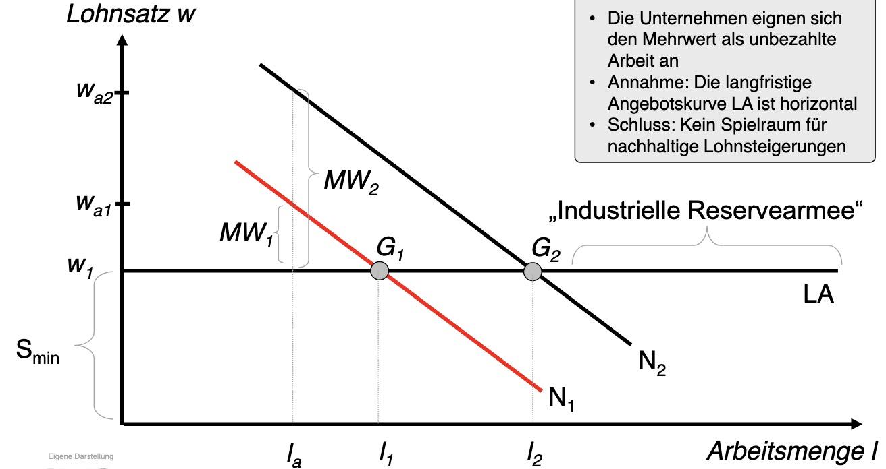
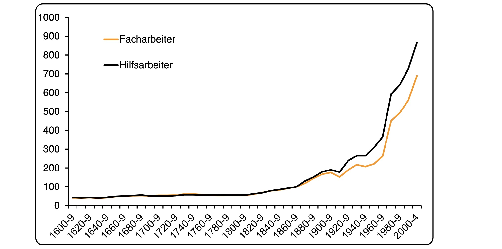

# 13.12.2022 Marxismus


## Grundidee

Analogieschluss: Gütermarkt auf Arbeitsmarkt

- **Gütermarkt:** Preis basiert auf Produktionskosten
- **Arbeitsmarkt:** Preis basiert auf *Reproduktion*skosten

Problem: *does not quite work out ...*

Die Menge an Arbeitskraft ist nicht begrenzt! (im Gegensatz zu Mobilität des Kapitals)



Mehrwertanalyse = heutige Konsumentenrente

Marxismus

- Mehrwert der Arbeit = geht vollständig an Kapitalisten
- Bevölkerungswachstum = Lohnkonkurrenz
- Lohnniveau auf Subsistenzlohn
- steigende Bevölkerungszahl

Problem:

- technischer Fortschritt
- Ausweitung Arbeitsnachfrage
- Erschöpfung der Industriellen Reserverarmee
- Steigerung Löhne



Ergebnis (der Neoklassik): Verbraucher und Konsumenten profitieren

> „Das erfolgversprechendste Mittel zur Erreichung und Sicherung des Wohlstands ist der Wettbewerb. Er allein führt dazu, den wirtschaftlichen Fortschritt allen Menschen, im besonderen in ihrer Funktion als Verbraucher, zugute kommen zu lassen, und alle Vorteile, die nicht unmittelbar aus höherer Leistung resultieren, zur Auflösung zu bringen.
>
> ~ Ludwig Erhard

## Mindestlohn

> Oh ne, nciht schon Wieder, wer Forschung (echte Makroökonomik) zu den Folgen will (nicht den Pieschen Mikrozeug), siehe hier: [Makroökonomische Folgen des Mindestlohnes](https://www.boeckler.de/de/pressemitteilungen-2675-erhohung-des-mindestlohns-auf-12-euro-38638.htm)

Empirische Erfolge des Mindestlohns:

- keine nennenswerte Steigerung der Arbeitslosenquote
- Senkung der Ungleichheit
- Steigerung der Reallöhne am unteren Spektrum
- Stärkung der Wirtschaftstruktur
- Innovationszuwachs


## Text

```
Title: Das Kommunistische Manifest
Autoren: Karl Marx, Friedrich Engels
Datum: 1848
```

1. Welche zwei Lager stehen sich in der bürgerlichen Gesellschaft feindlich gegenüber?

    - Bourgeoisie = moderne Kapitlaisten mit Produktionsmitteln
    - Proletariat = industrielle Reservearmee, Arbeiterschaft

2. Was hat die Bourgeoisie historisch bewirkt, in Wirtschaft und Politik?

    - materialistische Sichtweise
    - Hinwegfegen des feudalen Systems
    - Produktionsmittel angesammelt
    - Barbarismus hinweggefegt
    - Bevölkerung agglomeriert

3. Wie bewerten Marx und Engels diese Wirkungen?

    - historisch: positiv wegen den Errungenschaften gegenüber Feudalen system
    - aber Bourgeosie wurde selsbt zur beherrschenden Klasse = schlecht
    - konstante Erneuerung wichtig

4. Wie bestimmen Marx und Engels den Durchschnittspreis des Lohnein-

    kommens?

    - Minimum des Arbeitslohnes zum Erhalt des Menschen (p.34)
    - kein Ertrag, dieser geht an den Industriellen
