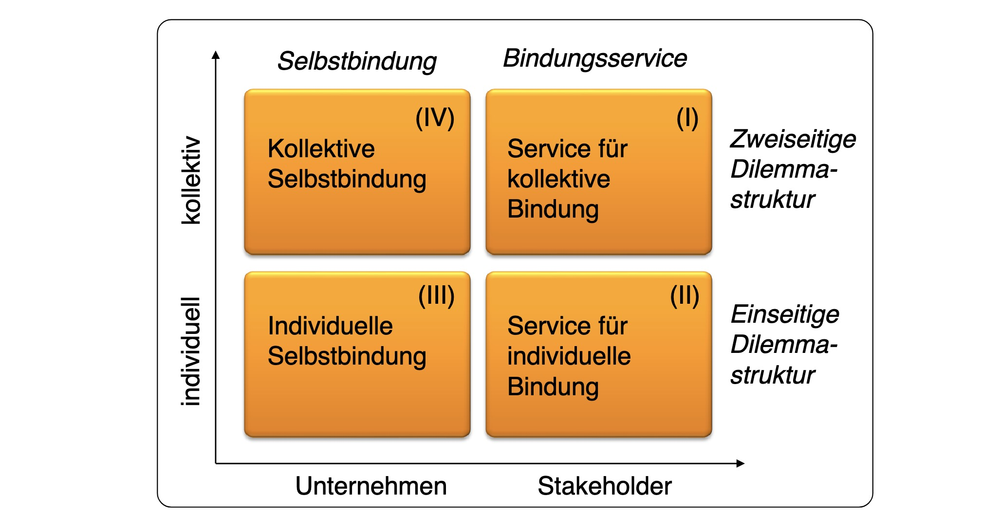

# 10.01.2022 Unternehmen & Social Responsibility

## Unternehmensverantwortung

These der Ordonomik:

- Moral = Produktionsfaktor für Unternehmen
- Unternehmen = gesellschaftliche Funktionen
    - Produktion  (nach Kundenwunsch, Minimalaufwand)
    - Innovation (dynamisch)
    - Rentendiffusion

 

> Eigentum an Produktionsmittel ist [...] ein **gesellschaftliches Mandat**
>
> ~ Ludwig van Mises

- Unternehmen haben Rechtfertigungsdruck für Gemeinwohl
- Rechtfertigungspflicht gegenüber Gesellschaft (nach *Franz Böhm*)

Unternehmen als Agenten:

- gesellschaftliche Nachhaltigkeit
- Risikovorsorge
- Innovation

### Beispiel Lammsbräu

wie kriegt man seine Lieferanten auf Bio umzustellen?

- *individuelle Selbstbindung*: 5 Jahre Absatzgarantie für Vertragsbauern
    - Problem: Trittbrettfahrer unter Bauern, die nur fake umstellen
- Lösung: *kollektive Selbstbindung* der Bauern: 
    - Hilfe bei Gründung ökologische Bauerngenossenschaft (EZÖB)
    - Lammsbräu nimmt nur Bauern aus EZÖB

## Nachhaltigkeitsbegriff

- semantische Innovation , ursprünglich aus Forstwirtschaft
    - dann volkswirtschaftlich
    - und jetzt Management 
- globaler Begriff (für Weltproblem)
- verbindet Sektoren (Ökologie, Ökonomie, Soziales) zu einer Dimension

- Definition als Prozesskriterium ("Kann man das auf Dauer fortführen") 
- vereinfacht Regelkonsens (international) *statt Wertekonsens*

3 säulen Konzept: ESG (Environment, Social, Governance)

## Management

Mittel = Verhaltenskodizes

- in einem Unternehmen (Selbstverpflichtungen)
- Branchenvereinbarungen (Common Code of Conducts)

in der Praxis = Corporate Social Responsibility *CSR*

