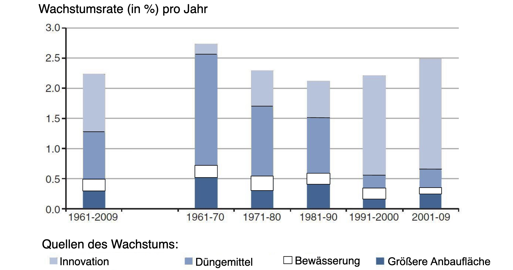

# 24.01.2023 Zivilgesellschaft und NGOs

> **Zivilgesellschaft aus Sicht der Ordonomik:** Bereitstellung öffentlicher Güter ohne marginale Zahlungsbereitschaft; 

Konkurrezn um Inputs:

- Ehrenamtliches Engagement = *Zeit*
- Spendengelder = *Geld*
- mediale Macht = *Einfluss*


Unterscheidung Unternehmen | NGOs: 

- profitorientiert
- aber nicht gewinnausschüttend
- Gewinn nur reinvestiert
- aber auf Inputseite ähnlich: wirtschaftend wie Unternehmen


## Beispiel: Nahrungsmittelspekulation

**AAAAAAHHHH ICH KANN IHM NICHT MEHR ZUHÖRN ALTER!**

NGOs rufen 2012 Skandal aus aufgrund von Nahrungsmittelspekulation

- offener Brief an Bundespräsident
- aufgrund von gesteigenen Nahrungsmittelpreisen

 

Argumentation Pies:

- Indexfonds erhöhen Stabilität
- Glätten die Preiskurve
- dadurch bessere Verfügbarkeit


**Realität:**

- Spekulateure (Händler ohne Lagerhaltung) erhöhen Volatilität (*[Weltbank](https://documents1.worldbank.org/curated/en/921521468326680723/pdf/WPS5371.pdf)*)
    - diese machen inzwischen an der Parsier Börse 70% der Händler für Weizen aus
    - im Gegensatz zu 30% für "echte" Händler
- diese höhere Volatilität trifft insbesondere low-income-countries ([Research](https://www.tandfonline.com/doi/full/10.1080/00036846.2018.1466992?src=recsys))
    - da diese weniger internationale Dollarreserven haben  ([Research](https://sci-hub.st/https://doi.org/10.1080/20954816.2021.1872854))
    - diese Volatilität erhöht dadurch Preise
    - und schädig diese Länder insbesondere:  [Quelle](https://thewire.in/economy/speculation-is-contributing-to-global-food-insecurity-significantly)

**=>  Nahrungsmittelspekulation sollte beschränkt werden!**


Forderungen der Organisationen:

- Nicht: Märkte verbieten
- Sondern eine Begrenzung der *position limits* von Spekulateuren
    - eine sinnvolle Regulierung des Marktes
- das wurde durch Lobbying verhindert...

**=> Die NGOs fordern sinnvolle Regulierung**


Nahrungsmittelkrise 1976 , Pies: "Ich musste die ganze Zeit Spinat essen"


### Wachstum des Agrarmarktes

Ausweitung des Angebotes durch:

- Dünger
- Innovationen
- mehr Anbaufläche
- bessere Bewässerung


seit 30 Jahren vor allem Innovation in Ostblockstaaten extreme Steigerungen



=> [Malthus](https://www.wikiwand.com/de/Malthusianische_Katastrophe) hatte nicht recht

### Hungerursachen

- Armut
- Entwicklungshindernisse
- schlechte politische Reaktionen (Exportverbote etc.)


## Text

```
Title: The right price of food
Autor: Johan Swinnen
Date: 2011
```

Fragen

1. Inwiefern wirken niedrige Agrarpreise unterschiedlich auf die ländliche bzw. städtische Bevölkerung in Entwicklungsländern?

    - Städer = Konsumenten, geschädigt durch hohe Preise
    - Land = Produzent, mag hohe Preise
        - außer Subsistenzbauern

2. Inwiefern ist der Wechsel der öffentlichen Darstellung, ob niedrige oder hohe Preise problematisch sind, politisch relevant?

    - weil es politsche Analyse erschwert
    - die “richtige” politik kann dadurch nciht festgestellt werden
        - sub-optimal policy

3. Was versteht man unter „urban bias“?

    - Politik Fokuas auf städtische Bevölkerung
        - städtische Bevölkerung = politisch relevanter
        - beispielsweise durch Demonstrationen etc.
    - mit negativen Effekten auf ländliche Farmer

4. Was versteht man unter „bad news hypothesis“?

    - Medien = mehr Interesse in Nachrichten mit Shcockinhalt
        - bspw. katastrophen (bad news)
    - erst durch Berichterstattung wird Aufmerksamkeit auf Thema
    - dann politische Reaktionen

5. Ist es möglich, dass der Wettbewerb um knappe Ressourcen NGOs unter

    Druck setzt, wider besseres Wissen einseitig verzerrte Maßnahmen zu for- dern?

    - eher Fokaus auf Bevölkerung, die gerade leidet (Stadt oder Land)
    - je nachdem unterschiedliche Policys