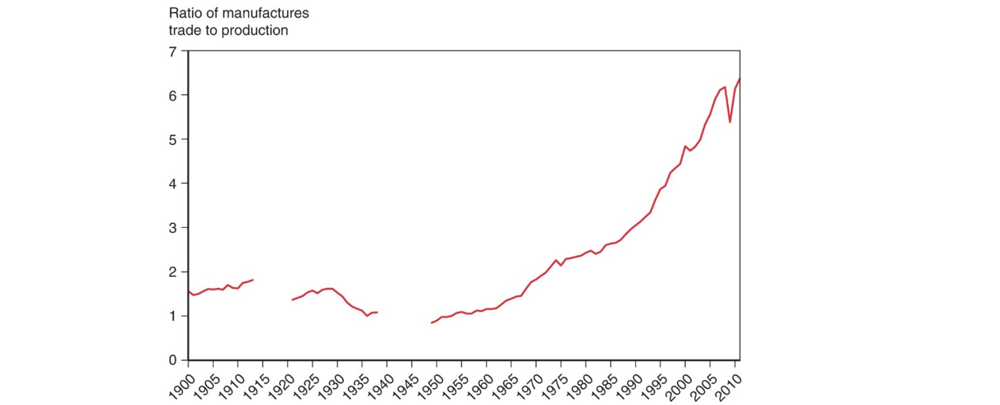
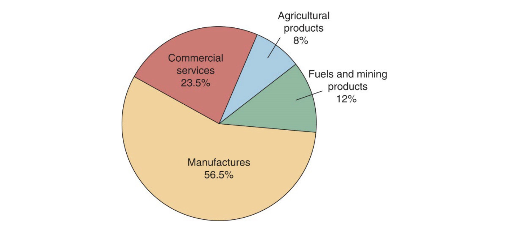
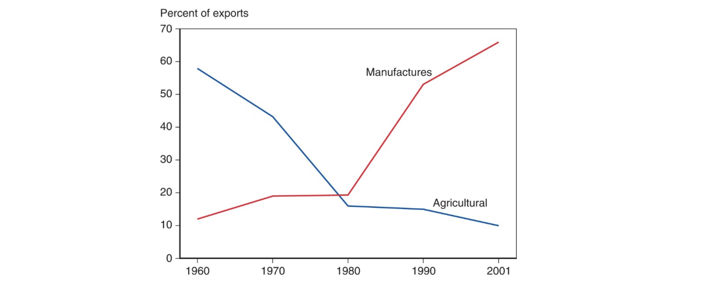

# 20.04.2023 International Economics

Learning Objectives:

- international and domestic economic issues
- recurring themes
- trade / monetary distinguish  

> **International Economics**: How nations interact trough ***trade*** (of goods and services) and ***finance*** (flows of money and investment)

History of Trade:

## Gravity Model

How much do people trade with each other? 

$$
T_ij = \frac{A \times Y_i \times Y_j}{D_{ij}}
$$

- A = constant term
- D = Distance
- Y = GDP of respective country

Anomalies: (EU and US)

- Ireland = cultural affinity
- Netherlands = transport cost advantages

=> more Trade than predicted

other Aspects (not in Model):

- cultural affinity
- geography
- Multinational Corps.
- Borders

## Trade Products

mostly manufactured goods

changes especially in developing countries:

- historical: agricultural products
- now: manufactured goods

## Service Outsourcing

in US, currently not significant

- most jobs are **not tradable**
- the tradable jobs are still often in the US

## Exercise I:

Exam:

- Derivatives (basic calculus)
- graphs
- 60 Minutes

### Supply and Demand

- Supply: $p = 0,5x +20$
- Demand: $p = -0,75x+50$
- Ueqilibrium: $x = 24, p=32$

Interventions:

- Government Minimum Price: $p = 38$
    - Demand: $-12 = -0,75x \to x = 16$
- Fixed cost increases: new Supply: $0,5x+30$
    - new Equilibrium: $x = 16, p=38$
- government demand subsidys: $p = -x+50$
    - new eq.: $x= 20, p = 30$

### International Trade

Degree of Openness: $\frac{exports+imports}{GDP}*100\%$

World Economy is concentrated in *Europe / North America / Southeast Asia*

#### Types of Trade

- Intraregional Trade
    - between partners of economic integration space (EU, NAFTA)
- Interregional Trade
    - between different spaces / countries

### GDP

Calculation: *Private Con+ Governemnt Con + Investments + Exports - Imports*

