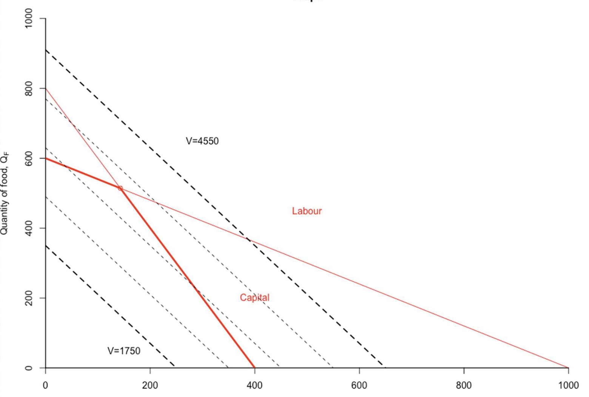
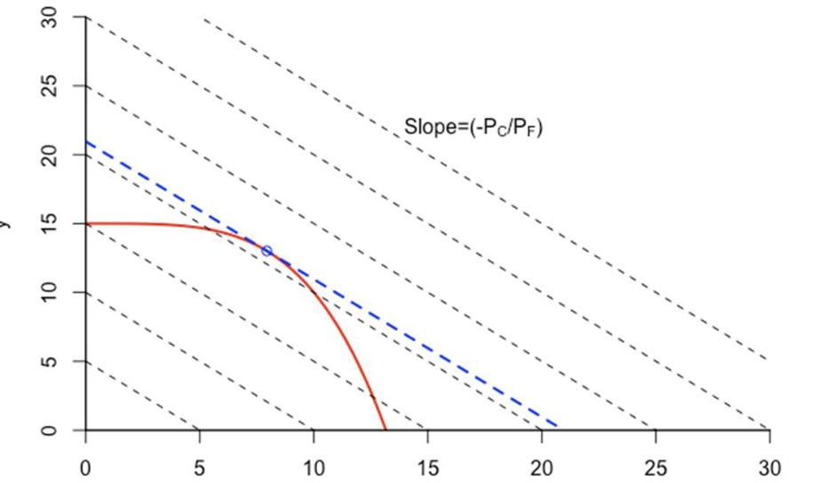

# 01.06.2023 Heckscher-Ohlin Modell

## Assumptions

- trade occurs due to different resources
    - different relative abundance
- and also other factors

- two Countries: home / foreign
- tow goods: coth / food
- two factors: capital labor
    - fixed supply of both
    - mixed across goods
- free capital / labor movement

## Math

Econmy with 2 Factors (L,K) and 2 Goods (Cotton, Food)

$$
a_{Kf} Q_F + a_{Kc} Q_C \le K \\
a_{Lf} Q_F + a_{Lc} Q_C \le L
$$

$a_{sector,product}$ = used amount of factour in sector

for given Restrictions:

- $3Q_F+6Q_C \le 2400$
- $5Q_F+3Q_C\le 3000$

Volume: $V = P_C * Q_C + P_F * Q_F$

- slope of this: $-\frac{P_C}{P_F}$

Heckschler Ohlin: both factors are interchangeable => smooth curve

- optimum point: slope of Budget Restriction = Slope of Heckschler OHlin Curve

