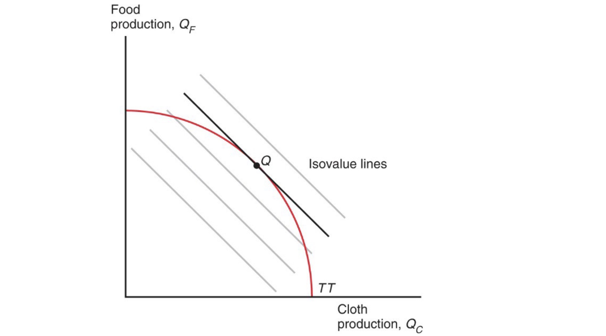
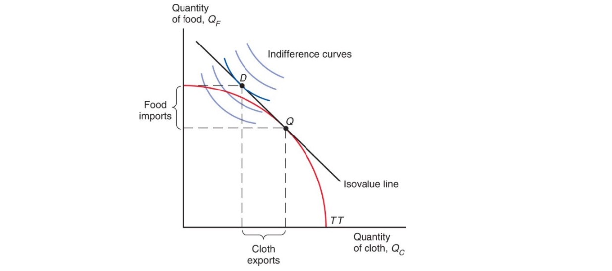
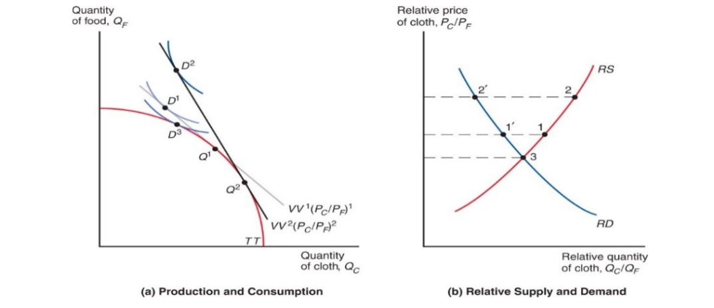
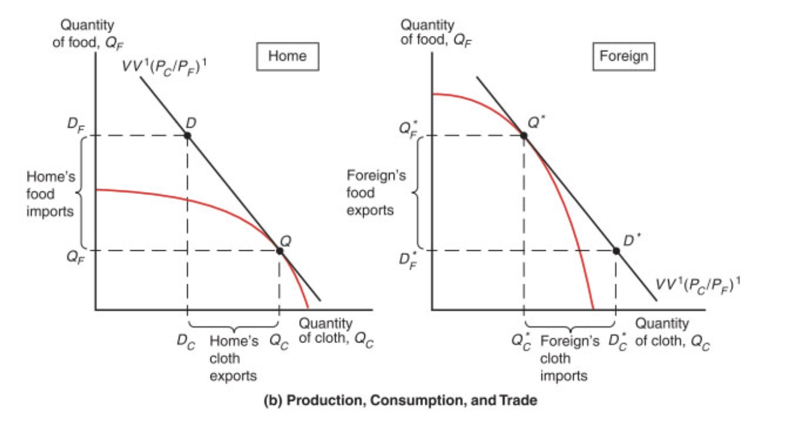
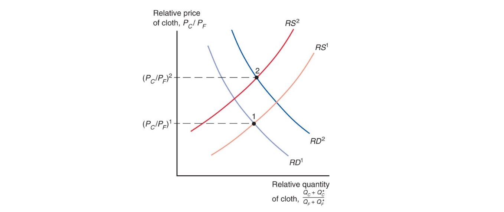
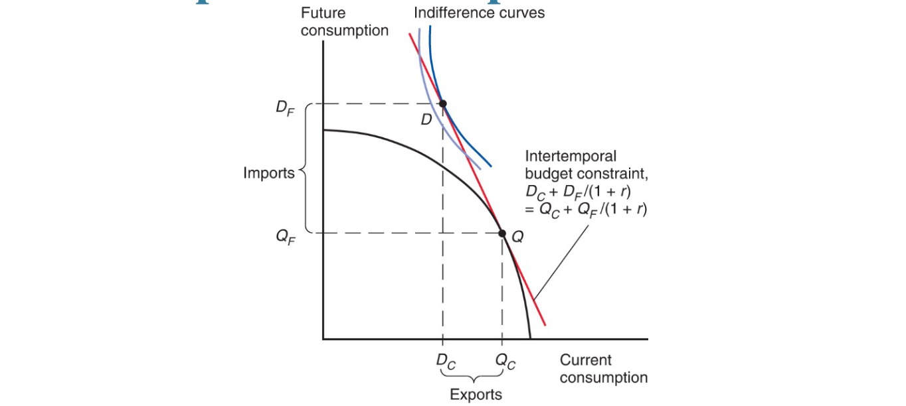

# 15.06.2023 Standard Trade Model

## General

general Model, combines Ricardian, Specific Factors and Heckscher

- two goods
- each country PFF

Differences between countries:

- labor 
- capital
- technology

Countrys Decisions:

- Production based on $\frac{ P_C }{P_F}$
- to maximise value $V = P_C Q_C+P_V Q_V$

relative Price Increases => steeper Isovalue Line => other combination better

## Relative Prices

Demand equal to Supply

$$
P_C D_C + P_F D_F = P_C Q_C + P_F Q_F = V
$$

Assumption: single representative consumer with indifference curve

resulting Diagram with IDC and trade

Whole-Economy:

- better off when export good relative price rises
- More Imports per export

=> Trade = expands PPF

- original Point without Trade: $D^3$
- original Point with Trade: $D^1$
- Point after Cloth Price Increase: $D^2$

## Distributional Effects

Uneven Distribution of Trade Gains

- poorer HH = more foods and manufactured 
    - better positioned after trade
- richer HH = more services = not exportable

But: Factor Prices (Wages) the other way around affected

## Terms of Trade

> **Terms of Trade:** price of exports relative to price of imports

higher ToT = better for country = afford to buy more imports

Determining relative Prices

- **Supply:** World Supply of Cloth rel. to world supply of Food: $\frac{ Q_C+Q_C^* }{Q_F+Q_F^*}$
- **Demand:** World Demand of Cloth rel. to world Demand of Food: $\frac{ D_C+D_C^* }{D_F+D_F^*}$

Situation with Trade

## Economic Growth

is usually *biased*: one sector more than other 

- changes terms of trade
- example: biased growth in cloth
    - lower relative price of cloth
    - lower Terms of Trade
    - effect depends on if cloth import or export

| Type                 | Definition                           | Effect                                |
| -------------------- | ------------------------------------ | ------------------------------------- |
| Export-biased Growth | increase PPF mostly in export sector | reduces ToT = reduces welfare at home |
| import-biased Growth | increase PPF mostly in import sector | increase ToT = increase welfare       |

## Instruments

### Import Tariff

- relative price of good (e.g food) rises
    - more producers into food
- lower rel. price of cloth
    - more consumers into cloth

Effect (from 1 to 2)

Effect: depends on size of economy in the world trade

### Export Subsidies

e.g subsidy on cloth exports:

- rel. price of cloth rises
- more producers into cloth
- consumers want less

### Effect of Instruments

- Import tariff: can increase domestic welfare
- export subsidy: reduce domestic welfare

Additional Effects

- another Foreign Country makes export subsidy
    - If home country also exporter = less  competitive
    - reduces home ToT
- Tariff vice versa = more ToT if both countries same role (import / export)

Export subsidies and Import tariffs:

- reduce world prices for other countries (more supply / less demand)
- better ToT depends on home countries role

## Borrowing and Lending

Countries maximize *intertemporal* consumption

- produce more this year, consume more next year
- then lend money to other countries this year and borrow next

=> interest rate globally come closer

