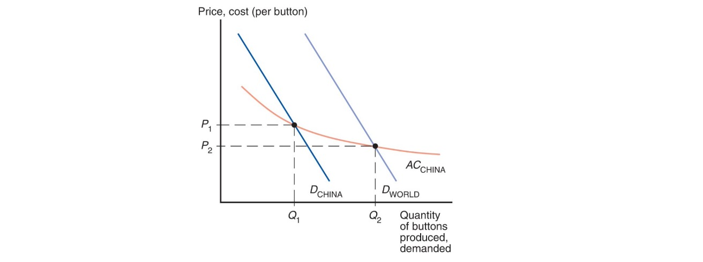
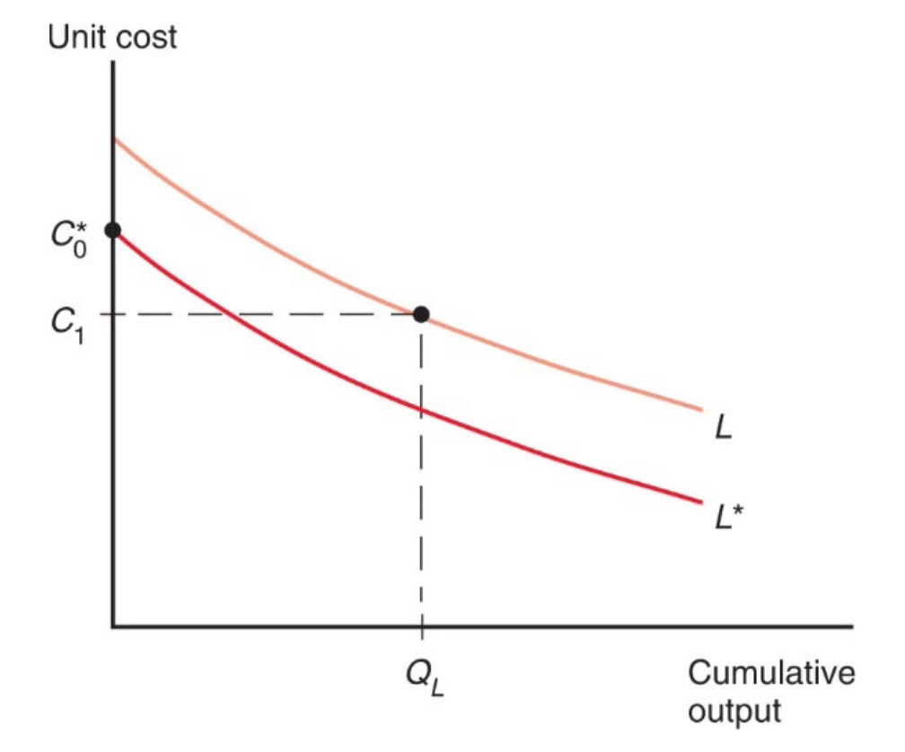

# 22.06.2023 Economies of Scale

> **Economies of Scale:** Outputs in Industry increase faster than inputs increase => more efficient production

## External Economies of Scale

Increase depends on **industry size**

- mostly smaller firms
- highly competitive region = better products

Reasons for ext. EOS:

- specialized equipment
- labor pooling
- knowledge spillover

Effects with Trade

- two countries with one industry 
- one cheaper to begin with = more production there
- as more goes to one country = ever lower prices
- in the end: all production in one country

=> reduce prices everywhere (as compared to in the middle of countries)

But:

- if one country has head start
- cheaper countries cant get enough demand
- even though less costly 

### Dynamic increasing returns

external EOS = also depend on cumulative output 

- more demand = more research
- more knowledge = cheaper products

=> learning curve (e.g solar panels very prominent)

| Theory                                    | Practice                                  |
| ----------------------------------------- | ----------------------------------------- |
|  |  |

**note:** EOS can giv arguments for protection of industries at infant stage! or to get a headstart!

