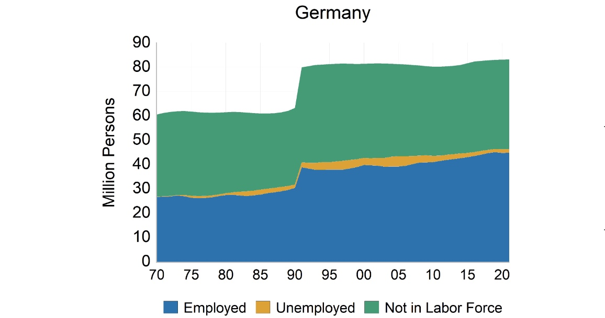
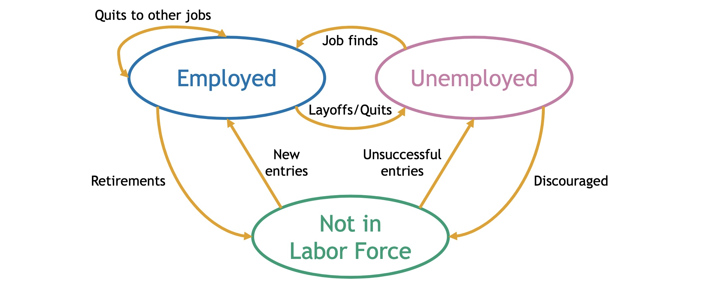
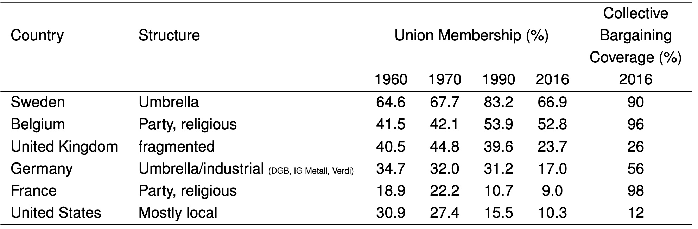
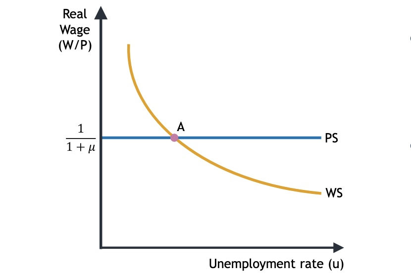
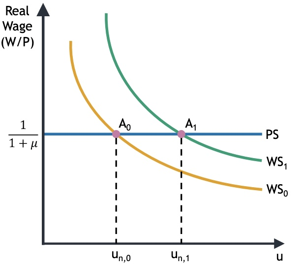
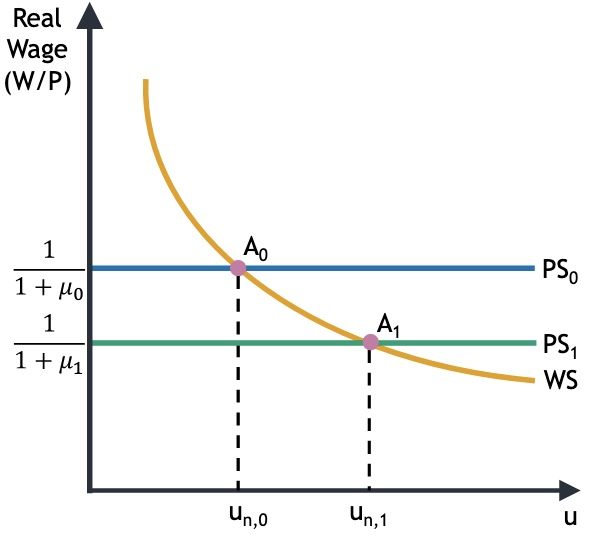
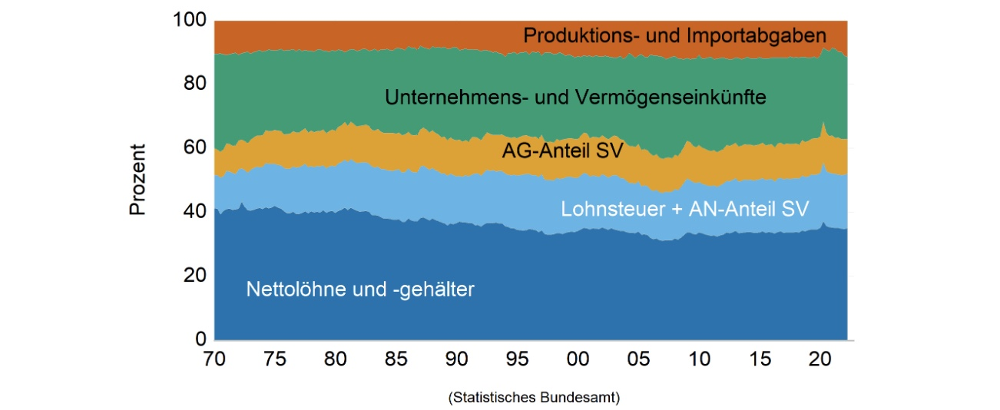

# 24.11.2022 Arbeitsmärkte

## Erwerbstätigkeit

```
  Erwerbstätige 
+ Erwerbslose
----------------
= Erwerbspersonen
+ Nicht-Erwerbspersonen (Kinder, Rentner,...)
----------------
= Bevölkerung
```



Aus Makro-Datenbank der EU: [AMECO](https://economy-finance.ec.europa.eu/economic-research-and-databases/economic-databases/ameco-database_en)


## Definitionen

- **Arbeitslosenquote (ALQ)**: Verhältnis Arbeitslose | Erwerbspersonen
- **Bevölkerung im erwerbsfähigen Alter:** zw. 15 und 64
- **Partizipationsquote**: Verhältnis Erwerbspersonen | Bevölkerung erwerbsfähiges Alter
- Weder arbeit suchen noch finden = nicht arbeitslos

Wege in dem Arbeitsmarkt 

## Lohnbildung

in Deutschland: Kollektivlohn 

- ausgehandelt zwischen Arbeitnehmern und Arbeitgebern
    - **DGB** = Gewerkschaftsbund mit ~6 Mio Mitlgiedern
    - **BDA** = Arbeitgeberbund mit 1 Mio. Unternehmen und rund ~20 Mio Beschäftigte


Kräfte, die beeinflussen:

- Reservationlohn = Lohn, bei dem AN indifferent zu Arbeitslosigkeit
- Lage am Arbeitsmarkt (ALQ)


Vergleich der Gewerkschaftsbewegungen



=> Mitgliedschaft sagt noch ncihts über die Stärke (*Bargaining Power*) aus (siehe Frankreich)


Verhandlungsmacht hängt ab von:

- alternative Arbeiten
- Kosten für Arbeiterersetzung

### Effizienzlohntheorie

annahme, dass Lohn mit Motivation der Arbeiter zusammenhängt

- somit macht Lohn über Reservationslohn Sinn
- bspw. High-Tech Unternehmen, wo viel von Mitarbeiten abhängt


Gesamtwirtschaftlcihe **Nominallohn**
$$
W = P^e\cdot f(\overset{-}{u}, \overset{\pm}{z})
$$
Bestandteile:

- $P^e$ = erwartetes Preisniveau
    - wichtig ist Reallohn, nicht Nominallohn
    - AN wollen wissen was sie sich leisten können
    - AG wollen Verhältnis Verkaufspreis / Kosten
- $u$ = ALQ
    - hohe ALQ = niedrige Verhandlungsmacht
- $z$ = restliche Faktoren (insb. institutionell)
    - kann positiv oder negativ sein


## Preisbildung

Annahme: *monopolistische Konkurrenz*

- gewisser Spielraum für Preise über Grenzkosten 
- mit Gewinnmarge $\mu$ abhängig von Marktmacht

$$
P= (1+ \mu) \cdot MC
$$

Annahme: in kurtzer Frist Produktionssteigerung nur mit mehr Arbeit! (K=konst.)

Marginalkosten dann:
$$
MC = \frac{W}{\underbrace{MPL}_{Grenzprod.}}
$$

## Strukturelle Arbeitslosigkeit

daraus resultiert: (bei langfristig $P^e = P$)

**Lohnsetzungsgleichung:**
$$
W = P \cdot f(u,z) \ | :P \newline
\underbrace{\frac{W}{P}}_{\text{Reallohn}} = f(u,z)
$$
Graphisch:

- Wage Setting (WS) = negativ wegen u
- Price Setting (PS) = gerade, aber abhängig von Marktmacht $\mu$



Schnittpunkt = **strukturelle Arbeitslosigkeit** $u_n$ (die nicht konjunkturell)

- Abhängig von z = Arbeitslosenunterstützung
- und $\mu$ = Marktmacht


mögliche Situationen

| mehr Arbeitslosenuntersützung z           | höhere Marktmacht $\mu$                   |
| ----------------------------------------- | ----------------------------------------- |
|  |  |


**Produktionspotenzial** dann: 
$$
Y_n = F(K,A \ (1-u_n)L)
$$
=> Je niedriger strukturelle AL, desto höher Produktionspotenzial

## Einkommensverteilung

Reallohn bei Cobb-Douglas Prod.Funktion
$$
\frac{W}{P} = \frac{1-\alpha}{1+\mu}\frac{Y}{N}
$$
Y/N = Arbeitsproduktivität, Reallohn entwickelt sich *ungefähr* im Gleichklang



**Lohnquote** = Anteil Arbeitseinkommen an Gesamteinkommen ( WN/PY )

- je größer Marktmacht, desto weniger Lohnquote!

## Übung

Gleichgewicht auf dem Arbeitsmarkt: Herleitung

- Preissetzung: $P = (1+\mu) \cdot MC$
    - mit $MC=\frac{W}{MPL} \to MC = W$ (vereinfachte Annahme) 
    - Also: $P= (1+\mu)W$
- Lohnsetzung: $W= P\cdot f(u,z)$

umstellen nach Reallohn: $\frac{W}{P}$

- Preissetzung: $\frac{W}{P} = \frac{1}{(1+\mu)}$
- Lohnsetzung: $\frac{W}{P} = f(u,z)$

Gleichsetzen: $\frac{1}{(1+\mu)} = f(u,z)$

---

Strukturelle Arbeitslosigkeit (im Gleichgewicht)
$$
f(u_n,z) = \frac{MPL}{(1+\mu)}
$$
Gegeben:

- $f = z(1-u)^2$
- MPL = A = 1
- z = 1
- $\mu = 0.25$

$$
(1-u_n)^2 = \frac{1}{1+0.25} \newline
1-u_n = \sqrt{0.8} \to u_n = 1-\sqrt{0.8} = 0.1055
$$

die strukturelle Arbeitslosenquote beträgt 10,55 %

Reallohn = $\frac{1}{1+\mu} = 0.8$

