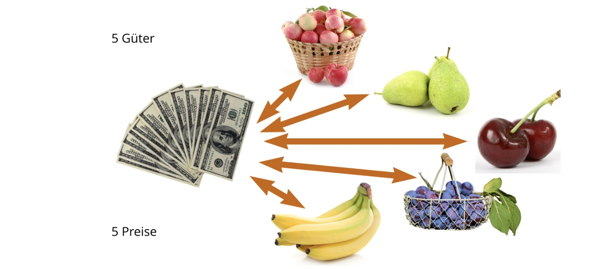
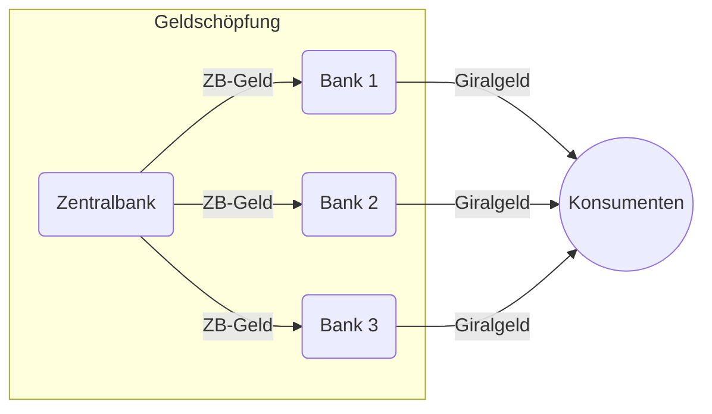
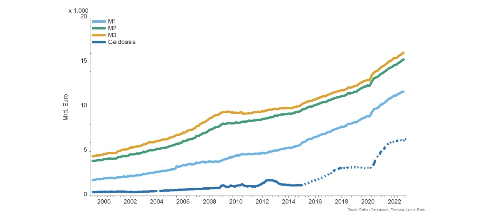
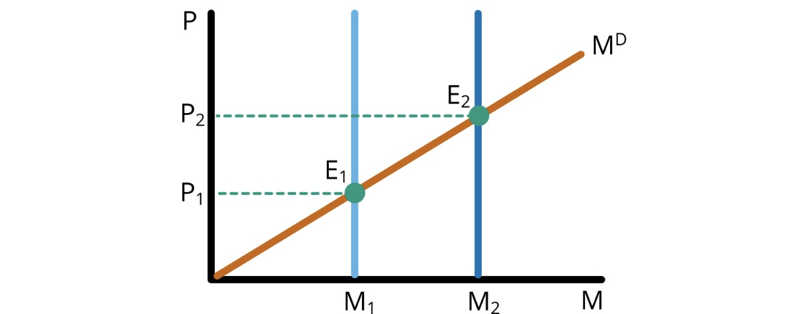
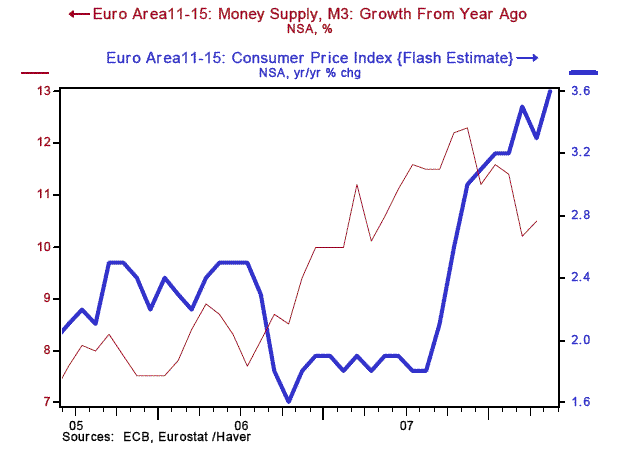
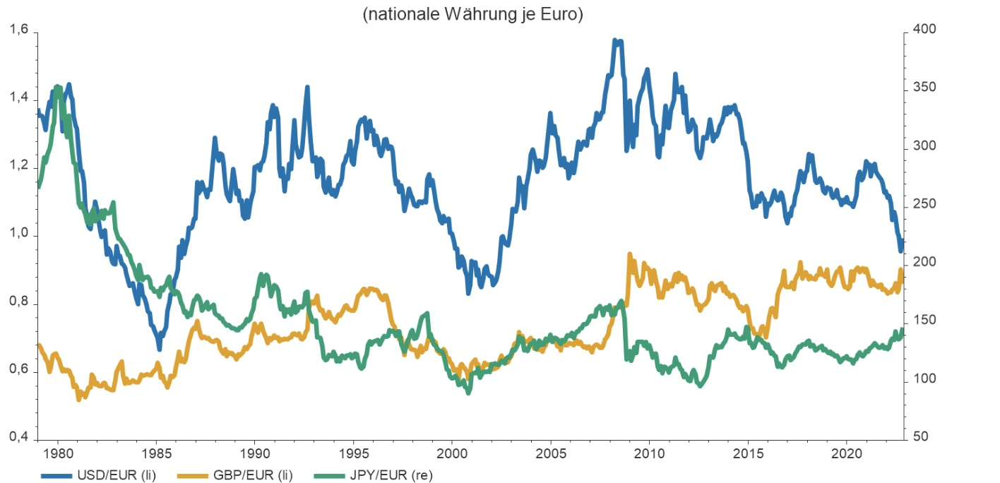

# 30.11.2022 Geld und Preise

## Geld

= soziale Institution

- basiert auf Vertrauen
- in Emittenten (meist Staat)

=> reduziert Transaktionskosten

### Erscheinungsformen

**Warengeld**

- Seide, Salz, ...
- Metallmünzen
- Anforderungen: Verwendbarkeit, Standardisierbarkeit, Haltbarkeit,...

**Kreditgeld** (*fiat money*)

- Bargeld
- Giralgeld (Bankkonto), direkter Zugriff

**Geldnahe Forderungen**

- Forderungen an Banken mit verzögertem Zugriff
- Geldmarktinstrumente (Repos)

### Funktionen

**Recheneinheit**: statt viele Verhältnisse pro Gut nur eines

**Tauschmittel:** indirekte Täusche, ohne dass Wünsche zweier Handelspartner perfekt aufeinanderpassen müssen

**Wertaufbewahrungsmittel:** zeitliche Trennung zw. Kauf - Verkauf

### Geldschöpfung

EZB: versorgt Zentralbankgeld an Geschäftsbanken:

- Kreditvergabe
- Offenmarktpolitik
- Interventionen

Geschäftsbanken:

- schöpfen Giralgeld durch Kreditvergabe (Bilanzausweitung)
- begrenzt durch Mindestreservepflicht an ZB-Geld

**Geldmengenkonzeption Euroraum**

| Position                 | M1                       | M2                       | M3                       |
| ------------------------ | ------------------------ | ------------------------ | ------------------------ |
| Bargeldumlauf            | :heavy_multiplication_x: | :heavy_multiplication_x: | :heavy_multiplication_x: |
| Täglich fällige Einlagen | :heavy_multiplication_x: | :heavy_multiplication_x: | :heavy_multiplication_x: |
| Termineinlagen           |                          | :heavy_multiplication_x: | :heavy_multiplication_x: |
| Spareinlagen             |                          | :heavy_multiplication_x: | :heavy_multiplication_x: |
| Geldmarktinstrumente     |                          |                          | :heavy_multiplication_x: |
| Schuldverschreibungen    |                          |                          | :heavy_multiplication_x: |

historische Entwicklung:

Geldbasis = ZB-Geld

### Geldmarkt

**Nachfrage** nach Geld (M) hängt ab von Transaktionsvolumen $Y$

Cambridge-Gleichung:
$$
M^D = k \cdot Y = k\cdot p \cdot Y
$$

- P = Preisniveau
- y = reales Volumen
- k = Kassenhaltungsfaktor (exogen)

**Angebot:** wird von ZB fixiert, muss sich anpassen

Gleichgewicht: Geldmenge trifft auf Nachfrage

## Preise

Zusammenhang Preise ud Geldmenge:

- Ausweitung Geldmenge = höheres Preisniveau
- ZB kann mehr Geld drucken, aber es werden nicht mehr Waren dadurch

bei konstanter Gütermenge: Preisniveau - Geldmenge = Faktor $\pi$
$$
\frac{\Delta P}{P} =\pi = \frac{\Delta M}{M}
$$

### Inflation

zu starke Geldmengenerhöhung = **Inflation** (theoretisch)

**Praktisch**: wenig Zusammenhang (bei moderaten M-Steigerungen)

historische Beispiele: Weimarer Republik

Folgen der Inflation:

- Kreditbeziehungen werden schwieriger
- Schuldner profitieren (bspw. ein Staat)
- Staat nimmt mehr Steuern ein (wegen Lohnsteigerungen)

=> Lenin: Inflation ist bester Weg zum Kommunismus :)

### Wachstum

Langfristiges Wachstum mit: $\frac{\Delta y}{y}$

dann Geldmengenwachstum: $\frac{\Delta M}{M}= \pi+\frac{\Delta y}{y}$

über dieses natürliche Maß = Entwertung der Kaufkraft

### Inflation und Allokationseffizienz

*Was passiert, wenn Inflation auftritt?*

Dekompositionsproblem

- Veränderung nominal oder realer Preise?
- Transitorisch oder permanent

=> Beeinträchtigung Preisfunktion

Wirtschaftsplanung

- Unsicherheit über reale Zinsen
- Höhere Risikoprämie

=> höhere Kapitalkosten

## Wechselkurse

es gibt Handel mit Devisen

> **Devisen:** an ausländischen Plätzen zahlbare Zahlungsanweisungen in fremder Währung (nicht Banknoten!)

im Handel bilden sich Wechselkurse

> **Wechselkurs:** Preis einer ausländischen Währung ausgedrückt in:
>
> - Preisnotierung (Eigen zu Fremd): 0,8 Euro je Dollar
> - Mengennotierung (Fremd zu Eigen): 1,25 Dollar je Euro

- Aufwertung: Zunahme des Wertes einer Währung im Vergleich zu anderer
- Abwertung: Abnahme des Wertes

### Realer Wechselkurs

> Rate, zu der Güter und Dienstleistungen eines Landes gegen die eines anderen getauchst werden können

$$
W_r = \frac{P_\text{heimischer Warenkorb in heimischer Währung}}{P_\text{fremder Warenkorb in fremder Währung}}
$$

ist realer Wechselkurs < 1: ausländische Waren teuer
$$
P_{fremd Waren,heimWährung} = P_{fremd,fremd} \times W_{nominal}
$$
Theorien:

- *Law of one Price*: identische Güter =  gleicher Preis in Ländern
- *absolute **P**urchasing **P**ower **P**arity (PPP):*  Preis heimischer Warenkorb = ausländischer Warenkorb in heimischer Währung -> $W_r = 1$
    - ist es in anderem Land billiger = Anpassung des Wechselkurses
- *relative PPP:* Wechselkursänderung = Inflationspotenzial

Abweichungen durch Transportkosten,  Zölle, ...

### Effektiver Wechselkurs

> **Effektiver Wechselkurs**: gewichtetes Mittel aus verschiedenen Wechselkursen anderer Währungen, gewichtet mit Handelsanteilen

