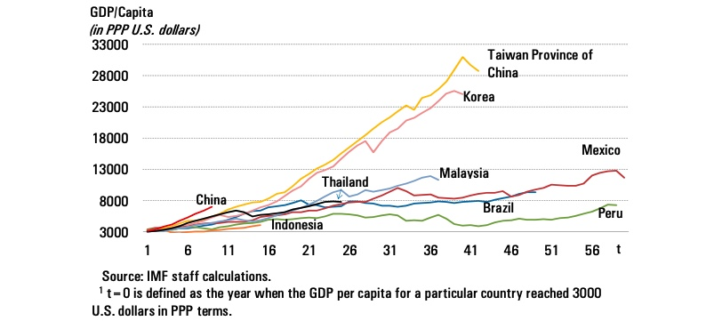
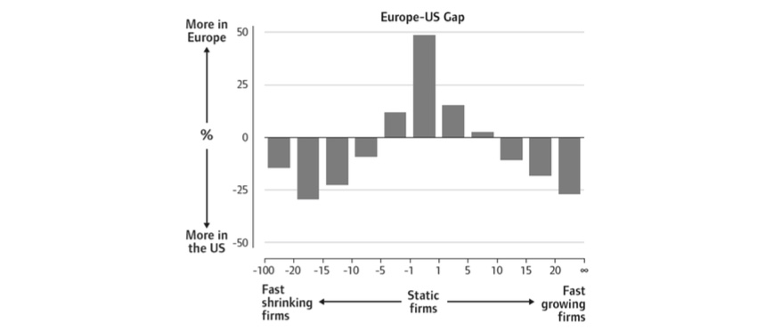
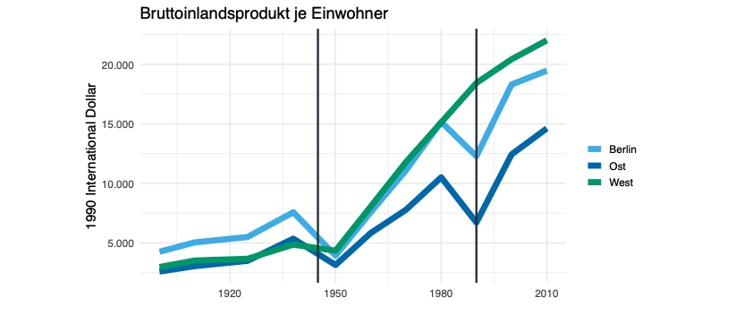
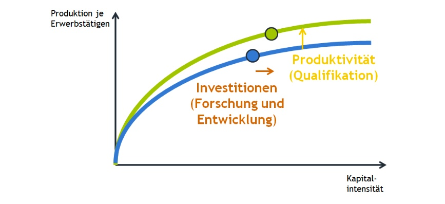
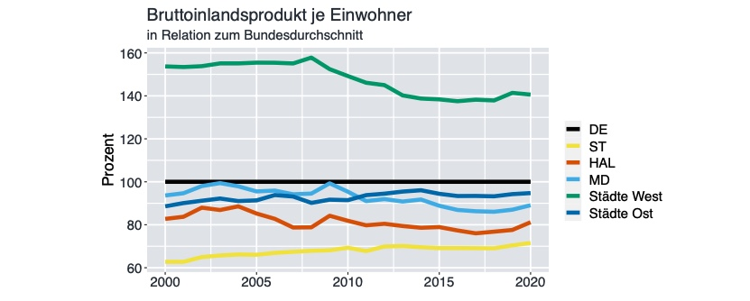
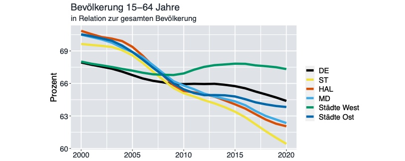
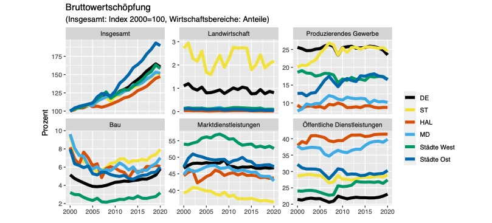
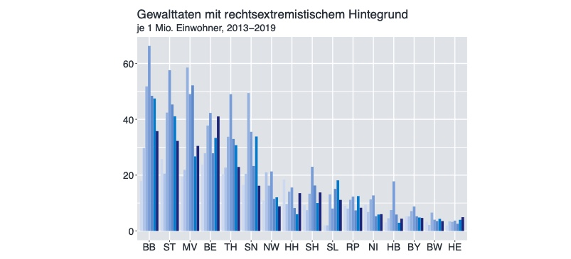

# 06.12.2022 Wirtschaftspolitik

## Ziele

langfristige Wirtschaftspolitik = Soziale Wohlfahrtsfunktion erhöhen

$$
W(x) = \frac{1}{1-\theta} \sum_{i=1}^N \alpha_i \cdot [\ u(x_i)\ ]^{1-\theta}
$$

- **Utilitarismus**: Maximiere Summe der individuellen Nutzen
- **Maximin** (Rawls): Maximiere minimalen Nutzen (des ärmsten)

## Instrumente

Stärkung des Produktionswachstums:

- Verbesserung der Infrastruktur
- Förderung Humankapitalbildung
- Förderung Forschung

Überkommen der Middle-Income-Trap: 

- Frühe Phase: **Investitionen**
    - Infrastrukturausbau
    - Reallokation Ressourcen in Industrie
    - technologische Konvergenz (Imitation / Adaption)
- dann: **Innovation**:
    - "Ease of doing business" erhöhen
    - Spitzenkräfte / internationale Forscher
    - internationelm Wettbewerb stellen

## Deutschland

Probleme

- stagnierende Produktivität
    - geringe Investitionen Digitalökonomie
    - wenig Patente
    - wenig technologieorientierte Firmen
- Arbeitskräftemangel
    - "wenig Flexibilität"
    - demografischer Wandel
    - gerine Beteiligung Frauen

mangelnde Dynamik in Europa

## Ostdeutschland

geringere BIP p.P : 

Gründe für "Schwäche":

- Alterstruktur (viel Auswanderung nach Westen)
- geringe Arbeitsproduktivität (weil geringe Kapitalinvestitionen)

### Vergleich Ost-West

- kleine Großstädte bis 500k, keine Hauptstadt
- Städte West: Augsburg, Münster,...
- Städte Ost: Jena, Rostock, Chemnit, Leipzig
- Außerdem: MD=Magdeburg, HAL=Halle, ST=Stendal

BIP p.P:

Demografie: 

Wirtschaftsstruktur

Toleranz: 

### Instrumente

mehr Investition in Humankapital:

- Schulabbrecher (**Talente**)
- Zuwanderung (**Toleranz**)
- Qualifizierung (**Technologie**)

**3Ts = !KLAUSURRELEVAN BESTIMMT!**
