# Macro 2 Summary

Table of Contents:
* [Labour Market](#labour-market)
  + [Wage and Effort ](#wage-and-effort)
  + [Wage Setting  ](#wage-setting)
  + [Prices ](#prices)
  + [Price Setting](#price-setting)
  + [Equilibrium](#equilibrium)
* [Banks](#banks)
* [Business Cycle](#business-cycle)
  + [Definitions](#definitions)
  + [Smooth Consumption](#smooth-consumption)
  + [Volatile Investment](#volatile-investment)
  + [Government Expediture](#government-expediture)
  + [Stylized Facts](#stylized-facts)
  + [Multiplier Model](#multiplier-model)
  + [Influences on the Multiplier Model](#influences-on-the-multiplier-model)
  + [AD and Unemployment](#ad-and-unemployment)
* [Government](#government)
  + [Important equations](#important-equations)
  + [Phase Lines](#phase-lines)
  + [Default Risk](#default-risk)
* [Inflation](#inflation)
  + [Philipps Curve](#philipps-curve)
  + [Bargaining Gap](#bargaining-gap)
  + [Inflation and AD](#inflation-and-ad)
  + [Expectations](#expectations)
  + [Monetary Policy](#monetary-policy)
  + [Preferences of CB](#preferences-of-cb)

## Labour Market

### Wage and Effort 

= individual worker

- wage set in contract, depends on
    - reservation wage = outside option
    - disutility of effort
    - employment rent

=> firms set wage based on effort level needed (**HR Department**)

### Wage Setting  

= whole economy

- based on unemployment in economy
- gives general wage level (nominal)

=> higher unemployment = lower nominal wage

| individual                                | whole economy                             |
| ----------------------------------------- | ----------------------------------------- |
| 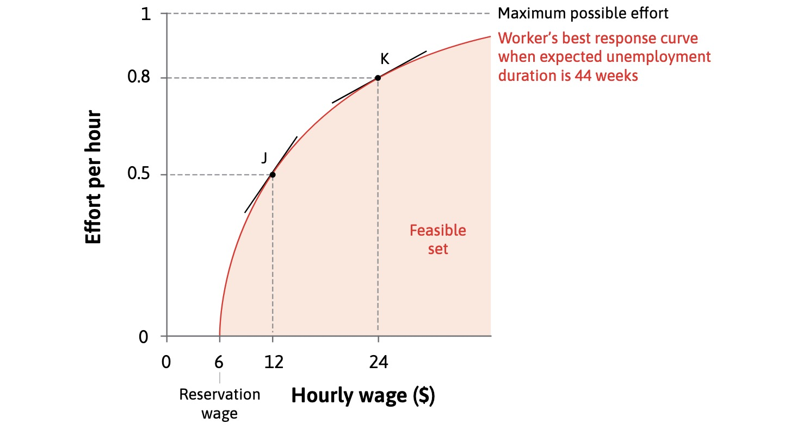 | 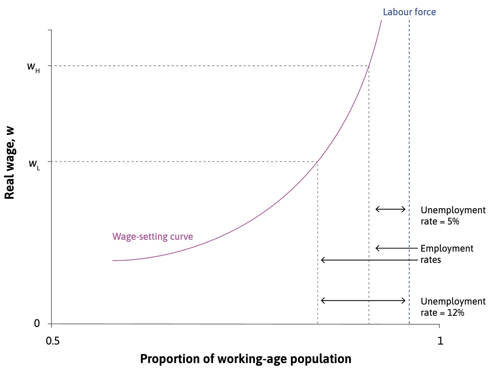 |

### Prices 

= at individual firms

Firms Decision at given Wage based on

- Demand
- Competition
- Markup needed for shareholders

=> prices / level of output and number of needed workers 

### Price Setting

= whole economy

- all prices combined lead to price level
- real profit per worker ($\Pi/P$)
- real wage per worker ($W/P$)

=> only depends on competition 

| indivudual firm                           | whole economy                             |
| ----------------------------------------- | ----------------------------------------- |
| 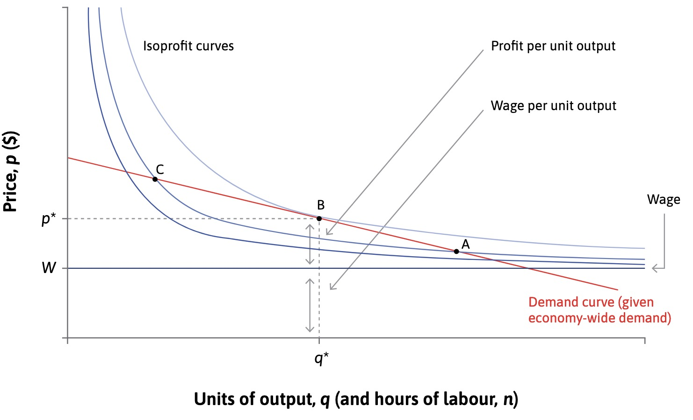 | 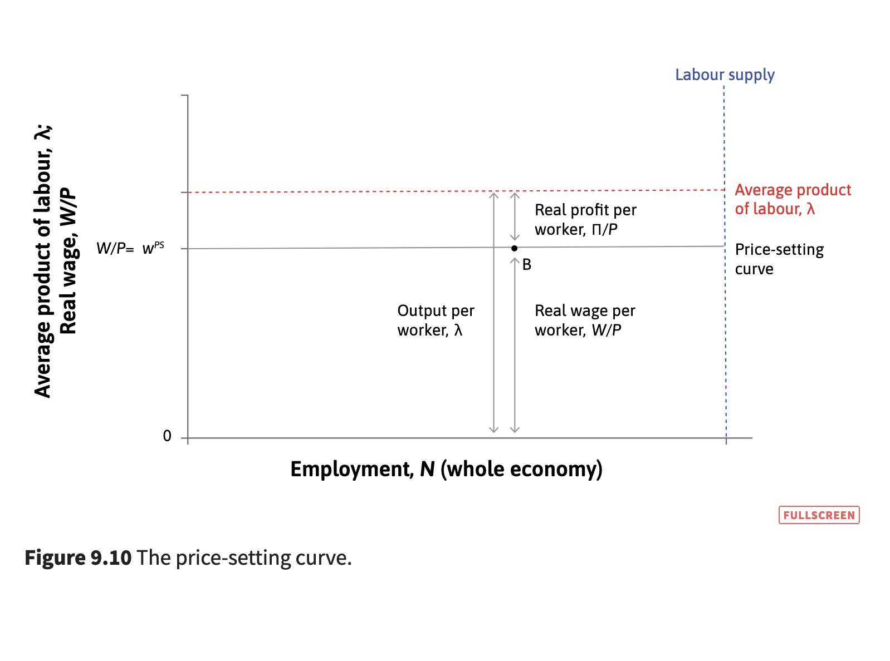 |

### Equilibrium

- Wage Setting: Wage at given Effort
- Price Setting: Prices at given Markup

leads to

- least wage for effort
- maximum employment
- Involuntary unemployment (due to incomplete contracts!)

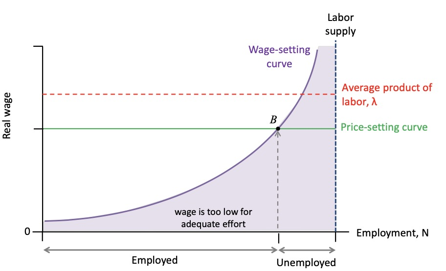

Model reaction to lower AD:

- higher unemployment
- lower wages along the WS-curve
- lower prices for goods 
- higher demand for goods = higher labor demand
- more employment back at equilibrium

Problem: **Sticky Wages**! and savings

Solution: Government Intervention to expand Demand (Monetary or Fiscal)

## Banks

*lets just hope that banks dont play a big role in the exam...*

## Business Cycle

### Definitions

> Type of Fluctuations in capitalist economies of aggregate economic activity between contraction and expansion

*Okuns Law*: Connection between Cycle and Unemployment

Recession: Significant decline in economy-wide activity

GDP: Gross Domestic Product, calculated in different ways:

- Income
- Spending
- Value added in Production

Spending: $Y = C+I+G+X-M$

### Smooth Consumption

individuals smooth consumption (to have higher quality of life)

- Borrowing from future income 
- saving / repaying in high-income times

limited by:

- credit constraint
- weakness of will
- limited insurance

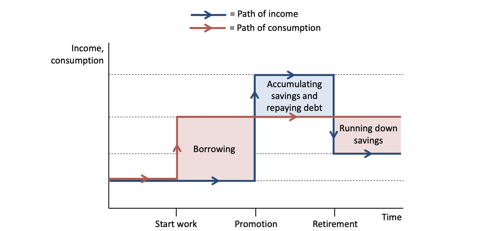

> **Consumption:**  lagging GDP, highly correlated

### Volatile Investment

Investment = depends on expectations regarding BC

| Contraction                               | Expansion                                 |
| ----------------------------------------- | ----------------------------------------- |
| 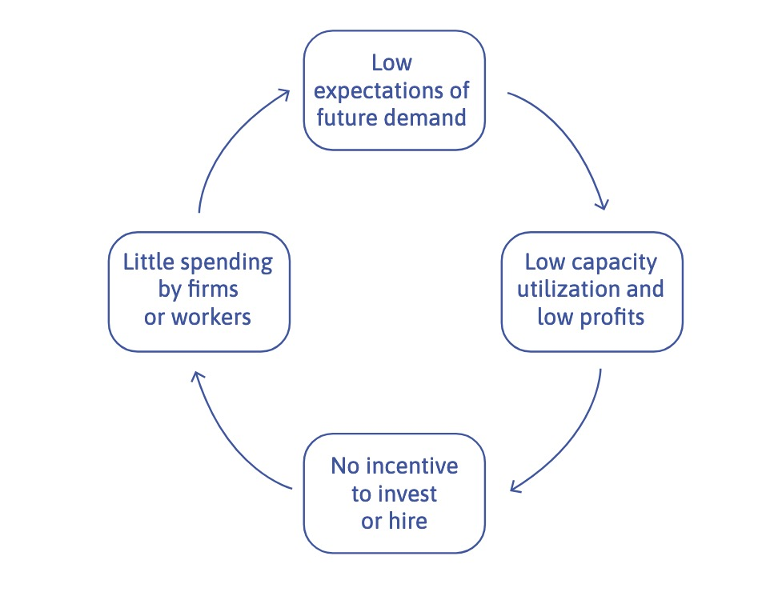 | 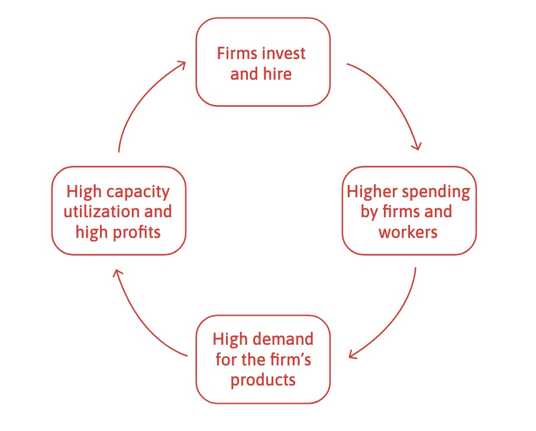 |

leads to **self-enforcing business cycles**

> **Investment:** leading GDP, high volatility

### Government Expediture

Share of Government spending on% of GDP ($b$)

- varies across countries
- depends on taxes / other income
- finacable by debt / money print

> **Government Expenditure:** less volatile than GDP, not dependent on expectations

### Stylized Facts

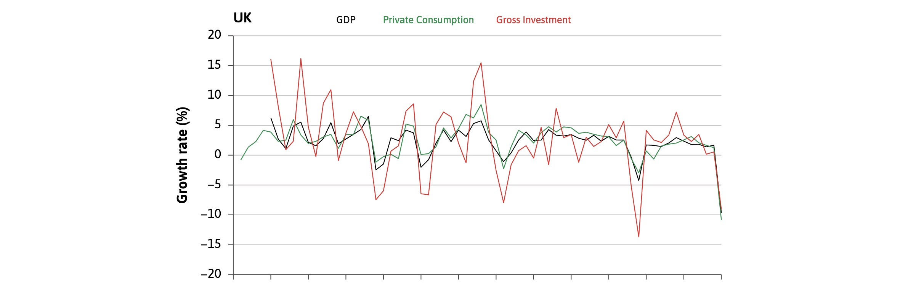

| Volatile                            | Correlation                                  | Persistence                          | Leading / Lagging        |
| ----------------------------------- | -------------------------------------------- | ------------------------------------ | ------------------------ |
| Investment = more volatile than GDP | Consumption / Investment = correlated to GDP | GDP + Investment = persistent        | Investment = leading GDP |
| Inflation = less volatile           | Infaltion \| GDP = no strong correlation     | G Exp + Employment = very persistent | Employment = lagging GDP |

### Multiplier Model

Consumption Function:

- autonomous consumption (from smoothing): $c_0$
- income dependent consumption: $c_1*Y$
    - based on marginal propensity to consume
- 45° Line = Aggregate Demand = Aggregate Supply
    - Everything needed is supplied (at less than full capacity)

Change in Output / Income: never relevant, moves along the line

Change in AD: relevant, because it moves the line (e.g $I, G, c_0$ change)

- exampe: higher Investment
- moves Consumption Line upwards
- multiplied by after round effects 

Multiplier: $k = \frac{ 1 }{1-c_1}$

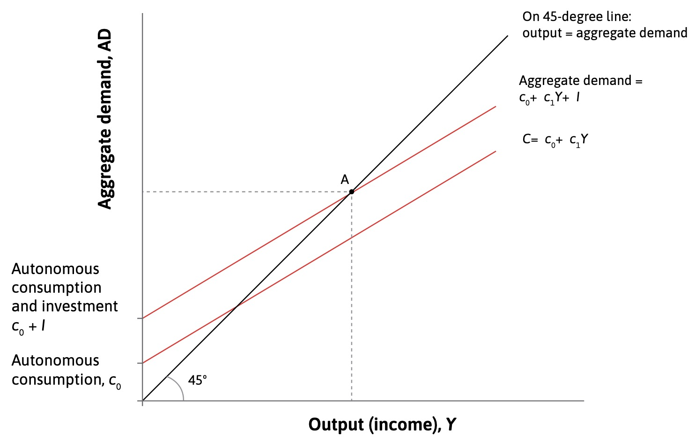

### Influences on the Multiplier Model

Fiscal Policy = dampen Fluctuations in AD

Multiplier influenced by

- Exports / Imports = make Stimulus more difficult
- high credit constrained = more effective multiplier
- Capacity of Economy 

### AD and Unemployment

Connection of both Models

- Supply Side: Labor Market Model
- Demand Side: Multiplier Model

Assumption: $N = Y$

| Supply Side                                                  | Demand Side                                                  |
| ------------------------------------------------------------ | ------------------------------------------------------------ |
|  |  |

## Government

Role = Fiscal Policy in Crisis, when k > 1 (output gap)

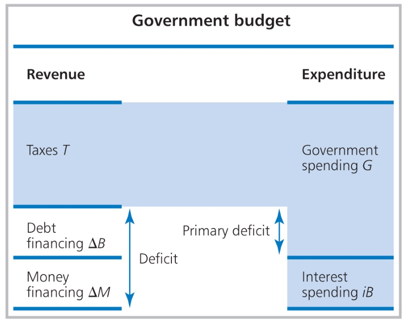

- Budget Deficit: $\Delta B = G+iB-T$
- Primary Deficit: $G-T$
- Budget Constraint: $T + \Delta B = G+iB$

### Important equations

- $\Delta b = g-t+(r-y)b$  : debt ratio dynamics
- $b^* = \frac{ g-t }{y-r}$ : equilibrium debt ratio
    - $b^* < 0$ = creditor 
    - $b^* > 0$ = debtor (should be at least)

### Phase Lines

Stability of Debt

- if $r-y < 0$ (growth higher than interest) = repayment always possible
- if $r-y > 0$ (high interest rate) = debt spirals out of hand

| stable creditor                                           | unstable creditor                                 |
| --------------------------------------------------------- | ------------------------------------------------- |
| 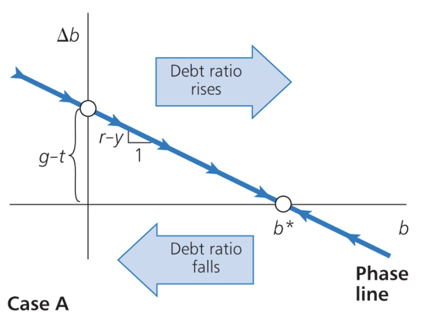 | 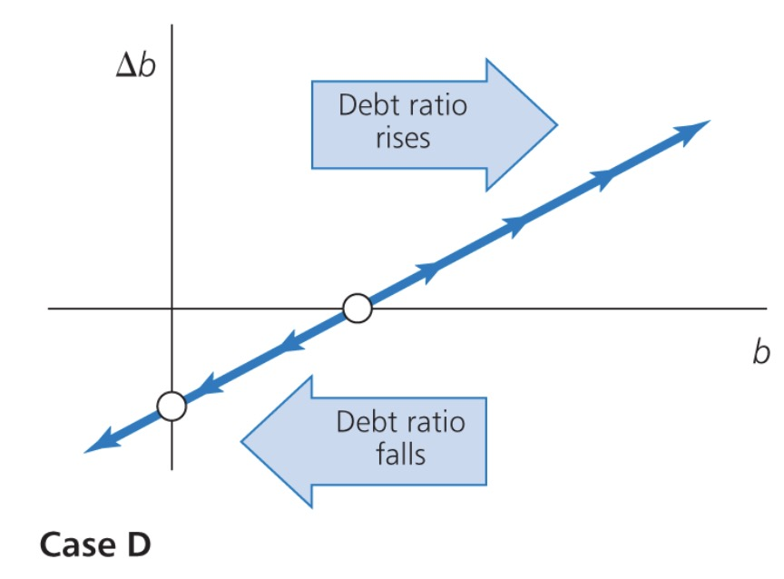 |

### Default Risk

- default probability: $\omega$ (determined by credit agency)
- $i_0$ = riskless asset

Government Interest Rate:

$$
i = \frac{ i_0+\omega }{1- \omega}
$$

Default Risk: $\omega = \omega_0 + \beta i$ (Debt ratio and interst are in calculation)

*Risk of Spirals:* interest rate $\uparrow$ = debt burden $\uparrow$ = risk $\uparrow$ = interest rate $\uparrow$

Bond Rating (R) and interest rate:

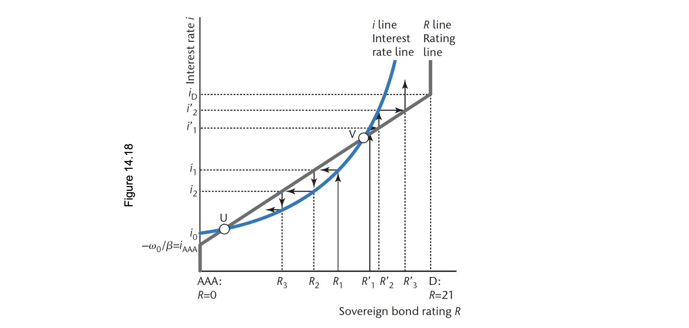

## Inflation

> **Inflation:** increase in general price level

### Philipps Curve

Correlation between Unemployment and Inflation (inverse relationship)

Higher unemployment = lower wages = lower prices = lower inflation

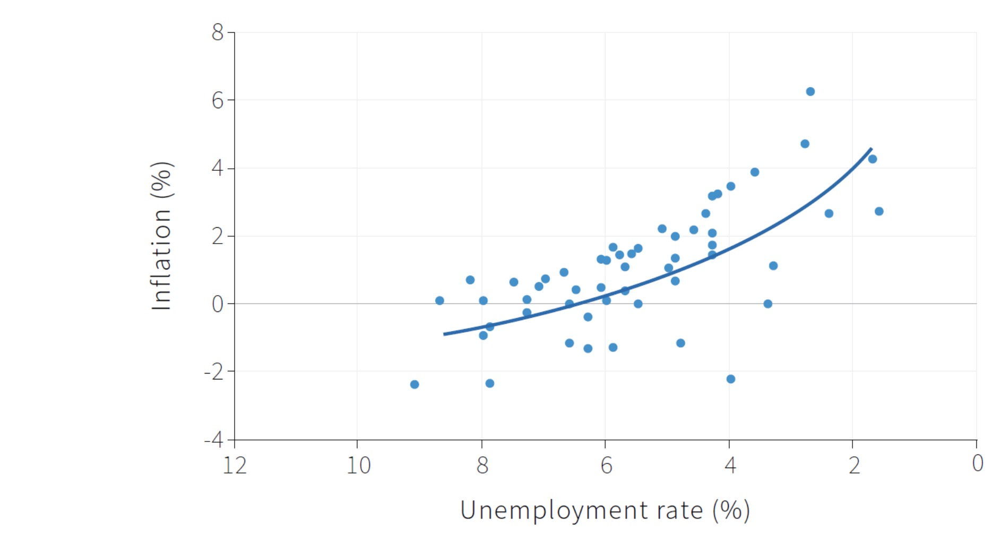

=> the philipp curve shifts with expectations of inflation! (staglfation)

### Bargaining Gap

Difference between:

- Wage firms want to offer for optimal effort (Wage Curve)
- Wage for optimal markup (Price Curve)

=> inconsistent claims in output

possible Reasons:

- higher firmpower = higher markup = lower PS
- higher union power = higher wages = higher WS
- more employment = WS $\to$

### Inflation and AD

Combination of 

- short run model (Multiplier Models)
- and medium run (efficiency wage model)

Effect of Boom:

- lower unemplyoment
- WS curve to the right
- higher wages + bargaining gap
- higher prices
- Wage price Spiral

| AD                                                        | Wage                                                      | Phillips                                                  |
| --------------------------------------------------------- | --------------------------------------------------------- | --------------------------------------------------------- |
| 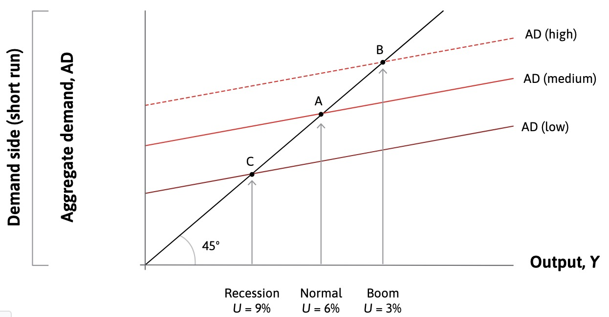 | 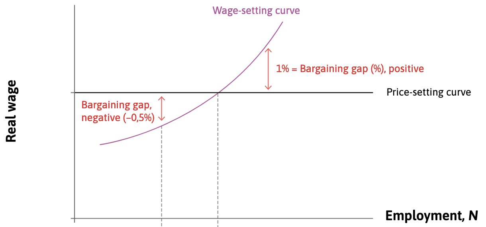 | 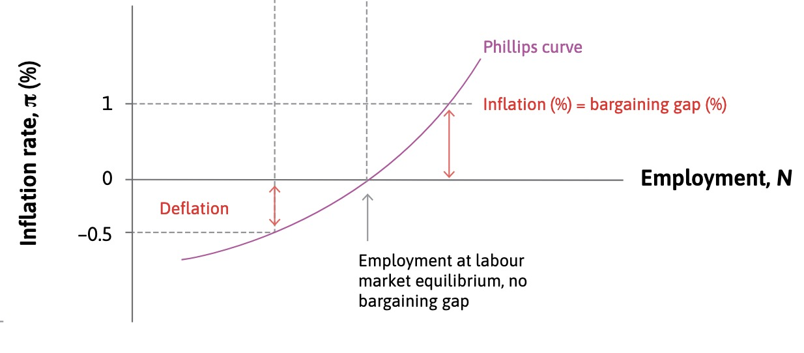 |

### Expectations

Friedman: Expectations are integrated into inflation => no long term suprise infaltion possible

Phillips Curve Tradeoff not possible!

Situation:

- normal inflation = 3%, Bargaining Gap = 2%
- workers demand wage rise of 5%
- but inflation next year = 5% => demand 7%

depends on static expectaions $\pi^e = \pi_{t-1}$

Spiral of Inflation:

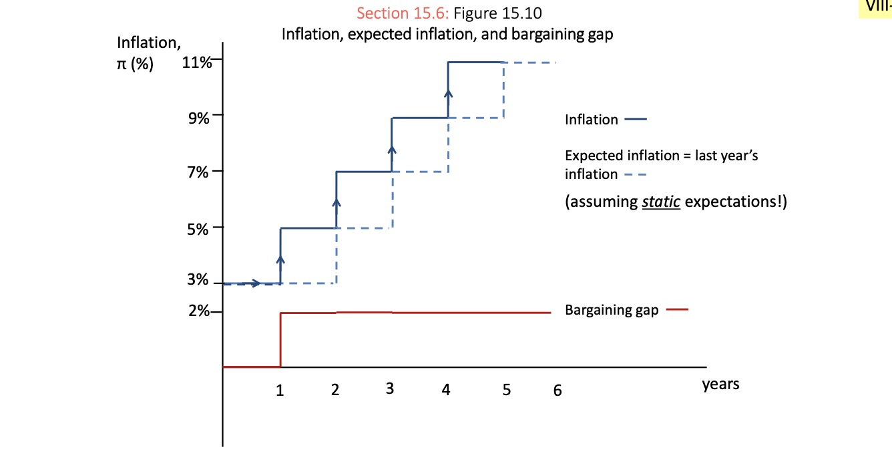

### Monetary Policy

Tools:

- interest rate, influences
    - market interest rates (investments)
    - asset values
    - expectations
    - exchange rate
- Quantiative Easing

Assumptions of effective MP:

- independence
- above zero bound
- flexible exchange rate
- own currency

Problems:

- Trust needed
- Fiscal Policy = can have opposing goals

### Preferences of CB

Loss Function: $L = b(U-U^*)^2+(\pi-\pi^*)^2$

Optimisation: $U = U_n - a (\pi-\pi^e)$ (Phillips Curve with Expectations)

=> Surprise inflation = incorporated = not worth it

defines rule-based inflation targeting:

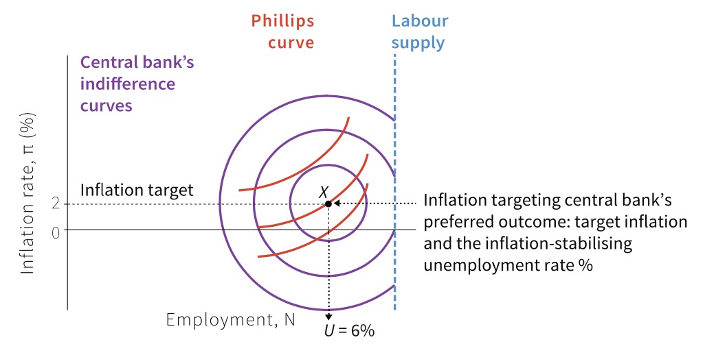