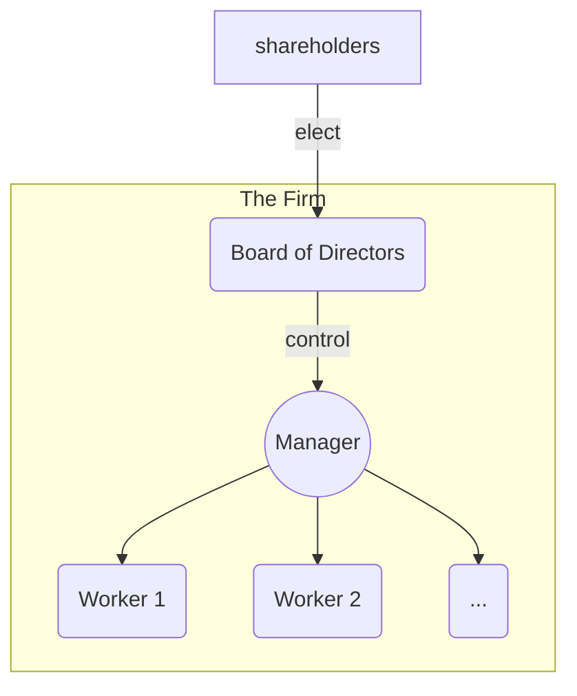
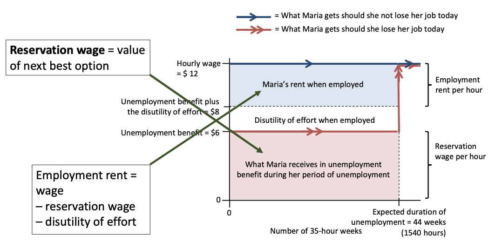
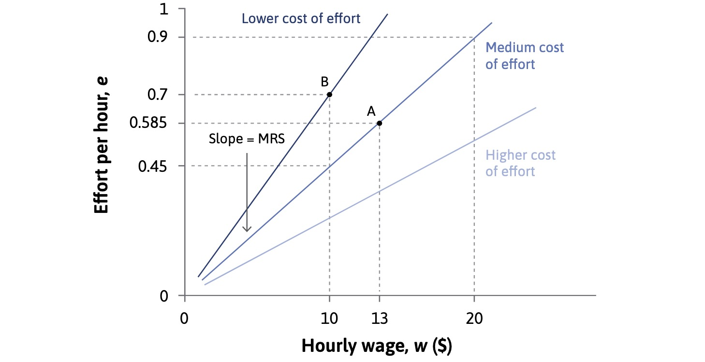

# 13.04.2023 The Firm

[Chapter 6](https://www.core-econ.org/the-economy/book/text/06.html)

> **Firm:** a business organization
>
> - employs people
> - inputs to outputs
> - price > cost of production
> - concentration of power in owners / managers

## Structure

separation of ownership (shareholders) and control (managers)

- a principal Agent Problem

inner firm is different to markets:

- market = voluntarily, 
- Work = involuntarily

firms are structured around *contracts*, without price mechanism

## Contract

> **Contract:** legal understanding, that specifies a set of actions that parties must undertake

- transfer of authority, not ownership!
- in wage relations = **incomplete**
    - do not specify every aspect
    - not always perfectly enforceable
    - firms do not force employess to stay on job

## Employment rent

how to compensate workers? with wage!

- employment rent > reservation wage (alternative)
- cost of job loss
- induce workers to stay on job

also includes calculation regarding unemployment benefit

## Labor Discipline

why do high wages motivate us?

- higher wage 
- higher employment rent
- higher cost of job loss
- more motivation

=> workers choose effort based on wage!

Workers *best response curve* to wage offer

Workers Best Response Function: 
$$
e = E(\underset{+}{w},\underset{-}{a}, \underset{+}{p},\underset{-}{b}, \underset{+}{d})
$$

- e = effort Level
- w = wage
- a = disutility of effort
- p = probability of getting fired
- b = unemplyment benefits
- d = duration fo unemployment

## Profit

*firms maximize profit*
$$
profit = \underbrace{R(N \times e)}_{Revenue} - \underbrace{N\times w}_{Costs} \\
\implies profit = R(N*w*\frac{e}{w})- (N*w)
$$
the higher the effort per wage dollar, the higher the profit

## Wage

gets determined at MRS = MRT

but shift at policy shocks:

- higher benefits = less effort
- higher unemployment = more effort

higher wages can be profitable for firm (adverse selection, turnover, ...)
