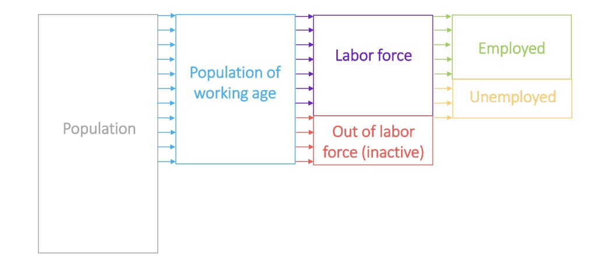
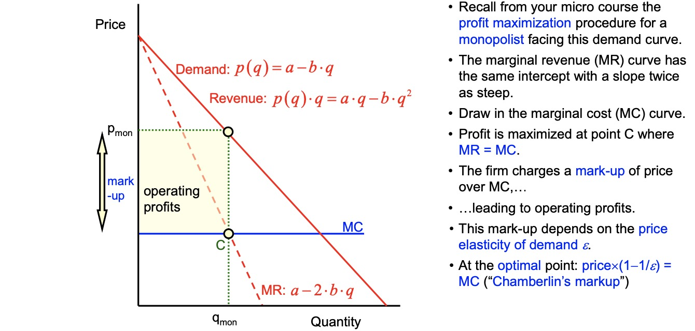

# 14.04.2023 Labour Market

[Chapter 9](https://www.core-econ.org/the-economy/book/text/09.html)

> **Unemployment:** people who are without work for longer period and seeking new employment

Definitions:

## The Labour Market

**Wage Setting:** takes place in the firm: wage above *unemployment rent*

- beased on unemployment rate
- other firms wages

**Price Setting:** as markup above cost of production

- other firms prices
- own costs and wages
- position of demand curve (elasticity)

=> adding up decisions = real wage and unemployment rate

Decision Process

| Department | Knows                       | Sets                |
| ---------- | --------------------------- | ------------------- |
| HR         | prices, wages, unempl. Rate | nominal Wage *W*    |
| Marketing  | demand curve position       | Price of output *p* |
| Production | labor productivity          | Employment *n*      |

Procution Function of Firm:
$$
Y = \underset{labor\ productiity}{\lambda} \cdot \underset{workers}{n}
$$

## Wage Setting Curve

Wages in aggregate economy:

Influences:

- unemployment benefits -> curve upwards
- labor supply increases -> curve downwards

## Isoprofit Curve

Firm maximizes profit

- based on elasticity of demand (inverse)
- and level of competition (inverse)

$$
\frac{1}{elasticity} = \frac{price-MC}{price} = \mu \\
with \; MC = \frac{W = nominal \ Wage}{\lambda = labor \ productivity }
$$

leads to price setting curve: (p.w. = per worker)
$$
\implies \underbrace{\frac{W}{P}}_{real \ Wage} = \underbrace{\lambda}_{output \ p.w.} - \underbrace{\lambda \cdot \mu}_{real \ profit \ p.w.}
$$
note:

- wage = $\lambda$
- high competition = low $\mu$ = high wages

### Price Setting

based on Monopolistic Competition

- markup depends on level of competition in market

