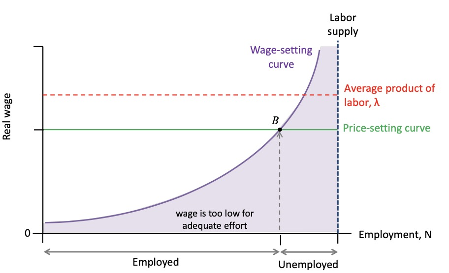

# 20.04.2023 Wage

## Labour Market Equilibrium

**wage-setting curve**: wage required at level of empl. for effort

**Price-setting curve**: real wage based on comp, productivitiy

Nash-Equilibrium:

- firms offer least wage for effort
- employment highest it can be
- unemployed cannot imporve situation

leads to:

### Involuntary Unemployment

> **involuntary unemployment:** people at working age willing to supply labor but not finding a job

- excess supply in labor market
- always exists
- due to incomplete contracts, not policy!

### Demand and Unemployment

Firms *labor demand* depends on *Demand for Goods* => **derived demand for labor**

- depends on aggregate demand
- Fall in AD => demand-deficient unemployment

**theory:**

- firms adjust wages to lower point
- lower costs -> lower prices 
- increased output

**reality**:

- no cuts to wages
- lower wages = less AD
- falling prices = deflation

=> Government Intervention helps

