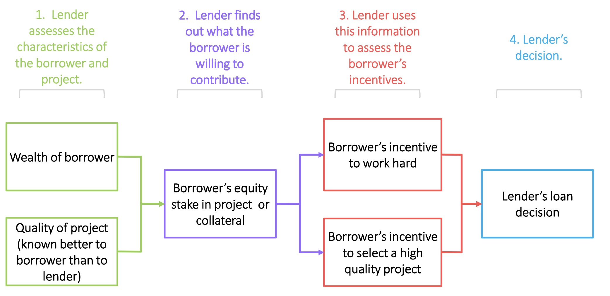
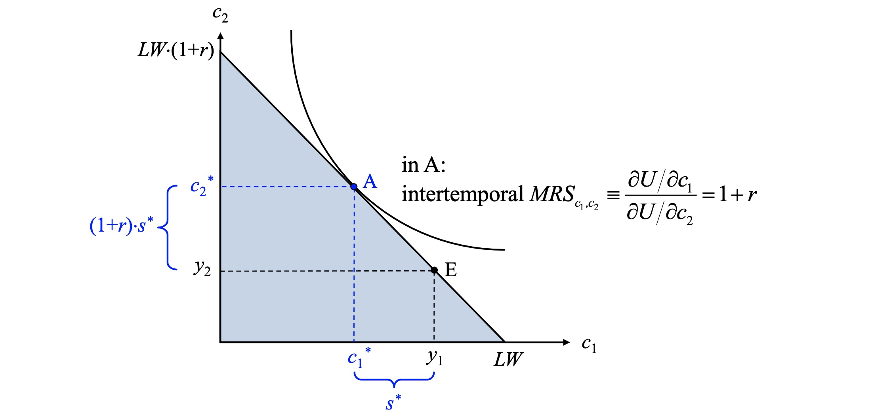
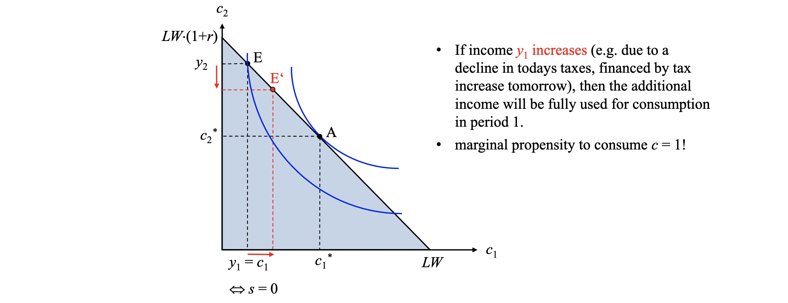

# 04.05.2023 Banks III

last Lecture: Credit Market Failures

## Wealth and Credit

Decisions by the Banks and Lenders

Contributions by Lender

- **Collateral** (Sicherheit)
- **equity** (Eigenkapital)

reduces Risk for Bank => higher lending

## 2 Period Model

- $y_1$ and $y_2$ (income now and then)
- $c_1, c_2$ (consumption)
- saving possible today
- interest rate *r*

### Constraint

Consumption Possibilities
$$
c_1 + s = y_1 \\
c_2 = y_2 + (1+r)s \\
\implies s = \frac{y_2-y_2}{1+r} \\
$$
Lifetime budget constraint (LBC)
$$
\underbrace{c_1 + \frac{y_2-y_2}{1+r}}_{\text{present value of consumption}} = \underbrace{y_1+ \frac{y_2}{1+r}}_{\text{present value of income}}
$$

### Preferences

Consumer Preferences: $U(c_1, c_2)$

- consumption smoothing advised
- maximization

### Equilibrium

$$
\max U(c_1, c_2) s.t. \ c_1 + \frac{y_2-y_2}{1+r}= y_1+ \frac{y_2}{1+r}
$$

Example (Saver):

Problem: Credit-rationed borrowers (borrow limit)

- not able to perfectly smooth from future to present
- every possibility to borrow is used
- every extra income is consumed today

=> marginal propensity to consume $c=1$

## Roles of Banks

**Goal:** maturity transformation: short-run to long run

Problem: Liquidity Risk

- fractional reserves not enough for customers demand
- panic -> bank run

Solution: Lender of Last Resort (LOLR)

Objectives of LOLR:

- interdependence in banking sector (uncertainty spreads)
    - negative spillover effect
- avoid moral hazard (Too big to fail)

## Lending and Inequality

- inly some people are able to prfit by lending
- credit rationing do not profit from borrowing

