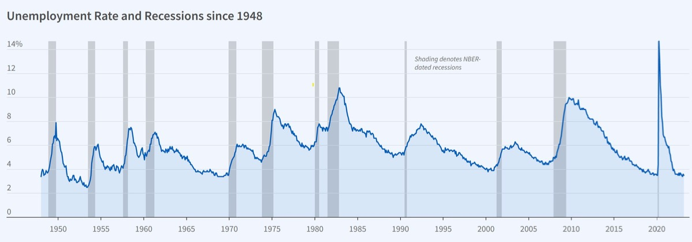
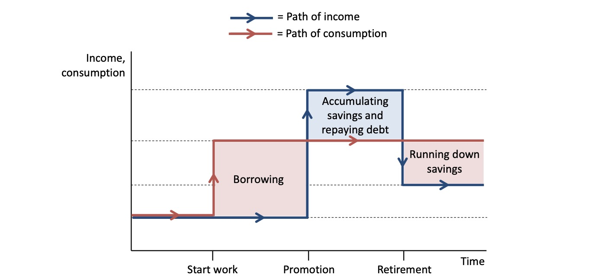
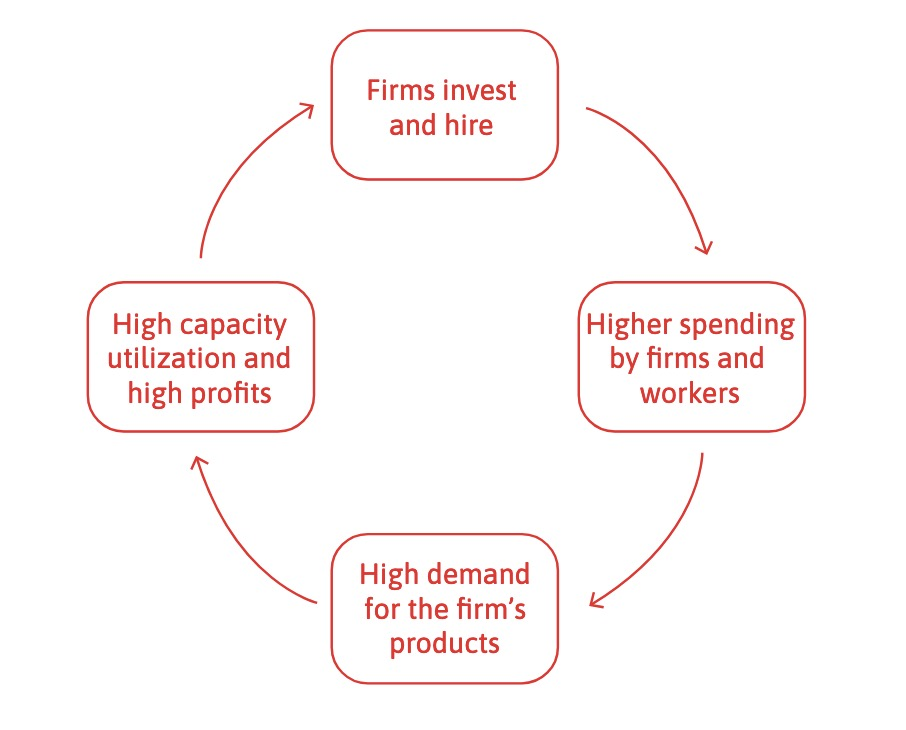

# 08.05.2023 Economic Fluctuations

[Chapter 13](https://core-econ.org/the-economy/book/text/13.html)

## Recessions and Unemployment

Connection between GDP and unemplyoment 

- but not always
- downturn GDP => higher unemployment

=> described empirically in *Okuns Law*

two Definitions of Recession

> **NBER:** period between peak and lowest point of economic activity

- significant decline in econ. activity
- economy-wide

> **alterantive:** economic output level below *normal* level

- possbile even during growth
- until prevous output reached

## Business Cycle

> **Business Cycle:** type of fluctuation (in capitalist economies) of *aggregate economic activity* between expansion / contraction

- recurrent but not periodic
- duration from one year to twelve years

## Measurig aggregate Economy

by measuirng GDP

- **Demand / Spending** (households, firms, government...)
- **Production** (value added)
- **Income** (wages, profits...)

Flaws in GDP:

- products not sold (care-arbeit)
- environmental costs not included

## Smooth Consumption

People want smooth consumption

- To have similiar quality of life
- e.g pensions for elderly

Smoothing via borrowing/lending/saving

Limits to shooting:

- credit constraint
- weakness of will
- limited co-insurance

## Volatile Investment

Why is Investment volatile?

- in Expansion: everybody wants to invest 
    - wages rise = high demand for goods
    - firms produce more to saturate demand
    - optimistic future
- in Contraction: nobody invests, pessimistic future

=> Vicious Cycles

| Contraction                               | Expansion                                 |
| ----------------------------------------- | ----------------------------------------- |
|  |  |

leads to **self-enforcing business cycles**

## Symmetric Moving Average

a mathematic filter to extract cycle from trend

- symmetric: take last values in future and past
- moving average: calculate for every time point

Example: $y_{t} = x_{t-1}+x_{t}+x_{t+1}$

## Government Expenditure

- less volative
- because not influenced by business confidence

relatively low in Germany: **aua**

## Trade Deficit

What does it mean:

- more imports than exports
- saving less than investing

Interpretations

- booming economy: higher demand than local production :thumbsup:
- foreigners invest in country :thumbsup:
- no need for saving for higher investing :thumbsup:
- flow abroad of divididends :thumbsdown:

Remember: 

- the money used for foreing trade
- is reinvested in the country (I > S)

## Inflation

> **Inflation:** Increase in the general Price level in economy

- measured by Consumer Price Index (CPI)
- based on representative basket

historic inflation

 GDP-Deflator:  implicit measure
$$
p_t^{implicit} = \frac{nominal\ GDP_t}{real \ GDP_{t-base}}
$$

- real GDP = use prices of last year
- nominal GDP = prices of this year

