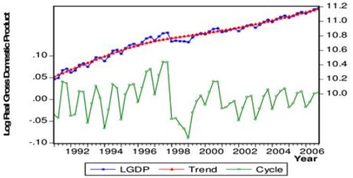

# 26.05.2023 Business Cycle

[Chapter 13 (again)](https://www.core-econ.org/the-economy/book/text/13.html#131-growth-and-fluctuations)

> **Business Cycle:** fluctuations found in the aggregate economic activity, consists of contractions and expansions

$$
Y = \underbrace{\bar{Y}}_{trend} \cdot \underbrace{Y^c}_{cyclical}
$$

let $y_t = \ln Y_t$,  $\bar{y}_t = \ln \bar{Y}_t$,  $c_t = Y_t^c$

sorted with: Hodrick-Prescott-Filter
$$
HP = \underbrace{\sum_{t=1}^T (y_t-\bar{y_t}^2)}_{\text{change in trend}}
+ \lambda \cdot \underbrace{\sum_{t=2}^{T-1}
[(\bar{y}_{t+1} - \bar{y_t}) - (\bar{y}_t - \bar{y}_{t+1})]}
_{\text{cyclical component}}
$$
$\lambda$ = weight of cyclical vs. trend

note: Trend is not always Regression, but fluctuates too! (not single straigt line!)

## Stylized Facts

### Volatility

empirical standard deviation 

$$
s_x = \sqrt{ \frac{ 1 }{T-1} \sum_t^T (x_t - \bar{x})^2}
$$
Stylized Facts of the BC

1. Real GDP moves up and down over business cycle
2. Investment is more volative than GDP (most unstable)
3. aboslute volatility of Inflation = 1/3 of GDP volatility 

### Correlation

Remember:

- Correlation can be negative / positive
- Variables can be leading and lagging

Facts:

1. Consumption / Investment = positive corr. with GDP
2. Employment = procyclical (and unempl. vice-versa)
3. Inflation = positively corr. with GPD (altough not strong!)
4. Employment / Nominal Interest = lagging variable

### Persistence

> **Persistence:** $x_t$ is not independent from $x_{t-n}$

Variables stay at point, even after others have already changed

Facts:

- GDP, Consumption, Investemennt = considerable persistence
- Employment = even more pers.

### Output Gap

Difference between real GDP and trend value 

- negative = recession
- Positive = boom

How to calculate? Insane Math...

Facts:

- Total Labor Input is procyclical, and so is TFP
- variation in labor is due to unemployment, not working hours

