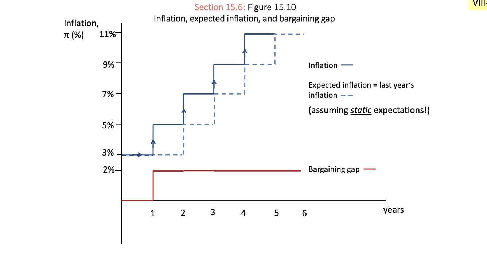
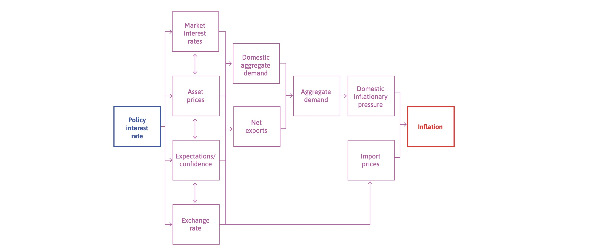

# 21.06.2023 Inflation and monetary policy

[Chapter 15](https://www.core-econ.org/the-economy/book/text/15.html)

## Inflation and Philipps Curve

> **Inflation**: Increase in general price level, measured by CPI

Real interest Rate $r = i - \pi^e_{t+1}$ (Fisher Equation)

- also measured with differnce between inflation indexed bonds and market bonds

rational expectations formulation:

- no *systematic* forecast errors
- use all relevant info (esp. expert forecasts)
- problem: incomplete models and experts

**Problems**

- volatile / high = detrimental
- investment unsafe
- income declines

**Benefits**

- effective monetary policy (no deflation)
- redistribution (creditor to debtor)

## Wage as Inflation Driver

also: Demand Pull Inflation

- Owners Power rises (e.g lower comp.) 
- employees power rises (e.g. more people join union)
- Unempl. falls

| Situation                                           | Graphic                                   |
| --------------------------------------------------- | ----------------------------------------- |
| Owners Power rises (e.g lower comp.)                |  |
| employees power rises (e.g. more people join union) |  |
| less unemployment (more power)                      |  |

Philipps Curve: Unemployment and Inflation

=> curve can shift over time (stagflation)

other reasons: Capacity Constraints (in the short run)

## AD, Unemployment and Inflation

### Labor Equilibrium shocks

> **Bargaining Gap**: Difference between real wage with highest incentive and real wage with highest profit

Calculated:

$$
inflation = \frac{ w_{ \text{wage curve}} - w_{\text{price curve}} }{w_{\text{price curve}}}
$$

translates to

Medium-Run:

- Boom (higher AD)
    - less unempl.
    - positive bargaining gap
    - positive wage-price spiral
    - Inflation 
- Recession (lower AD): vice versa

in Boom:

- workers want real wage rise and inflation combat rise
- these rises oush next years inflation etc...

### Supply Shocks

Price Shocks to the material supply:

- Firms rise prices to protect profits
- workers lose real purchasing power

=> bargaining gap 

## Monetary Policy

Transmission channels on Inflation

- market interest rates
- value of assets
- expectations
- exchange rate

Limitations:

- zero lower bound
- long maturities

=> alternative Quantitative Easing

### Interest rate Yield curve

