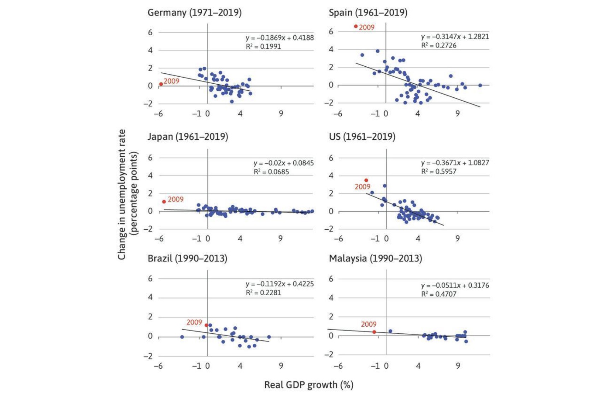

# 12.06.2023 Tutorial 3

## 1) Okuns Law

relationship between GDP & Unemployment

- all countries except Japan visible
- when GDP Growth = 0, then change in unemplyoment everywhere positive

Cases:

- more population => no clear effect on unempl. (depends)
- Technology => more work / less work (depends)

## 2) Multiplier

relative magnitude of change

- change in government stimulus 
- will translate to change in GDP

two economies:

- more credit-constrained = higher mutliplier
- more consumption smoothing = smaller multiplier

AD in an Economy

$$
AD = \underbrace{C_0}_{autonomous} + \underbrace{C_1 Y}_{dependent} + I
$$

business cycle:

- Boom
    - credit constrained household: $y \uparrow = c \uparrow$
    - smoothing household: $y \uparrow = c  \ const.$
- Recession
    - c.c HH: $y \downarrow = c \downarrow$

Multiplier in Credit-constrained Economics = higher
