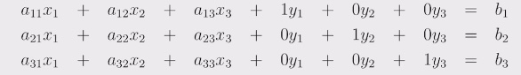
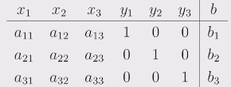
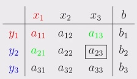
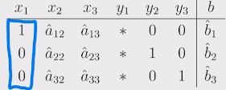
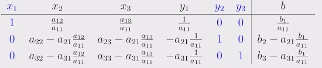
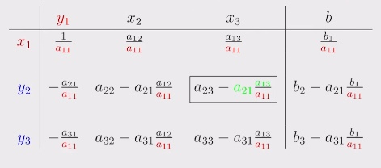
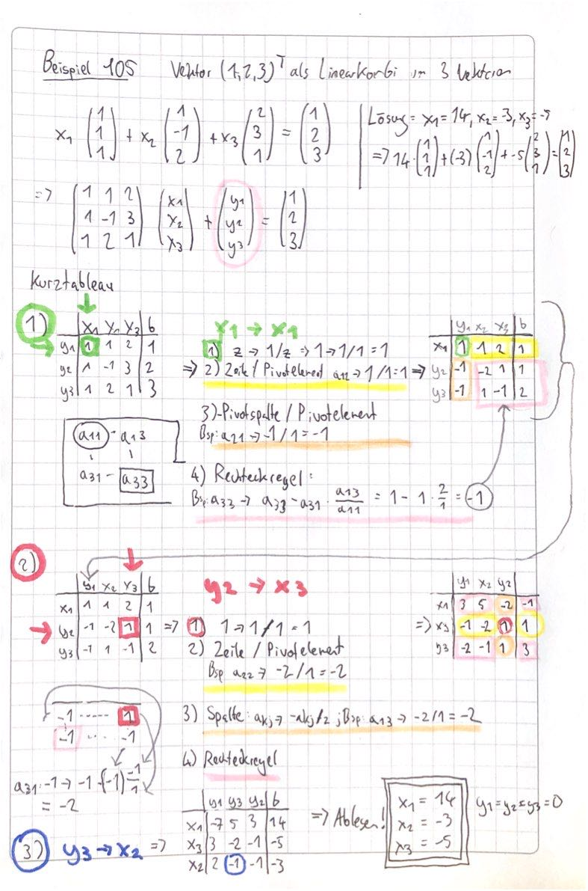

#  26.11.2021 Lineare Optimierung 1

### Elementare Basistransformation

Lösen eines Gleichungssystems *A x = b* mit x* als Lösung

Schritte zur Lösung der Gleichung: 

- Hilfsmittel *y*  einführen => $A x + I y = b$ (viele zusätzliche Variablen)
    - wenn *y = 0* -> x* ist Lösung 
    - wenn *x = 0* -> *y = b* 
- Umformung zu $I x + \tilde{A}y = \tilde{b}$ mit **Austaschverfahren**
    - wenn y = 0 -> x* ist Lösung

---

#### Beispiel Austauschverfahren: n = m = 3

in Tabellenform:  

und Kurzform: 

Ziel :

Schritte für jede Zeile:

1. $I \to I/a_{11}$ 
2. $II \to II-a_{21} * I/a_{11}$
3. $III \to  III - a_{31}*I/a_{11}$

Ergebnis:

in Kurzform: 

Schritte der Verkürzung von Langform auf Kurzform  

| Beschreibung                                             | formal                                   | Beispiel                                      |
| -------------------------------------------------------- | ---------------------------------------- | --------------------------------------------- |
| Pivotelement suchen und durch 1 teilen                   | $z \to 1/z$                              | $a_{11} \to 1 / a_{11} $                      |
| Pivotzeile / Pivotelement                                | $a_{il} \to a_{il} / z$                  | $a_{12} \to a_{12} / a_{11}$                  |
| Pivotspalte / Pivotelement und dann negativ              | $a_{kj} \to -a_{kj}/z$                   | $a_{21} \to -a_{21}/a_{11}$                   |
| auf restliches Rechteckregel (wie grün dargestellt oben) | $a_{kl} \to a_{kl} - a_{il} a_{ki} / z $ | $a_{23} \to a_{23} - a_{21} a_{13} / a_{11} $ |

---

Anwendungsbeispiel 105:

Bemerkungen:

- Inverse kann mitberechnet werden aus der Mitte der Tabelle dann! 
    - aufpassen Reihenfolge Zeilen und Spalten!
- Vektor *b* behandelt wie A => mehrere rechte Seiten können mit

