# 04.05.2022 Gütermarkt

> **Never start reasoning from price change**

- Preise sind endogen!
- Modell prüfen anhand eines exogenen Schocks

Der Gütermarkt:

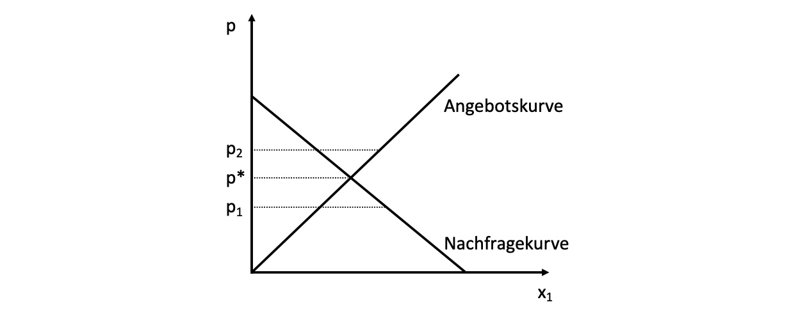

bestehend aus Nachfrage und Angebotskurve

Nachfrage nach oben = Änderung des Einkommens = marginale Zahlungsbereitschaft Änderung

Nachfrage nach rechts = neue Nachfrager

## Kurvenbewegungen

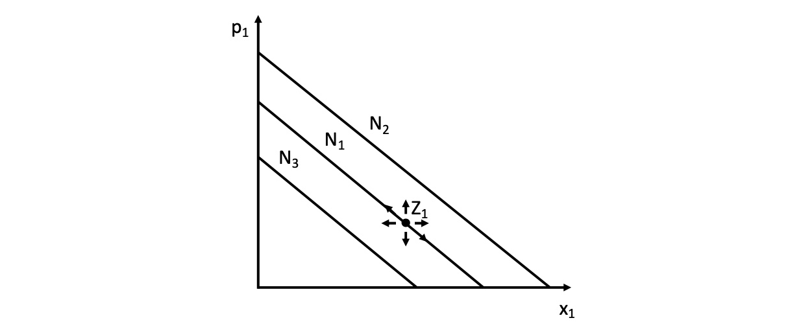

Mögliche Arten der Bewegung der Nachfragekurve (exogen)

- Einkommensteigerung: $B \uparrow  = N\uparrow = (N_1\to N_2)$
- Einkommensminderung: $B \downarrow  = N\downarrow = (N_1\to N_3)$
- sinkender Preis Subsitutionsgüter: $p_2 \downarrow = N\leftarrow \ = (N_1\to N_3) $
- steigende Anzahl Nachfrager: $N \uparrow = N \rightarrow = (N_1 \to N_3)$

Verschiebungen = $\leftarrow, \rightarrow,\uparrow, \downarrow$

Veränderungen des Preises = entlang der Nachfragekurve

*analog für Angebotskurve*

- mehr Anbieter $S \rightarrow$
- Höhere Faktorkosten/Grenzkosten $S \uparrow$
    - da angebot abhängig von MC und die sich automatisch anheben
- weniger Anbieter $S \leftarrow$
- sinkende Grenzkosten $S \downarrow$

## Schocks

hier: Nachfrageüberschuss von $D_0$ auf $D_1$

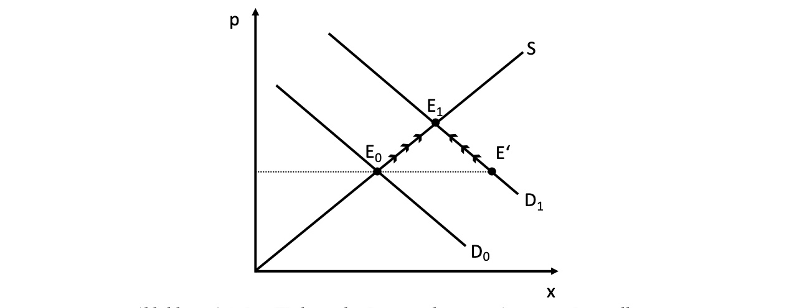

- daraufhin Erhöhung des Angebots und
- Erhöhung des Preises

=`gesellschaftlich erwünschte nicht- intendierter Folgen intentionalen Handelns`

## Markteingriffe

### Steuerinzidenz

Gütersteuer von Höhe *t* auf Angebot:

- Angebotskurve verschiebt sich um *t* nach oben
- neuer Schnittpunkt mit Nachfragekurve

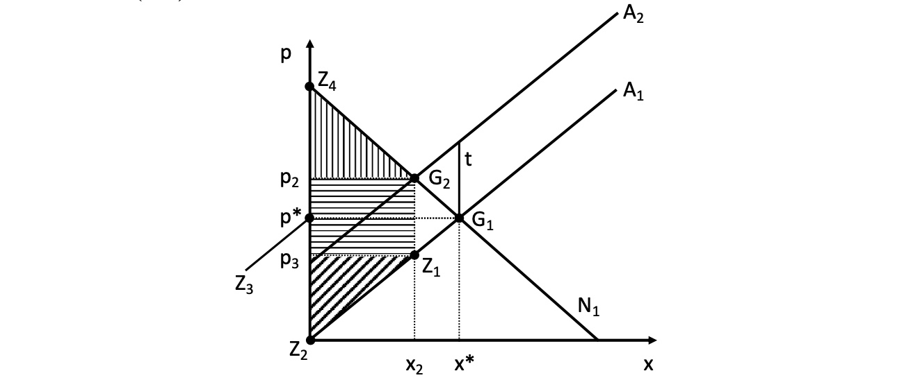

- Wohlfahrtsverlust (Deadweight Loss) zwischen $(G_1,G_2,Z_1)$
    - hier gleichmäßig getragen von Konsumenten und Produzenten
    - unabhängig davon, ob es eine Quellensteuer oder Verkaufsteuer ist (wer zahlt)
    - *genaue Verteilung der Steuerlast sonst abhängig von Elastizitäten!*
- horizontal schraffierte Fläche = staatliche Einnahmen

Verteilung der Steuerlast

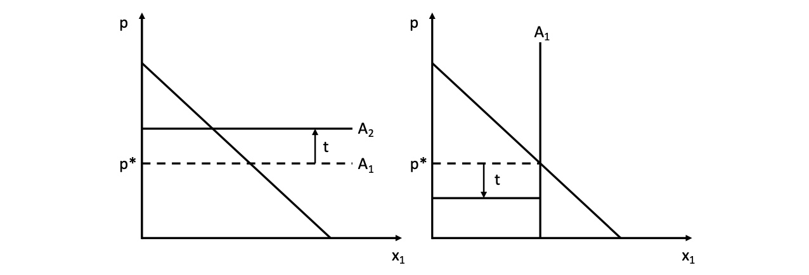

- *Elastisches Angebot (links):* zu bestimmtem Preis jede Menge des Gutes anbietbar
    - vollständige Überwälzung der Steuerlast auf Verbraucher
- *unelastisches Angebot (rechts):* egal welcher Preis, Angebot fest
    - Unternehmen tragen Steuer vollständig
- **langfristig passen Unternehmen sich an!** und Verbraucher tragen Kosten immer

=> die unelastischere Seite trägt die Hauptlast 

> **beachte:** wichtig ist die Verwendung des Steueraufkommens. Wenn es für Finanzierung öffentlicher Güter genutzt wird, kann es schlussendlich zu positiven Netto-Wohlfahrtseffekten führen.

### Subventionierung

Stücksubventionen für die Anbieter => Verschiebung der Nachfragekurve

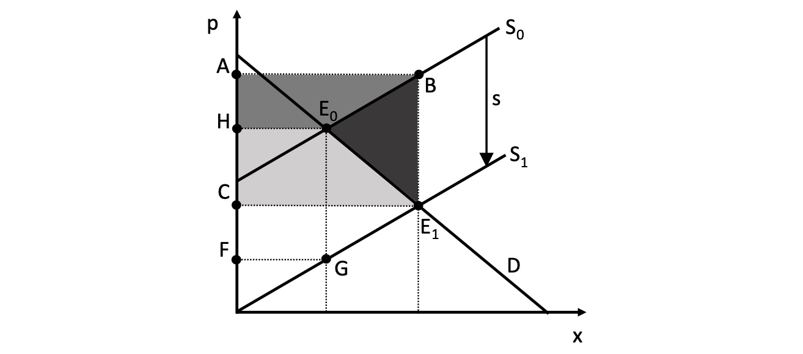

- Wohlfahrtszuwächse über/ unter dem neuen Dreieck
- aber Deadweight Loss in $B,E_1, E_0$ der Subventionen

> **beachte:** wenn Güter positive Externalitäten induzieren, kann eine Subventionierung sinnvoll sein
>
> analog bei negativen Externalitäten = Besteuerung

### Preisfestsetzungen

- Höchstpreis unter Marktpreis = Nachfrageüberschuss
- Mindestpreis über Marktpreis = Angebotsüberschuss

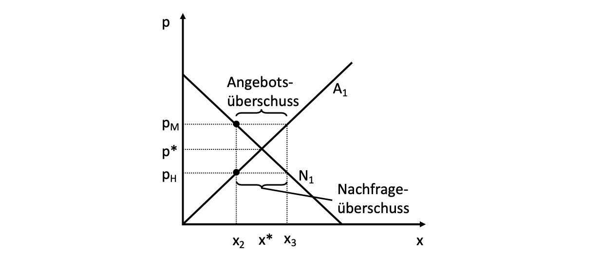

#### Wohlfahrtseffekte

eines Höchstpreises: 

- Best-Case: Konsumenten mit höchster marginaler Zahlungsbereitschaft erhalten Kauferlaubnis
    - Wegfall von leicht grauem Dreieck 
    - Gewinn von dunkelgrauem Dreieck für Konsumenten

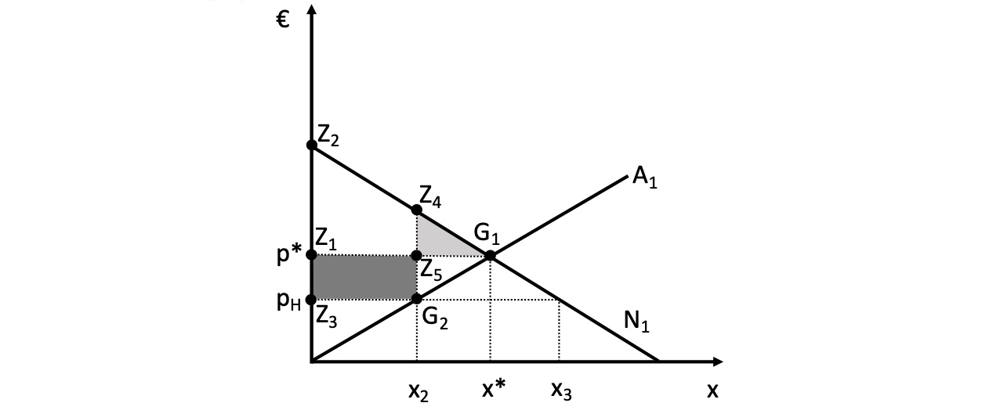

- Worst-Case: Außerkraftsetzung des Marktpreises => Verlust der Funktionsweise
    - Konsumenten mit niedriger MZB erhalten Zugang (die vor Preisgrenze vielleicht gar keine Lust gehabt hätten)

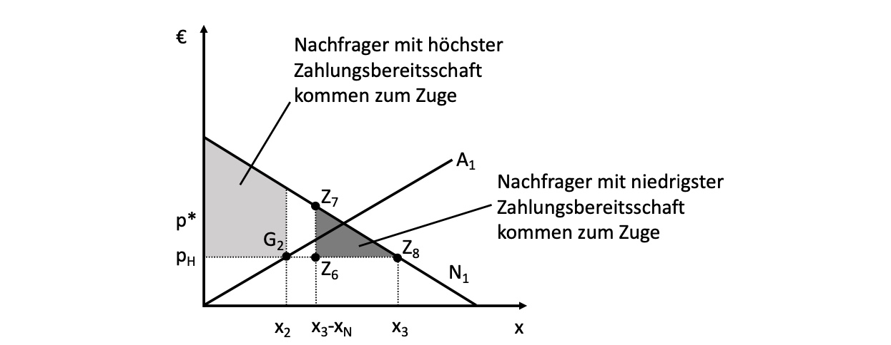

- Preisetzungen als Instrument der Sozialpolitik: 
    - im Bereich der Wettbewerspolitik meist ineffizienter als andere Maßnahmen
    - im sowieso stark regulierten Arbeitsmarkt können sie Effizienz erhöhen
    - **ist nicht immer alles so einfach wie das neoklassische Modell!**

## Übung

### Marktgleichgewicht (kurzfristig)

$$
D(p) = x = - \frac{1}{2}p+9 \\
S(p) = x = p- 6 \\
D(p) = S(p) \to - \frac{1}{2}p+9 = p- 6 \\
\frac{3}{2}p = 15  \to p = 10
$$

graphisch: 
$$
D \to p = -2x +18 \\
D_{IPO}  =  (0,18) ; D_{IPA} = (9,0)\\
S \to p = x + 6 \\
S_{IPO}  =  (0,6) ; S_{IPA} = (-6,0)\\
$$
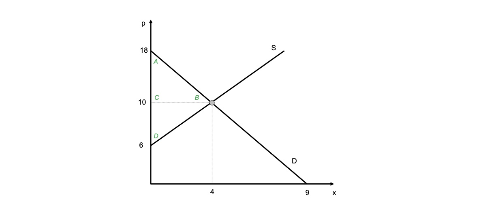

Konsumentenrente / Porduzentenrente
$$
PR = 4*4*0,5 = 8€ \\
KR = 4*8 * 0,5 = 16€ \\
PR + KR = 24€
$$

### Innovationen

Verschiebung der Angebotsfunktion auf $S(p) = p - 3$

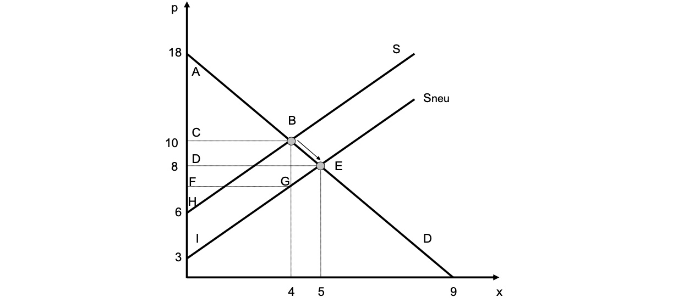
$$
KR = 5*10*0,5 = 25€ \\
PR = 5*5*0,5 = 12.5 €\\
PR + KR = 37.5€
$$
Langfristig: da $p = ATC_{min}$ Verschiebung nach unten

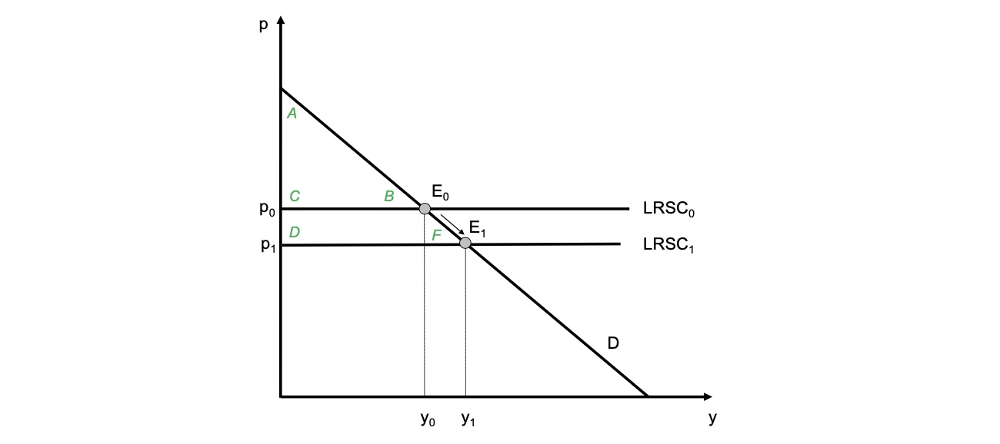

### Konsumentenbesteuerung

Stücksteuer von 3€, neue Demand-Funktion: $D\to p = -2x + 18-3$

neues Gleichgewicht: 
$$
-2x + 15 = x+6 \\
x^* = 3, p^* = 9
$$
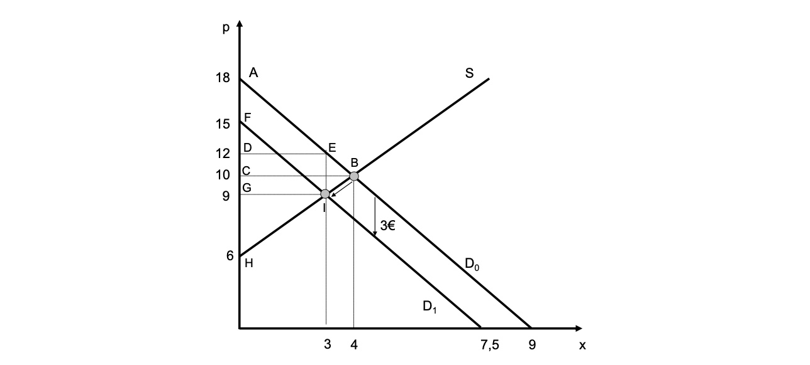

Langfristig: Verschiebung der Nachfrage um t

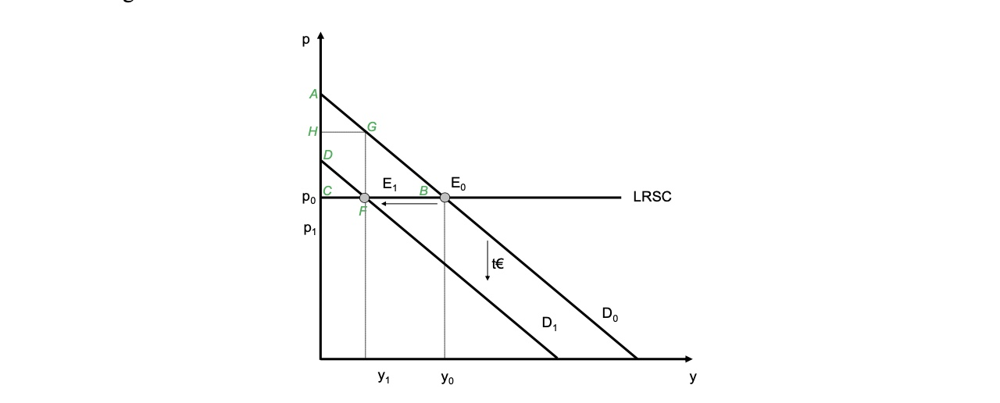

**analog Produzentensteuer**
