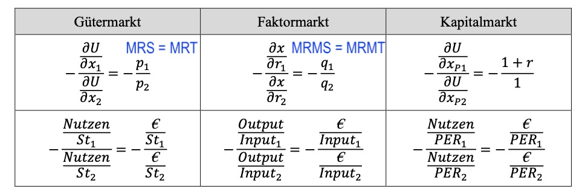

# 15.05.2022 Kapitalmarkt

*Was passiert, wenn Haushalte die Möglichkeit haben Geld anzulegen / zu leihen?*

=> Erfindung des Bankensystems!

## intertemporale Budgetbeschränkung

gegenwärtige Wert zukünftiger Auszahlungen $B = \frac{m}{(1+r)^t}$

- *m* = heutige Einzahlung
- *r* = Zins

Entscheidung eines Haushalts zwischen Gütern in zwei Perioden

- $x_{p2}, x_{p1}$ = Güter in Periode 1/2
- $m_1,m_2$ = Einkommen in Periode 1 / 2
- Preise der Güter sind konstant und gleich 1

Güterkonsum in Periode 2, wenn Haushalt in Periode 1 anlegen kann:
$$
x_{p2} = m_2 + (m_1 -x_{p1}) + r*(m_1 - x_{p1}) \\
= m_2 + (1+r) * (m_1 - x_{p1})
$$
alternativ: Haushalt kann in Periode 1 Geld leihen 
$$
x_{p2} = m_2 - (x_{p1} - m_1) - r*(x_{p1} - m_1) \\
= m_2 - (1+r)*(x_{p1} - m_1) \\
= m_2 + (1+r)*(m_1-x_{p1})
$$
= gleiche Mengenfunktion wie davor

$$
\text{B in Zukunftswerten:}\\
(1+r) * x_{p1} + x_{p2} = (1+r) * m_1 + m_2 \\
\text{B in Gegenwartswerten:}\\
x_{p1} + \frac{x_{p2}}{(1+r)} = m_1 + \frac{m_2}{(1+r)}
$$

## intertemporale Konsumpräferenzen

wie lässt sich die Präferenz eines Haushalts zwischen zwei Zeitpunkten beschreiben?

Ziel: maximiere den Gesamtnutzen in beiden Perioden

Lagrange Funktion aufstellen: 
$$
\begin{aligned}
L = U(x_{p1}, x_{p2}) &+ \lambda \ [m_1 * (1+r) + m_2 - (1+r)x_{p1} - x_{p2}] \\
&\to \frac{\partial L}{\partial x_{p1}} = \frac{\partial U}{\partial x_{p1}} - \lambda * (1+r) = 0 \\
& \to \frac{\partial L}{\partial x_{p2}} = \frac{\partial U}{\partial x_{p2}} - \lambda  = 0 \\
&\to \frac{\partial L}{\partial \lambda} = m_1 * (1+r) + m_2 - (1+r)x_{p1} - x_{p2} = 0 \\
\end{aligned}
$$
Umstellen für die Zeitpräferenzrate
$$
\implies \frac{\frac{\partial L}{\partial x_{p1}}}{\frac{\partial L}{\partial x_{p2}}}  = 1+r \text{ oder } \frac{MU(x_{p1})}{MU(x_{p2})} = 1+r \\
r = \frac{MU(x_{p1})}{MU(x_{p2})} - 1 \\
r = \frac{MU(x_{p1})}{MU(x_{p2})}- \frac{MU(x_{p2})}{MU(x_{p2})} \\
r = \bold{\tau = \frac{MU(x_{p1})- MU(x_{p2})}{MU(x_{p2})}}
$$
Analogie Betrachtungen dieser Formeln

Betrachtung der temporalen Konsumpräferenzen

- Haushalt 1: hohe Gegenwartspräferenz in Punkt $Z_1$, Verschuldung in Periode 1
- Haushalt 2: hohe Zukunftspräferenz, Kapitalanlage in Periode 1

Berechnung der Zinsrate: *Realzins = Nominalzins - Inflationsrate*

## Übung

### Aufgabe 1: intertemporaler Konsum

Konsument woll über zwei Jahre optimieren, ohne Möglichkeit anzulegen / Schulden zu machen!

Nutzenfunktion: $U(x_1,x_2) = x_1^{0.5} x_2^{0.5}$

- für Funktionsgleichung nach $x_2$ umstellen (Ordinaatenachse)

$$
\frac{U}{x_1^{0.5}} = x_2^{0.5} \to x_2 = \frac{U^2}{x_1}
$$

für *U=100* : $x_2 = 10000/x_1$

### 2 Aufgabe: Intertemporale Budgetgerade

Haushalt mit Einkommen = 100 GE pro Jahr und r=5%

Bestimmung der Gleichung der Budgetgerade:

- Steigung der Gerade = MRT = *1+r*
    - $r=0.5 \to MRT = 1.05$
- Schnittpunkt der Gerade mit Ordinate = SPO = *B+B(1+r) = B(2+r)*
    - $B=100 \to SPO = 205$
- Somit: $x_2 = -MRT * x_1+SPO = -(1+r)x_1+B(2+r)$
    - $x_2 = -1.05x_1 + 205$
    - $SPA = \frac{205}{1.05} = 195.23 $
    

graphisch: 

### Aufgabe 3: Intertemporales Gleichgewicht

Maximierungsproblem mit Lagrange
$$
\underset{x_1,x_2}{maxU} = \underset{x_1,x_2}{max}(x_1^{0.5} x_2^{0.5}) \\
s.t. \\
x_2 = -(1+r)*x_1+B(2+r)
$$
Lagrange Funktion und Ableitung: 
$$
\begin{aligned}
LF &=x_1^{0.5} x_2^{0.5} + \lambda[x_2 + (1+r)*x_1 - B(2+r)] \\
\\
\frac{\partial L}{\partial x_1} &= 0.5x_1^{-0.5} * x_2^{0.5} + \lambda(1+r) = 0 \\
\frac{\partial L}{\partial x_2} &= 0.5x_2^{-0.5} * x_1^{0.5} + \lambda= 0 \\
\frac{\partial L}{\partial \lambda} &= x_2 + (1+r)*x_1 - B(2+r) = 0
\end{aligned}
$$
Auflösen der ersten Ableitungen nach Lambda und Gleichsetzen
$$
\lambda = \frac{0.5x_1^{-0.5} * x_2^{0.5}} {(1+r)} \\
\lambda = 0.5x_2^{-0.5} * x_1^{0.5} \\
0.5x_2^{-0.5} * x_1^{0.5} = \frac{0.5x_1^{-0.5} * x_2^{0.5}} {(1+r)} \ \bigg|*2; :x_2^{-0.5} \\
x_1^{0.5} = \frac{x_1^{-0.5} * x_2^{0.5}} {(1+r) *x_2^{-0.5}} = 
\frac{x_1^{-0.5}} {(1+r)} * x_2 \ \bigg|:x_1^{-0.5} \\
x_1 = \frac{1}{(1+r)}*x_2 = \frac{x_2}{(1+r)}
$$
Einsetzen in die Lambda-Ableitung 3
$$
x_2 + (1+r)* \frac{x_2}{(1+r)} - B(2+r) = 0 \\
2x_2 - B(2+r) = 0 \\
x_2^* = \frac{B(2+r)}{2}
$$
Rücksubstitution in $x_1$ Optimum: $x_1^* = \frac{B(2+r)}{2(1+r)}$

> Das ist allgemein anwendbar für die spezifische Nutzenformel 

für B=100 und r=0.5
$$
x_1 = \frac{100*(2.05)}{2*1.05} = 97.61 \\
x_2 = \frac{100*2.05}{2} = 102.5 \\
U = x_1^{0.5} x_2^{0.5} = 97.61^{0.5}* 102.5^{0.5} = 100.025
$$

- Der Haushalt würde im ersten Jahr ~2.39 GE sparen und im zweiten Jahr das konsumieren
- Daraus zieht er einen um 0.025 höheren Nutzen als ohne Kapitalmarkt

Graphisch: 

### Aufgabe 4: Schocks

Zinsatz sinkt auf 3%, Budget bleibt

- Budgetgerade: $-(1+r)x_1+B(2+r) = -1.03x_1+203$
    - *SPO = 203, SPA = 197,1*
- neue Optima:
    - $x_2^* = \frac{B(2+r)}{2} = 101.5$
    - $x_1^* = \frac{B(2+r)}{2(1+r)} = 98.54$
    - $U = 101.5^{0.5} * 98.54^{0.5} = 100.01 $
    - Der Haushalt zeiht Nutzen aus dem Kapitalmarkt, aber weniger als davor

Graphisch: Zinsratenänderung = Drehung der Budgetgerade 

