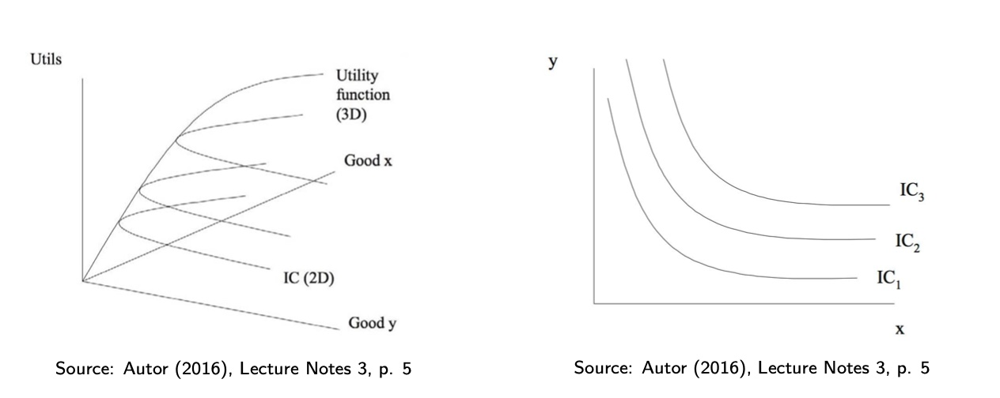
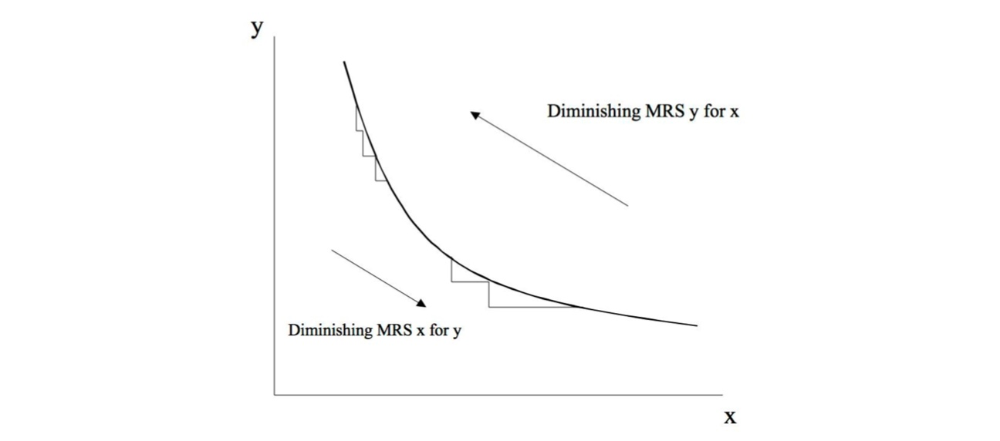

# 25.10.2022 Konsumententheorie I

im System der Neoklassik

> **Neoklassik:** Wirtschaft ist System aus Märkten, in denen Angebot und Nachfrage zusammenkommen

Akteure = *homo oeconomicus*

- nutzenmaximierend
- rational
- zukunftsschauend

in der Mikro = *Rational Choice Theory*

- **normative** Theorie
- teilweise deskriptiv/positiv = empirische Frage
- axiomatische Theorie mit Annahmen

## Präferenzen

Menschen haben **Präferenzen**

- Binär = verbindet zwei Sachen
- bspw. Anna mag Äpfel lieber als Bananen

$\succ$ = **starke Präferenz**: striktes Vorziehen X vor Y

$\succsim$ = **schwache Präferenz**: X mindestens genauso gut wie Y $\neq$ besser!

$\sim$ = **indifferent**: X genaus gut wie Y

Präferenzen sind bezogen auf Choice Set, bspw:

- A = $\left\langle \text{2 Bananen, 3 Birnen} \right\rangle$
- B = $\left\langle \text{3 Bananen, 2 Birnen} \right\rangle$

Präferenzen sind **vollständig** und **transitiv**

> **transitiv**: aus 2 Präferenzen folgt dritte$\forall A,B,C \to A \succsim B; B\succsim C \implies A \succsim C$

Bsp.: Relation "ist Vorfahr von" anhand 3 Menschen

- wenn A Vorfahre von B ist, und B Vorfahre von C, dann ist A Vorfahre von C

> **vollständig**: wenn für alle Elemente eine Relation festgelegt ist

außerdem Bedingungen:

- **Nichtsättigend**: mehr ist immer besser
- **konvexität**: Mischung aus Güter ist besser als nur ein Gut (bei gleichem Nutzen)
- **stetig:** keine Sprünge zwischen ähnlichen Bündeln

## Nutzenfunktion

> **Nutzenfunktion:** mathematische Beschreibung zur Beschreibung von Präferenzrelationen

Nicht Werte der Funktion interpretieren! (nur kardinal, nicht ordinal)

werden durch **Indifferenzkurven** visiualisiert

- gleiche Kurve = gleicher Nutzen
- unendlich viele Kurven
- sind konvex

### Grenzrate der Substitution

Bereitschaft, auf Einheiten von Gut x zu verzichten, um Gut y zu erhalten

= *Steigung der Indifferenzkurve*
$$
-\frac{dy}{dx} = \frac{MU_x}{MU_y}
$$

## Übung

Aufgabe 2: zutreffende Implikationen

- wenn $x \succ y \; \& \; y \succ z \implies x \succ z$
- wenn $x \succsim y \; \& \; y \succ z \implies x \succ z$
- wenn $x \succsim y \; \& \; y \succ z \implies x \succsim z$
- wenn $x \succ y \; \& \; y \sim z \implies x \succ z$
- wenn $x \sim y \; \& \; y \sim z \implies x \sim z$
- wenn $x \succsim y \; \& \; y \succsim x \implies x \sim y$

