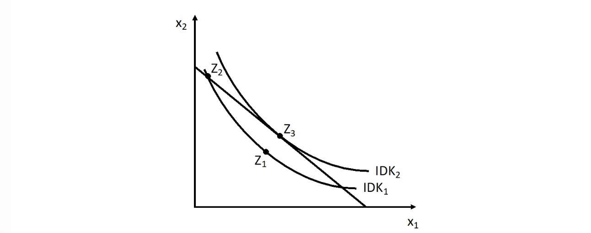
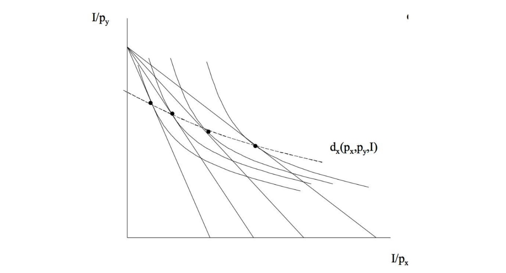

# 02.11.2022 Marshall Nutzenfunktion

Entscheidungsproblem eines Komnsumenten

- Budget I (Income)
- Preise von Gütern x,y 

Budgetbedingung $I = p_x x + p_y y$

- Budget wird vollständig ausgegeben
- Präferenz Trade off (innerer Tradeoff des Konsumenten)
    - **Grenzrate der Substitution**
- Markt Trade-off (Verhältnis der Preise)
    - **Grenzrate der Transformation**

im Optimalpunkt

- Steigung der Budgetgerade = Steigung der Indifferenzkurve

## Lagrange Ansatz

Optimierungsproblem: 
$$
\max U(x,y) \ s.t \ p_x x+ p_yy \le I \\
\to L = U(x,y)+ \lambda (I-p_x x-p_y y)
$$
Jetzt: Ableiten ($x,y,\lambda$) und 0 setzen
$$
I.\frac{\partial L}{\partial x} = \frac{\partial U}{\partial x} 
= MU_x - \lambda p_x  = 0\\
II.\frac{\partial L}{\partial x} = \frac{\partial U}{\partial y}
= MU_y - \lambda p_y = 0\\ 
III.\frac{\partial L}{\partial \lambda} = I-p_x x-p_y y = 0
$$

aus 1. und 2:
$$
\lambda = \frac{MU_x}{p_x} = \frac{MU_y}{p_y} \\
\frac{MU_x}{MU_y} = \frac{p_x}{p_y} \to MRS = MRT
$$

$\lambda$ = **Schattenpreis**

- Nutzenveränderung einer kleinen Einkommensänderung
- also leichte Lockerung der Budgetrestriktion
- nur ordinal interpretierbar!

## Marshallsche Nachfrage

> **Marshallshe Nachfragefunktion:** von Gut nachgefrage *Menge* abhängig von *Preisen* und *Einkommen*

Notation: $d_x (p_x, p_y, I)$

- Erklärung von Nachfrageänderung bei Preisänderung etc
- Math. : Menge von Tangentialpunkten zwischen Indifferenzkurven

Veranschaulichung:

### Übung dazu

Marshallsche Funktion
$$
\max U(x,y) \ s.t \ p_x x+ p_yy \le I \\
\to L = A \cdot x_1^a \cdot x_2^b+ \lambda (I-p_1 x-p_1 y)
$$
Ableitungen
$$
\begin{aligned}
I.\frac{\partial L}{\partial x} &= A \cdot a x_1^{a-1} \cdot x_2^b - \lambda p_1  = 0\\
II.\frac{\partial L}{\partial x} &= A \cdot b x_2^{b-1} \cdot x_1^a  - \lambda p_2 = 0\\ 
III.\frac{\partial L}{\partial \lambda} &= I-p_1 x-p_2 y = 0
\end{aligned}
$$
Folgerungen (I und II nach Lambda umstellen)
$$
\lambda = \frac{A \cdot a x_1^{a-1} \cdot x_2^b}{p_1} \\
\lambda = \frac{A \cdot b x_2^{b-1} \cdot x_1^a}{p_2} \\
\to x_2(x_1) = \frac{b}{a} \cdot \frac{p_1}{p_2} \cdot x_1 
$$
in III einsetzen und voilà 
$$
x_1^* (p_1,p_2, I) = \frac{I}{p_1} \cdot \frac{1}{1+ \frac{b}{a}} \\
x_2^* (p_1, p_2, I) = \frac{I}{p_2} \cdot \frac{b}{a+b} \\
$$
das sind die Optima

Schlussfolgerungen (bei Gut 1)

- steigt $p_1$, sinkt Menge von $x_1$
- wenn $I$ steigt, steigt auch $x_1$
- $p_2$ hat keinen Einfluss auf Menge für $x_1$
    - nicht immer!

## Indirekte Nutzenfunktion

gibt maximalen Nutzen bei geg. **Einkommen** und **Preisniveau** an

- aus direkter Nutzenfunktion 
- praktisch, weil man nicht andauernd Optimierungsproblem neu berechnen muss
- mit p = Preisvektor

Notation: $V(p, I) = U(x^* (I,p) , \ x*(I,p))$

