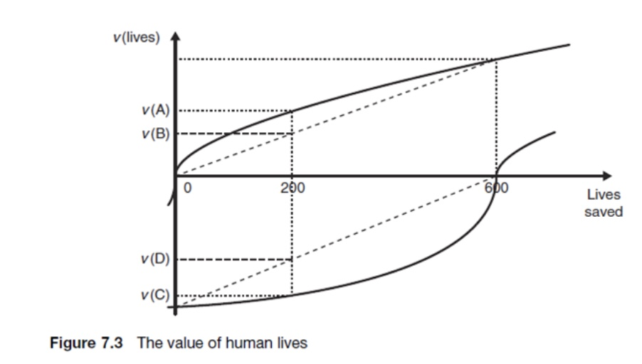
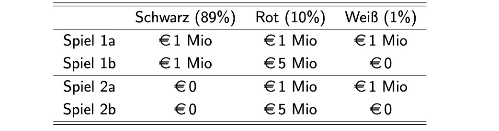
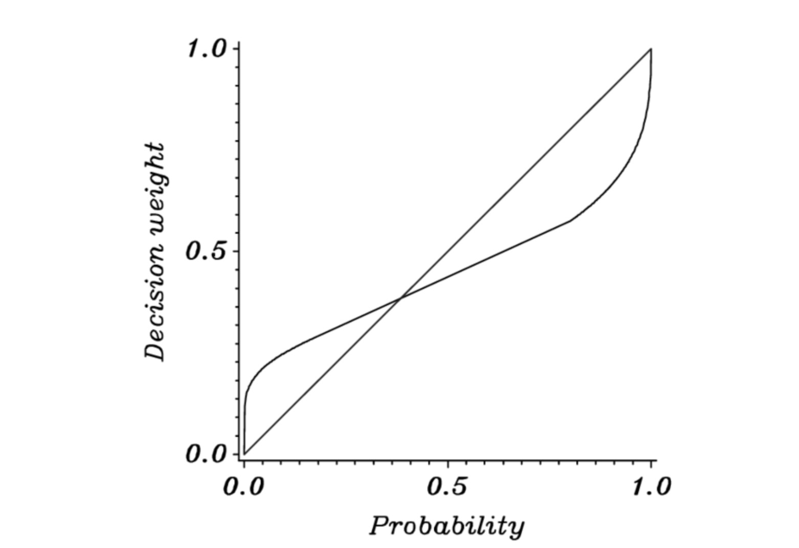
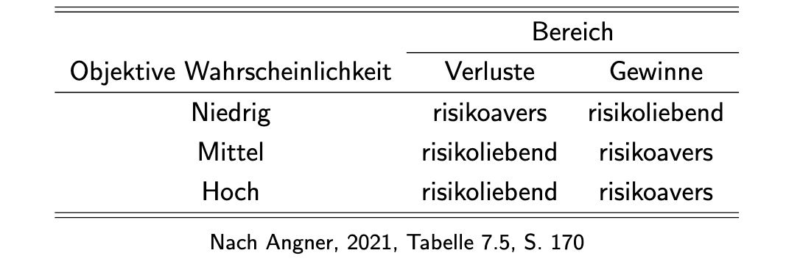

# 10.12.2022 Verhaltensökonomik II: Prospect Theory

> **Prospekt-Theorie** = neue Erwartungsnutzentheorie, entstanden aus Mängeln der neoklassischen Theorie

## Framing Effekte

`The Asian Disease Problem` nach Kahneman & Tversky 1984

neue Krankheit, an der wahrscheinlich 600 Menschen sterben

- Optionen:
    - **A**: 200 Menschen retten
    - **B**: 1/3 Wahrscheinlichkeit 600 retten, 2/3 keinen
- Gegenoptionen: (andere Formulierung):
    - **C**: 400 Menschen sterben
    - **D**: 1/3 Wahrscheinlichkeit keiner stirbt, 2/3 600 sterben

bei erster Frage = viele wählen A, bei zweiter viele D, obwohl A=C und B=D

**=> Framing und Fragestellung können Ergebnisse verändern**

> **Framing:** bewusst gesteuerte Prozess einer Einbettung von Ereignissen und Themen in Deutungsraster

Unterschied in Darstellung:
- Situation 1 = Gewinndarstellung
    - Referenzpunkt = 600 Tote
    - bei Gewinnen = risikoavers
- Situation 2 = Verlust
    - Referenzpunkt = 0 Tote
    - bei Verlusten = risikoliebend ("hab ja sowieso schon viel verloren")

verletzt Prinzip der Invarianz = keine Veränderung der Nutzenfunktion durch andere Darstellung

Nutzen dieses Wissens (Bspw. bei Referenden):

- Gewinn Framing wenn sichere Option gewählt werden soll
- Verlust Framing, wenn risikoreichere Option gewählt werden soll

## Bündelung und Mental Accounting

Beispiel Tombola:

- 2 Tickets mit 25 Euro Gewinn und 50 Euro gewinn
- ob separiert oder gesammelt = Unterschiede

Gewinne einzeln = besser (*segregated framing of gains*)

- weil verschobener Referenzpunkt
- und Konvexität Kurve = am Anfang schnellerer Nutzenzuwachs
    - $v(75) < v(25)+ v(50)$

und Verluste aggregieren für kleineren Nutzenverlust (bspw. jährliche Abrechnung)

### Mental Accounting

ob Ereignisse zusammengefasst werden oder getrennt  = Abhängig von *Mental Account*

- Konto für Arbeitszeit
- Konto für Freizeit
- ...

=> nur Zusammenfassung bei selbem Account

## Allais Paradoxon

Angebot 1:

- **1 Mio €**
- 1 Mio € mit 89%, 5 Mio mit 10%, 1% nichts

Angebot 2:

- 11% 1 Mio
- **10% 5 Mio**

Darstellung mit Urnen:

Schwarze Kugeln sollten keinen Unterschied machen!

> **Certainty Effekt:** Menschen tendieren dazu, Sicherheiten stärker zu gewichten

Übergang von Sicher zu Risiko wird stärker gewichtet

Als Übergang von unsicher zu weniger unsicher

- von 99% auf 100% mehr Gewinnverzicht
- als von 50% auf 51%

## Wahrscheinlichkeitsgewichtung

neben Nutzenfunktion jetzt **Gewichtungsfunktion** $\pi(Pr)$

- ersetzt objektive Wahrscheinlichkeiten
- $\pi(0)=0$ und $\pi(1)=1$
- für niedrige Wahrscheinlichkeiten $\pi(x)>x$
- für hohe Wahrscheinlichkeiten $\pi(x)< x$

Risikopräferenzen in der Prospect Theory

## Prospekt Theorie

Eintscheidungsprozesse in 2 Phasen

1. **Editing**
    - **Kodierung** der Gewinne/ Verluste, Referenzpunkt
    - **Kombination**: Zusammenfassung etc.
    - **Vereinfachung**: Rundung von Wahrscheinlichkeiten
2. **Evaluation**
    - Gewichtung mit Wahrscheinlichkeitsgewichtungsfunktion
    - Nutzenfunktion in S-Form anwenden

## Übung

