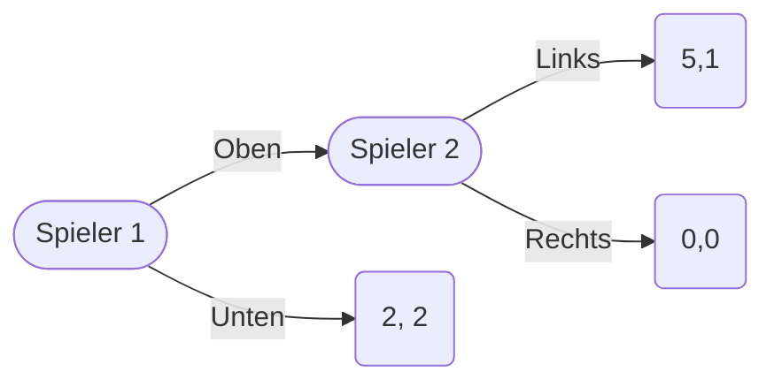

# 19.01.2023 Erweiterungen der Spieltheorie

## Nash Gleichgewicht

Beispiel Nullsummenspiel: Meetup with my Ex

- deine Ex will dich sehen, du sie aber nicht
    - Aufeinandertreffen, sie freut sich (1), du nicht (0)
- was einer gewinnt, verliert ein anderer
- kein Nash-Gleichgewicht in **reinen** Strategien
    - niemand findet irgendwas gut

### gemischte Strategien

Voraussetzung: Spieler indifferent zwischen reinen Strategien

dann Strategien mit Wahrscheinlichkeiten versehbar

- ich gehe mit Wahrscheinlichkeit *p* in Harzmensa
- Ex mit Wahrscheinlichkeit *q* in Harz und Gegenwahrscheinlichkeit in Tulpe 

indifferent: $U(Harz) = U(Tulpe)$

mein Nutzen dann: 
$$
U(H) = q \cdot 0+(1-q) \cdot 1 \\
U(T) = q \cdot 1+(1-q) \cdot 0
$$
daraus folgt: $1-q=q \implies q = \frac{1}{2}$

## Nash-Theorem

> **Nash-Theorem:** jedes endliche Spiel hat mindestens ein Nash-Gleichgewicht (ob rein oder gemischt)

- Aber: nicht immer herausfindbar (Schach)

## Trembling Hand

Erweiterung des Gleichgewichtkonzeptes

- wenn Spieler 1 denkt, Spieler 2 spielt links, dann Oben beste Antwort
- Wenn 1 denkt, 2 spielt Rechts: indifferent
- vice-versa Strategien Spieler 2

|       | L         | R          |
| ----- | --------- | ---------- |
| **O** | (**1,1**) | **0**, 0   |
| **U** | 0, **0**  | **(0, 0**) |

- zwei Gleichgewichte finden:
    1. Oben + Links
    1. Unten + Rechts, da eigentlich beide indifferent, aber dann trotzdem Treffpunkt
- das zweite GG ist auch GG, aber eigentlich unsinnig

> **Schwache Dominanz**: eine Strategie dominiert andere schwach, wenn
>
> - sie für keine Strategie des anderen Spielers schlechtere Antwort
> - aber für mindestens eine Strategie bessere Antwort

- Oben und Links sind schwach dominante Strategien

- schwach *dominierte* Gleichgewichte sind also eigentlich nicht plausibel

> **Trembling Hand Gleichgewicht:** Nash-GG, bei dem Strategien beste bleiben, wenn Spieler mit winziger Wahrscheinlichkeit $\epsilon$ andere Strategie spielt (zitternde Hand)

- Oben bleibt für Spieler 1 beste Strategie, trotz eigentlich Indifferenz
- (O, L) ist Trembling Hand GG
- (U, R) ist nicht Trembling Hand GG, da Wechsel hier sich lohnt

=> jedes Trembling Hand GG ist Nash-GG, aber nicht umgekehrt

## Teilspielperfekte Gleichgewichte

Erweiterung von *Selten* für **Sequentielle Spiele**: nacheinander Züge

- Darstellung meist mit Spielbaum (**Extensivform**)
- jeder Knoten ist aber Teilspiel

> **teilspielperfektes GG:** Strategieprofil, das in jedem Teilspiel ein Nash-GG erzeugt

=> jedes teilspielperfekte GG ist Nash-GG, aber nicht umgekehrt

### Beispiel

- wieder ObenUnten/Links Rechts, aber zuerst spielt Spieler 1

Normalform:

| Spieler 1 / Spieler 2 | L         | R         |
| --------------------- | --------- | --------- |
| **O**                 | **(5,1)** | 0,0       |
| **U**                 | 2,**2**   | **(2,2)** |

Extensivform:

- Spieler 2: würde in Teilspiel Links spielen
- Spieler 1: würde Oben spielen
- also teilspielperfektes GG nur <Oben, Links>
- das andere ist nicht teilspielperfekt

die Drohung, dass Spieler 2 R spielt, ist unglaubwürdig!

## Spieltheorie

- verschiedene Arten von Gleichgewichten
- aber nie Vorhersage, welches sich wirklihc einstellt
- basierend auf rationalen Annahmen

## Übung

Aufgabe 4: Teilspielperfekte GG

| 1 / 2 | LL       | LR       | RL        | RR         |
| :---- | -------- | -------- | --------- | ---------- |
| **U** | **3**,1  | **3**, 1 | 1, **3**  | (**1, 3**) |
| **D** | 2, **1** | 0, 0     | (**2,1**) | 0, 0       |

Gleichegwichte herausfinden:

- wenn Sp1 U spielt, höchste Zahlen an zweiter Stelle markieren (durch die Zeilen gehen)
- dann wenn Spieler 2 RR wählt, höchste in jeder Spalte an erster Stelle markieren
- dann GG finden

aus diesen beiden GG würde Spieler 1 das (2, 1) wählen, also D als erste Option
