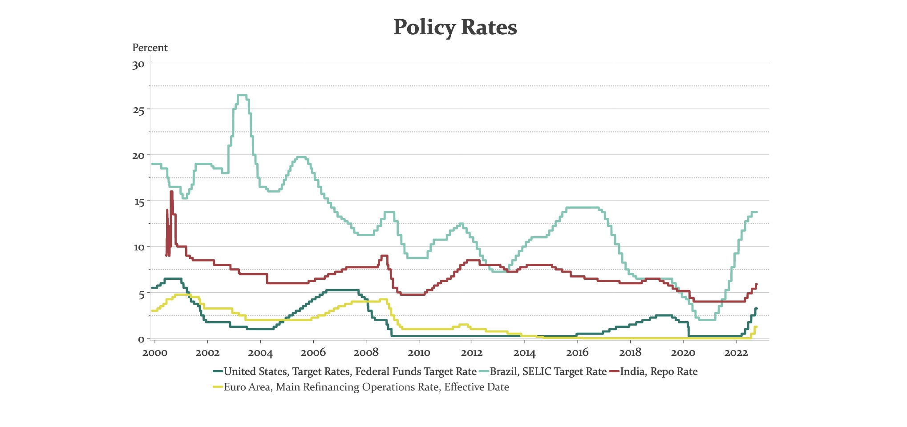

# 18.10.2022 Zentralbanken

## Geldpolitik

**Konventionell**: ZB setzt kurzfristigen Zinssatz (*overnight-interest rate*)

- niedrigere Zinsen = bessere Kreditbedingungen = mehr Investitionen
- bei zuviel Investitionen = Überhitzen der Nachfrage = Inflation
- wenn Zinssatz auf 0 => braucht unkonventionelle Geldpolitik

**unkonventionell:** Geld in Wirtschaftskreislauf bringen von ZB (*quantitative easing*)

- PEPP (Pandemic Emergency Purchase Programm) = Aktienkäufe
- PSPP (Public Sector Purchase Programm) = Staatsanleihenkäufe

### Definitionen

- Zinssatz *i*
- morgen ist Bankeinlage *1(1+i)* Euro wert
- aber ein Euro ist weniger wert geworden

Gegenwartswert einer Einlage: $PV = \frac{CF}{(1+i)^n}$

- PV = Present Value
- CF = Cash Flow

Nutzung: Berechnung des realen Returns auf Investitionen (i = Kapitalkosten)
$$
i = \Big(\frac{CF}{P}\Big)^{1/n} - 1
$$

## Anleiheinstrumente

- *einfacher Kredit*: vollständige Auszahlung am Anfang, komplette Rückzahlung + Zinsen
- *Ratenkredit*: Abzahlung mit Zinsen
- *festverzinsliches Wertpapier*: Kuponzahlungen während Laufzeit, Rückzahlung am Ende
- *Nullkuponanleihe:* Teilzahlung am Anfang, vollständige Rückzahlung Ende

### Effektivzins Wertpapier

$$
P = \frac{C}{(1+i)1} + \frac{C}{(1+i)^2} + ... + \frac{C+F}{(1+i)^n}
$$

- Preis P = 1000
- Rückzahlung F = 1000
- Kuponzahlung C = 100
- Perioden n =  2

$$
1000 = \frac{100}{(1+i)^1} + \frac{100+1000}{(1+i)^2} \implies i=10\%
$$

Beispiel 2: P=900, F=1000, C=100, n=2
$$
900 = \frac{100}{(1+i)^1} + \frac{100+1000}{(1+i)^2} \implies i=16.25\%
$$
**sinkt der Preis, steigt der Effektivzins!**

