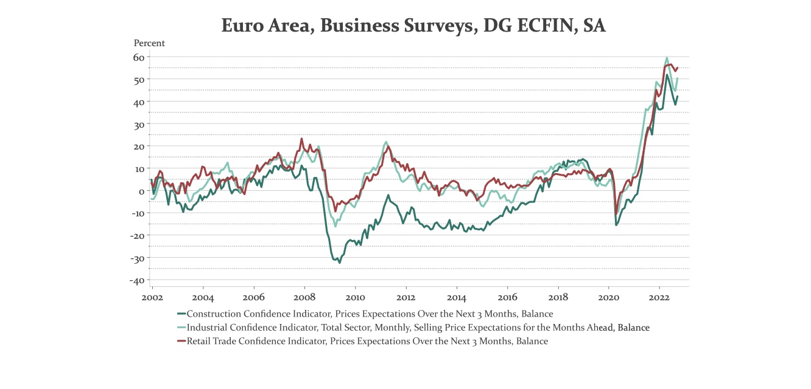

# 25.10.2022 Inflation

Inflationserwartungen im Euroraum

Reaktion der EZB = Reduktion der Anleihekäufe auf 0

=> fallende Preise => steigende Zinsen

## Zinsen und Renditen

*Ertrag = Kupon + Preisveränderung* $(P_{t+1} - P_t)$

*Rendite = Ertrag/Preis =* $\frac{C+P_{t+1}-P_t}{P_t}$

*Rendite =* $i_c+g$:

- Zinskupon $i_c = \frac{C}{P_t}$
- Wertänderung $g = \frac{P_{t+1}-P_t}{P_t}$

### Beispiel mit Laufzeit

Anleihen mit Preis = 1000, kupon = 10%

- Anleihe 1 = Laufzeit 1 Jahr
- Anleihe 2 = Laufzeit 5 Jahre

**Anleihe 1:** was passiert bei (Effektiv)-Zinsänderung?
$$
i=0.1: \; P = \frac{C+F}{(1+i)^1} =\frac{1000+100}{(1+0.1)^1}= 1000 \\
i=0.2: \; P = \frac{C+F}{(1+i)^1} =\frac{1000+100}{(1+0.2)^1}= \ 917
$$
**Anleihe 2:**
$$
i=0.1: P =  \frac{C}{(1+i)1} + \frac{C}{(1+i)^2} + ... + \frac{C+F}{(1+i)^n} \\
P = \frac{100}{(1+0.1)^1} + \frac{100}{(1+0.1)^2} + ... + \frac{1000+100}{(1+i)^n} = 1000 \\
i=0.2: P = \frac{100}{(1+0.2)^1} + \frac{100}{(1+0.2)^2} + ... + \frac{1000+100}{(1+2)^n} = 714
$$
**=> je länger die Laufzeit, desto stärker sinkt der Preis bei Zinssteigerung**

= Abdiskontieren der zukünftigen Zahlungen
$$
R_1 = \frac{C}{P_t}+ \frac{P_{t+1}-P_t}{P_t} = \frac{10}{1000}+ \frac{917-1000}{1000} = 1,7\% \\
R_2 = \frac{10}{1000}+ \frac{741-1000}{1000} = -15,9\% \\
$$
**Längerfristige Papiere = höheres Risiko**

## Realzinsen

**Fischer Gleichung:** Realzins = Nominalzins - Inflationserwartungen: $i_r = i-\pi^e$ 

Unterscheidung

- Ex ante Realzins = berücksichtigt Erwartungen
- Ex post = berücksichtigt realisierte Inflation

wichtiger Zins = realer Effektivzins

- steigen Erwartungen, verlangen wir höheren effektiven Nominalzins
- höherer Nominalzins => sinkender Papierpreis

**höhere Inflationserwartung => Rückgang Anleihepreise**

# Übung

### 1b) 

Effektivzins Berechnung: mit pq Formel

- P = 900
- F = 1000
- $C = 100 \to i_c = 0.1$
- t = 2

$$
900 =  \frac{100}{(1+i)1}+ \frac{1100} {(1+i)^2} \\
0 = \underbrace{\frac{100}{900}}_p(1+i) + \underbrace{\frac{1100}{900}}_q(1+i)^2 \\
(1+i)_{1/2} = \frac{p}{2} \pm \sqrt{\frac{p}{2}^2-q} \\
i_{1/2} = -1 + 0.0556 \pm 1.11069\\
\implies \bold{i_1 = 16.25\%} ;i_2 = -200\%
$$

### **1d)** 

höhere Nominalverzinsung = höherer Preis => gleicher Effektivzins wegen *Arbitrage*

### **2)** verschiedene Arten + Berechnung

mit Werten aus der vorherigien Aufgabe: $P=900; C=100; t=2; F=1000$

**Nullkuponanleihe:**
$$
C = 0 \to P = \frac{F}{(1+i)^t} \\
900 = \frac{1000}{(1+i)^2} \\
(1+i)^2 - \underbrace{\frac{1000}{900}}_q = 0 \; \Big| \ p=0 \\
i_{1/2} = \pm\sqrt{\frac{1000}{900}} \\
\bold{i_1 = 0,9486}, i_2 = -0.9486
$$
bei einem einfachen Kredit ist das genau gleich! (nur anders gedacht)

**Ratenkredit:** 
$$
F = 0 \to 900 = \frac{100}{1+i} + \frac{100}{(1+i)^2} \\
(1+i)_{1/2} = \frac{100}{900} \pm \sqrt{\frac{100}{900}^2-\frac{100}{900}} \\
\bold{i_1 = -0.6065}
$$
is nen schlechtes Geschäft *alter*

### 3) Verkauf einer Staatsanleihe

Verkauf vor Ende der Restlaufzeit

- $t_{Rest} = 1$
- F = 5000
- C = 8%
- $i_1$ = 10% (ex ante)
- $i_2$ = 15% (ex post)

Rendite = Ertrag +  Wertänderung: $R = i+g = \frac{C}{P_t} + \frac{P_{t-1} - P_t}{P_t}$

Wir kaufen im Jahr vor Ablauf und verkaufen nächstes

- berechnen Kurswert dieses Jahr und nächstes Jahr
- berechne Ertrag bei Verkauf dieses Jahr
- berechne Wertverädnerung, den Papier bis nächstes Jahr haben wird
- dann Rendite

$$
P_{t_1} = \frac{C+F}{1+0.1} = 4909.0909 \\
P_{t_2} = \frac{C+F}{1+0.15} = 4695.65 \\
i_c = \frac{i(=0.08) \cdot F(=5000)}{P_t(=4905.0909)} ?= 0.08148 \\
g = \frac{P_{t-1}-P_t}{P_t} = -0.0435 \\
R = i_c + g = 0.08148 - 0.0435 = 0.038
$$

**je näher Staatsanleihe an Ende, desto mehr nähert sich Kurswert dem Nennwert an**

### 4) Inflationserwartung

Fischer = Effektivzins - Erwartung 

- Erwartung 1 = 1%
- Erwartung 2 = 3%
- Effektivzins der Anlage = 5%

$$
i_r = 5-1 = 4\% \\
i_r = 5-3 = 2 \%
$$

1. die Investoren wollen aber Realzins beibehalten
2. Die Nominalzinsen müssen steigen
3. ergo die Preise fallen
