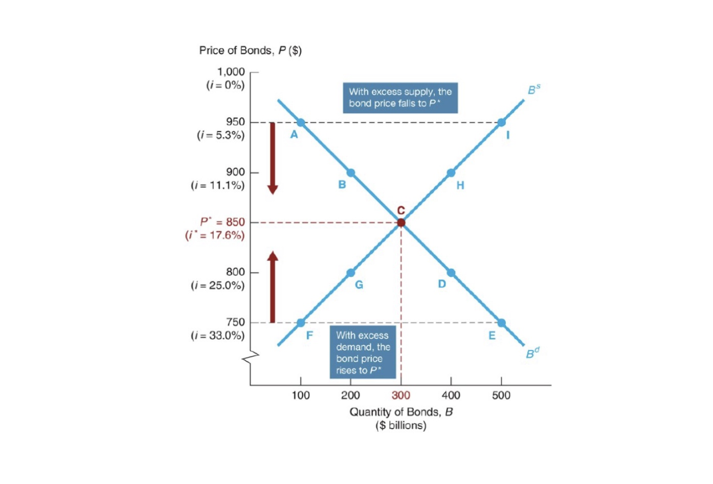
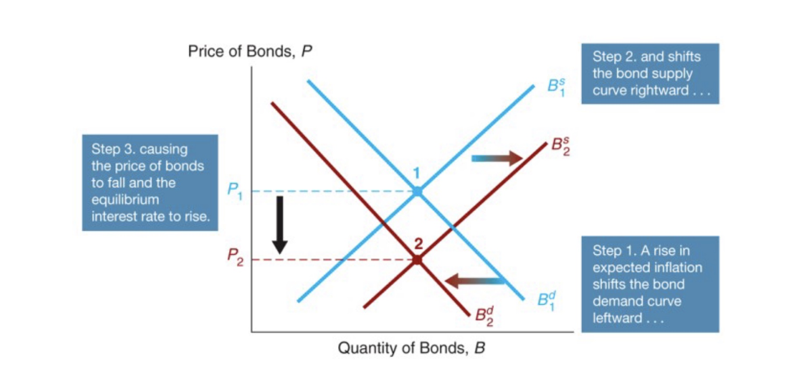
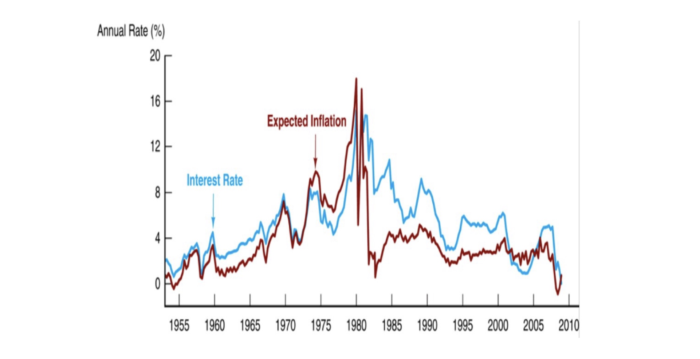
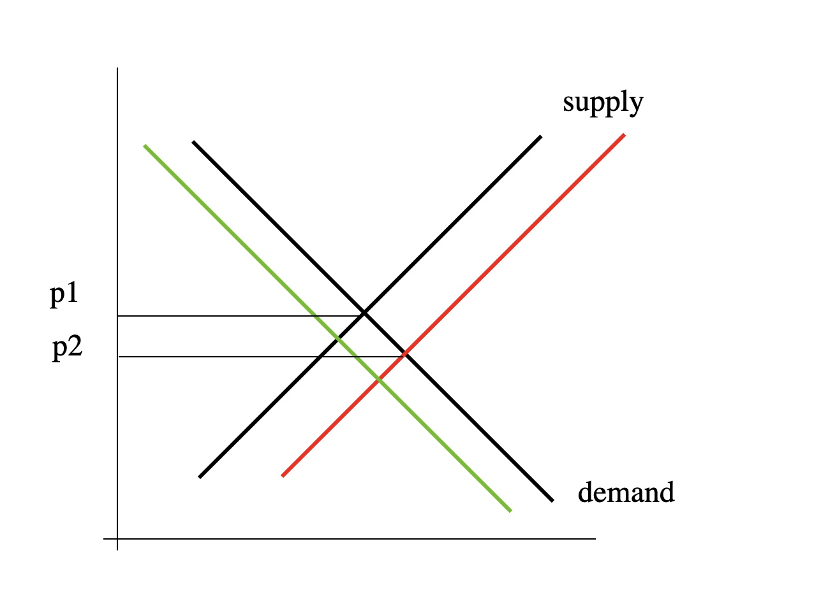

# 01.11.2022 Anleihenmarkt

Erinnerung:

- Preis und Effektivzins = negativer Zusammenhang
- Wichtig ist reale Verzinsung = abhängig von Inflationserwartungen

## Zinsbildung

Beispiel:

- Nullkuponanleihe, einer Periode Laufzeit
- F = 1000

$$
\text{Rendite } i = \frac{F-P}{P}
$$

Unterschiedliche Punkte der Nachfragekurve:

- mit Ausgedachten Nachfragen nach Bonds = $B^d$

- $P = 950, i= \frac{F-P}{P}=\frac{1000-950}{950} = 0.053, B^d = 100 \gets \text{Annahme}$
- $P = 900, i= \frac{F-P}{P} = 0.111, B^d = 100 \gets \text{Annahme}$
- ...

Nachfrage: 

- niedriger der Preis = höhere Nachfrage (höhere Zinsen)
- niedriger Preis = niedrigeres Angebot

## Verschiebung der Kurve

Bisher: nur entlang der Kurven 

Jetzt: Verschiebung der Kurven durch externe Faktoren

- Verschieben der Nachfrage
    - Konjunktur = Kurve nach rechts
    - Inflation = Wert der Auszahlung sinkt = Kurve nach links
- Verschieben Angebot
    - Inflation = Wert der Rückzahlung sinkt = Kurve nach rechts
    - Profitabilität steigt = Kurve nach links

Inflationserwartungen und Markt 

Fischer Effekt empirisch belegt: Inflationserwartungen und Zinsen 

## Konjunktur

in Aufschwungphasen steigen die Zinsen = Angebotseffekt dominiert

- Unternehmen wollen mehr Geld
- stärker als die veränderte Situation der Haushalte
- höhere Zinsen

## Quantitative Easing

Die Anleihekaufprogramme der EZB , bspw PEPP (Pandemic Emergency Purchase Programm) pumpen viel Geld in den Anleihemarkt

- steigert den Preis der Anleihen (meist Staatsanleihen)
- ceteribus paribus senkt die Zinsen

Kalkül:

- kurzfristige Zinssätze lagen schon bei 0%
- weitere Lockerung geht nur so
- reduziert Spread zwischen Zinsen für verschiedene europ. Staaten

## Übung

Der Anleihemarkt mit Bondangebot $B^{supply}$ und Nachfrage $N$

auf Nachfrageseite mögliche Szenarien

| Situation                                       | Nachfrage | Preis          |
| ----------------------------------------------- | --------- | -------------- |
| Vermögen steigt                                 | $N \to$   | $P \uparrow$   |
| erwartete Rendite sinkt                         | $N \gets$ | $P \downarrow$ |
| Inflationserwartung steigt                      | $N \gets$ | $P \downarrow$ |
| Risiko steigt                                   | $N \gets$ | $P \downarrow$ |
| relative Liquidität steigt (zu andern Anleihen) | $N \to$   | $P \uparrow$   |

Zinsen im Aufschwung:

- Nachfrage nach Geld auf Unternehmensseite steigt 
- mehr Anleihen werden angeboten
- Preis steigt => Zinsen steigen
- Die Nachfrage nach Bonds kommt erst langsam hinterher

Anstieg der Erwarteten Inflation:

- reale Finanzierungskosten sinken: $B^{supply} \to$
- Erwartete Renditen sinken führt zu  $N \gets$

Letztendlich: Preise sinken (doppelt)

