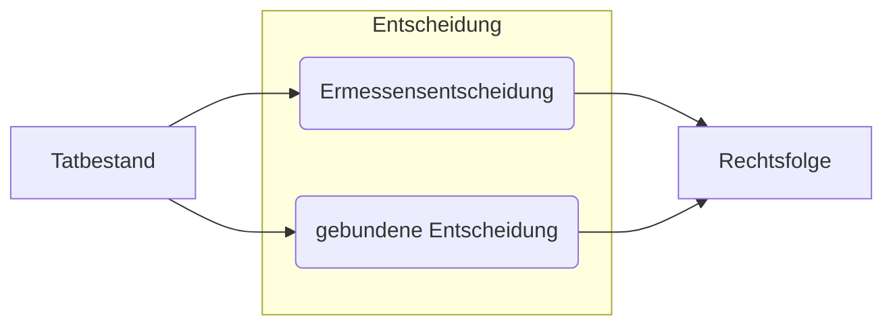
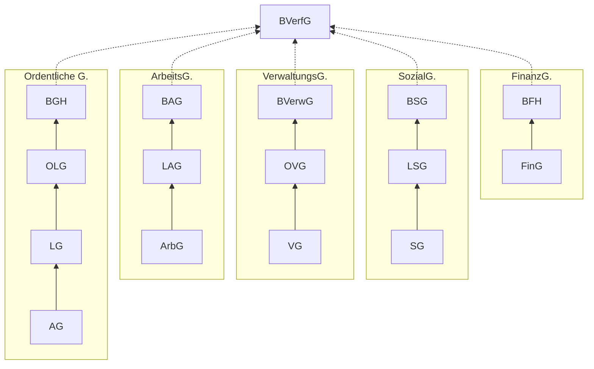

# Zusammenfassung Öffentliches Recht

Zusammenfassung für das Modul *"Öffentliches Recht für Wirtschaftswissenschaftler:innen"*

Übersicht:

- [Öffentliches Recht](#Öffentliches-recht)
    - [Abgrenzung](#abgrenzung)
    - [Rechtsnorm](#rechtsnorm)
    - [Subsumtion](#subsumtion)
    - [Rechtsebenen](#rechtsebenen)
    - [Auslegung](#auslegung)
- [Verfassungsrecht](#verfassungsrecht)
    - [Staatsorganisationsrecht](#staatsorganisationsrecht)
    - [Grundrechte](#grundrechte)
    - [Verfassungsprozessrecht](#verfassungsprozessrecht)
- [Verwaltungsrecht](#verwaltungsrecht)
    - [Verwaltungsakt](#verwaltungsakt)
    - [Staat & Wirtschaft](#staat-amp-wirtschaft)
- [Europarecht](#europarecht)

# Überblick

## Abgrenzung

|                 | öffentliches Recht             | Strafrecht       | Zivilrecht                     |
| :-------------- | :----------------------------- | :--------------- | :----------------------------- |
| *Involvierte*   | Staat - Bürger / juris. Person | Staat - Bürger   | Bürger - Bürger                |
| *Handlungsform* | subordinativ                   | subordinativ     | Augenhöhe                      |
| *Handlungsart*  | Verwaltungsakt, Verordnung     | Strafe, Geldbuße | Vertrag, Kündigung (einseitig) |
| *Beispiel*      | VwVfG                          | StGB             | BGB                            |

## Rechtsnorm

## Subsumtion

Schritte:

1. Hypothese
2. Definition
3. Subsumtion
4. Schlussatz

## Rechtsebenen

Rechtsfolge:

1. Art 79. GG
2. Primäres Europarecht: EUV,AEUV
3. Grundgesetz
4. Formelle Gesetze des Bundes, Sekundärrecht EU, transformiertes Völkerrecht
5. VO des Bundes
6. Verfassung der Länder
7. formelle Gesetze der Länder
8. VO der Länder
9. Satzung der Länder / Seöbsverwaltungsträger

Fomelles vs Materielles Gesetz:

- **formelles**: Gesetze aus förmlichen Gesetzgebungsverfahren der Legislative
- **Materielles** Gesetz: allgemeine Rechtsnorm, beispielsweise VO der Exekutive

Normenkollisionen und Lösung

- **Anwendungsvorrang:** mehrere Normen regeln denselben Sachverhalt
    - Untergeordnete Norm ist nicht automatisch unwirksam, nur **nicht angewendet**
    - *lex specialis derogat lex generali* und Subsidiarität
    - Bsp.: An [Kreuzungen](https://www.wikiwand.com/de/Kreuzung_(Verkehr)) und [Einmündungen](https://www.wikiwand.com/de/Einmündung) hat die [Vorfahrt](https://www.wikiwand.com/de/Vorfahrt), wer von rechts kommt. Das gilt nicht, wenn die Vorfahrt durch [Verkehrszeichen](https://www.wikiwand.com/de/Verkehrszeichen) besonders geregelt ist […].“ 
        - spezielles Gesetz für Verkehrschilder hat dann Vorrang
- **Geltungsvorrang**: mehrere Normen mit Widerspruch
    - widersprechende / nachrangige Norm ist **ungültig**
    - *Lex superior derogat legi inferiori*
    - Bundesrecht bricht Landesrecht, bspw Todestrafe

## Auslegung von Recht

> **Auslegung:** Begründung, warum dieses oder jenes Verständnis des Gesetzes vorzugswürdig ist

Ermittlung des Inhaltes eines Gesetzes

Methoden der Auslegung:

- **Wortlaut:** Wortlaug und Wortsinn
- **Systematik:** Verbindung zu anderen Normen
- **Historie**: Wille des Gestzgebers bei Norm
- **Telos** : Sinn und Zweck einer Norm

Außerdem: richtlinienkonforme Auslegung, verfassungskonforme Auslegung

# Verfassungsrecht

- Staatsorganisationsrecht
- Grundrechte
- Verfassungsprozessrecht

## Staatsorganisationsrecht

regelt Prinzipien, Aufbau, Funktionsweise des Staates

definierender Paragraf:

> **Art. 20 Grundgesetz:** 
>
> (1) BRD ist ein demokratischer und sozialer Bundesstaat
>
> (2) Staatsgewalt geht vom Volke aus , in Wahlen und Abstimmungen
>
> (3) Rechtsprechung folgt verfassungsmäßiger Ordnung

daraus entstehende Prinzipien

1. Republikprinzip
    - Macht geht vom Volke aus
2. Sozialstaatsprinzip
    - gleiche Lebensverhältnisse und soziale Gerechtigkeit `Art. 72 GG`
3. Demokratieprinzip
    - Wahlgrundsätze: frei, geheim, unmittelbar, gleich, allgemein `Art. 38 GG`
4. Bundesstaatsprinzip
    - Abgrenzung Länder | Bund nach `Art. 28 GG`
5. Rechtstaatprinzip
    - Verhätlnismäßigkeit, faire Verfahren, Rechtsweg, Willkürverbot

### Organe

- Bundestag `Art. 38ff. GG`
- Bundesrat `Art. 50ff. GG ` 
- Bundespräsident `Art. 54ff. GG` 
- BVerfassungsgericht `Art 93ff. GG`

### Gesetzgebungskompetenz

*Grundsatz*: Länderkompetenz gem `Art. 70 I GG`

**Auschließliche** Bundeskompetenz: `Art. 71, 73 GG`

- Auswärtiges, Währung, Zoll etc

**Konkurrierende** Bundeskompetenz: `Art. 72, 74 GG`: öff. Fürsorge, Verhinderung übertragbare Krankheiten 

1. Absatz: *Kernkompetenzen* nichtgebrauchmachen des Bundes 
2. *Erforderlichkeitskompetenzen*: für gleichwertige Lebensverhätlnisse erforderlich
3. *Abweichungskompetenzen*: Länder dürfen abweichen bspw. bei Jagdrecht

**ungeschriebene** Bundeskompetenz

- Natur der Sache (Nationalfeiertage)
- Sachzusammenhang (bundesweite politische Parteien)
- Annex

## Grundrechte

Abgrenzung zu Staatsziele = abstrakt, nicht einklagbar, wie:

- Umwelt / Tierschutzstaat 
- Europäische Integration
- Gleichberechtigung

### Unterteilung

- **Freiheitsrechte** `Art. 4,6,8 GG`
    - Versammlung, Glaube ...
- **Gleichheitsrechte**: `Art. 3 GG`
    - Mann / Frau, ohne Herkunft, etc
- **Teilhaberechte** `Art. 17 GG`
    - gleichwertige Lebensverhältnisse

### Funktion

- **Abwehrrechte** (*status negativus*) der Bürger gegen den Staat
- **Leistungsrechte** (*status positivus*) der Bürger von dem Staat
    - bspw. Kindereziehung, Schulwesen
- **Mitwirkungsrechte** des Bürgers im Staatswesen
    - Wahlrecht Petitionsrecht
- **Einrichtunsgarantien:** Gewährleistung von 
    - Institutionsgarantie (privat): Ehe, Eigentum
    - institutionelle Garantien (öfftl. rechtl.): Uni, Religionsunterricht

Drittwirkung von Grundrechten = strahlen in den privaten Raum aus, bspw. Diskrimierungsverbot auf Arbeit

### Prüfschema Freiheitsgrundrechte

---

:one: Eröffnung des Schutzbereichs

- **persönlicher Schutzbereich** (wer ist betroffen?)
    - Grundrechtsberechtigung: natürliche Personen (jeder / Deutsche) ;juristische Personen `Art.19 III GG`
    - Grundrechtsverpflichtet: Staatsgewalten / im Auftrag des Staates
- **sachlicher Schutzbereich** (was ist betroffen?)
    - ist es ein Tatbestand?

im Zweifel als Grundrecht auslegen (*in dubio pro liberte*)

---

:two: Eingriff

> **moderner Eingriffsbegriff**: jedes staatliche Handeln, das dem Einzelnen ein Verhalten, welches zum Schutzbereich gehört, ganz oder teilweise unmöglich macht

---

:three: Rechtfertigung

- **Schranken:** Vorschrifte, die das Grundrecht beschränken
    - einfacher Gesetzesvorbehalt: *"kann durch Gesetz beschränkt werden"* `Art 8 GG`
    - qualifizierter Vorbehalt: wie einfach, aber mit genaueren Beschränkungen `Art. 11 GG`
    - verfassungsimmanente Schranken: berührt andere Verfassungsgüter `Art. 5 II`
- **Schranken-Schranken:** Verhältnismäßigkeit der Schranke

> **Verhältnismäßigkeit:** Kollidierende Rechtsprinzipien werden in Verhätlnis zueinander gesetzt, wenn wahrende Interesse schwerer wiegt als aufgeopferte

Abwägungsprozess

1. legitimer Zweck
2. Geeignetheit
3. Erforderlichkeit
4. Angemessenheit

bei einzelnen Grundrechten gibt es genauere Schranken, Verhältnismäßigkeiten etc

## Verfassungsprozessrecht

befasst sich mit den Gerichtsverfahren vor Verfassungsgerichten

Gerichtsorganisation nach `Art. 92. GG`

**merke:** BVerfG ist keine Superrevisionsinstanz (die können Fälle ablehnen)

### Verfahren vor dem BVerfG

- Verfassungsbeschwerde nach `Art. 93 I 4a` (jedermann):
    - Öffentliche Gewalt greift in Grundrechte ein
- konkrete Normenkontrolle `Art. 100`: 
    - Überprüfung eines Gesetzes nach Richtervorschlag 
- abstrakte Normenkontrolle `Art. 93 I 2`: 
    - Überprüfung eines Gesetzes nach Aufruf durch Parlamente
- Organstreit `Art. 93 I 1`: 
    - zwischen staatlichen Stellen
- Bund-Länder Streit `Art. 93 I 4`:
    - Kompetenzabrenzung zwischen BUndesländern spezifisch

### Zulässigkeitskriterien

- Zuständigkeit des BVerfG (nach oben genannten Kriterien)
- Beschwerdegegenstand (Akt des Staats gegen GR)
- Beschwerdefähigkeit (grundrechtsberechtigt)
- Beschwerdebefugnis (man selber wurde in GR verletzt)
- Rechtswegerschöpfung (Subsidiaritätsprinzip)
- Verfahrensfähigkeit (Eltern für Kinder etc)
- Frist von 1 Jahr (Gesetz)

# Verwaltungsrecht

> **Verwaltung:** jedes administrative Handeln, das dem Vollzug öffentlich-rechtlicher Vorschriften dient

jedes Handeln bedarf einer Rechtsgrundlage, Verwaltungsrecht => Regeln für staatliches Handeln

## Verwaltungsakt

> ***Verwaltungsakt §35 VwVfG:***
>
> jede Verfügung, Entscheidung oder andere **hoheitliche Maßnahme**, die eine **Behörde** zur **Regelung eines Einzelfalls** auf dem Gebiet des **öffentlichen Rechts** trifft und die auf unmittelbare Rechtswirkung **nach außen** gerichtet ist

=> Haupthandlung Verwaltung gegen individuellen Bürger, bspw Bußgeldbscheid

Rechtsfolgen eines Verwaltungsaktes

- Festlegung konkreter Rechte / Pflichten im Einzelfall
    - bsp. Fällen eins Baumes in deinem Garten
- Bestandskraftfunktion
    - wenn nicht rechzeitig Widerspruch, dann Geltung
- Vollstreckungsfunktion
    - wenn nicht Baum gefällt, dann gibts Schläge

### Klagen gegen VA

Prüfungschema:

1. Verwaltungsrechtsweg
2. Statthaftigkeit
3. Klagebefugnis
4. Vorverfahren (innerhalb der Behörde) `§68 VwGO`
5. Prozessfähigkeit
6. Form & Frist

Klagearten:

- **Anfechtungsklage ** `§42 Abs. 1 2 VwGO`: Kläger:in möchte, dass belastender VA aufgehoben wird (bspw. Aufhebung Gebührenbescheid)
- **Verpflichtungsklage** `§42 Abs. 1 2 VwGO`: Kläger:in möchte dass VG einen begünstigenden VA erlässt (bspw. Gehnehmigung)

### Ermessen

Behörden haben bei Entscheidungen meist Ermessen nach `§40 VwVfG`, dieses Ermessen kann von Gerichten überprüft werden `§114 VwGO`

Ermessensfehler:

- Ermessensunterschreitung / nichtgebrauch
- Ermessensüberschreitung
- Ermessensfehlgebrauch
- Ermessensreduzierung auf Null

## Staat & Wirtschaft

Handlungen des Staates in der Wirtschaft:

1. Staatliche Spielregeln (**Gewerbeordnung**)
2. Staat Mitspieler (**Vergaberecht**)
3. Staat beinflusst Spielergebnis  (**Steuern**...)

### Gewerbeordnung 

> **Gewerbe:** jeder auf Gewinnerzielung gerichtete, auf Dauer angelegte selbstständige Tätigkeit, die nicht Urpoduktion, Ausübung eines freien Berufes oder Verwaltung eigenenen Vermögens darstellt

Grundsätzlich: Betreiben erlaubt, aber anmeldepflichtig

- zum Schutz öffentlicher Ordnung
- Untersagung in Schritten

> **Gewerbeuntersagung §35 GewO:** Ausübung eines Gewerbes *ist* ... *zu untersagen*, wenn *Tatsachen* vorliegen, welche die *Unzuverlässigkeit* des Gewerbetreibenden ... dartun

typische Unzuverlässigkeiten:

- fehlende Sozialversicherungsbeiträge
- Betrug

# Europarecht

wichtige Institutionen:

- Ministerrat
- Europäischer Rat
- Parlament
- Kommision 
- EuGH `Art. 267 AEUV`
    - Entscheidend über Auslegung und Handlungen der Organe der EU
- EZB
- Rechnungshof

> **Artikel 3 AEUV:** Ziel der Union ist es, den Frieden, ihre Werte und das Wohlergehen ihrer Völker zu fördern

## Rechtslage

Hierarchie

1. Primäres Europarecht: EUV, AEUV, Grundrechtecharta
    - Rechte und Pflichten der MItgliedstaaten gegeneinander
2. Sekundäres Unionsrecht
    - erlassenes Recht der Organe (VO, Richtlinien, Beschlüsse,...)
3. Richterrecht: case law der EuGH

Mittel:

- **Verordnung:** verbindliche Rechtsgrundlage, unmittelbar
- **Richtlinie:** Angleichung von Recht zwischen MS

Handlung der EU: `Art. 5 AEUV`

- _begrenzte Einzelermächtigung_: Union kann nur bei abgegebenen Kompetenzen zuständig werden 
- _Subsidiarität:_ EU darf nur tätig werden wenn Ziel besser durch EU als MS verwirklichen kann

Zuständigkeiten:

definiert in `Art. 2f AEUV`:

- **ausschließliche** Z.: Außenhandel, Wettbewerb, Währung
- **geteilte** Z.: Verkehr, Energie, Forschung
- **keine** Z: Bildung, Jugend, Sport

## Binnenmarkt

Freiheiten:

- Waren
- Personen
- Dienstleistungen
- Kapital

meistverhandelt vor dem EuGH: Dassonville, Cassis, DocMorris

## Grundrechte