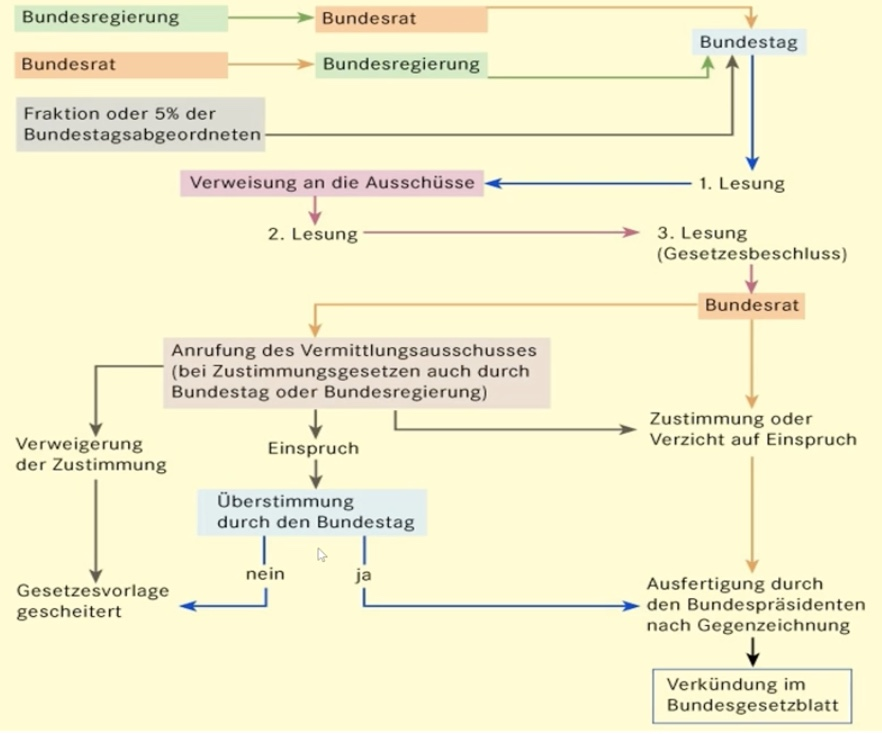

# 21.05.2022 Staatsorganisationsrecht

## Staatsorgane

### Bundestag

demokratische Vertretung der Bürger

`Art. 38ff. GG`

- Bundestag hat Geschäftsordnung
- Abgeordnete sind immun
- BVerfG kann Gesetze kassieren


### Bundesrat

`Art. 50ff. GG ` 

Zweite Kammer = Vertretung der Länder

- jedes Land min. 3 Stimmen
- Stimmen eines Landes nur einheitlich


### Bundespräsident

`Art. 54ff. GG` 

- repäsentative Aufgaben der BReg
- Amtszeitbegrenzung 5 Jahre
- Bundestag auflösen


### Bundesregierung

`Art. 62ff. GG`

- aus Kanzler:in und Minister:innen
- Richtlinienkompetenz der Kanzler:in
- Vertrauensvoten durch Bundestag


### Bundesverfassungsgericht

`Art. 93ff. GG`

- Oberstes  Gericht zur Entscheidung der Verfassungsmäßigkeit eines Gesetzes


## Gesetzgebungskompetenzen

*Grundsatz*: Länderkompetenz gem `Art. 70 I GG`

**Auschließliche** Bundeskompetenz: `Art. 71, 73 GG`

- Auswärtiges, Währung, Zoll etc

**Konkurrierende** Bundeskompetenz: `Art. 72, 74 GG`: öff. Fürsorge, Verhinderung übertragbare Krankheiten 

1. Absatz: *Kernkompetenzen* nichtgebrauchmachen des Bundes 
2. *Erforderlichkeitskompetenzen*: für gleichwertige Lebensverhätlnisse erforderlich
2. *Abweichungskompetenzen*: Länder dürfen abweichen bspw. bei Jagdrecht

**ungeschriebene** Bundeskompetenz

- Natur der Sache (Nationalfeiertage)
- Sachzusammenhang (bundesweite politische Parteien)
- Annex

```
!!! mögliche Klausurfrage: !!!
wer hat im Bereich des Waffenrechtes die Gesetzgebnugskompetenz? 
```


## Gesetzgebunsverfahren



jaaaaaaaaaa gut.

formal: Einbringung von Gesetzesvorlagen nach `Art. 76 Abs 1 GG`

### Zustimmungsgesetze

Zustimmg vom Bundesrat brauchen Gesetze, die:

- die Verfassung ändern
- Auswirkungen auf Länderfinanzen haben
- in Organisations und Verwaltungshoheit der Länder eingreifen

ist ein Teil des Gesetzes zustimmungsbedürftig, so ist das ganze Gesetz zustimmungsbedürftig


