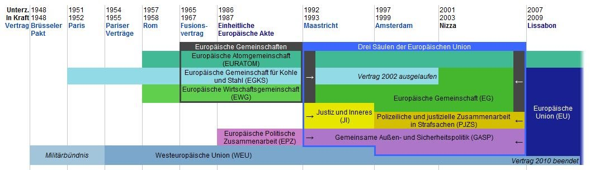
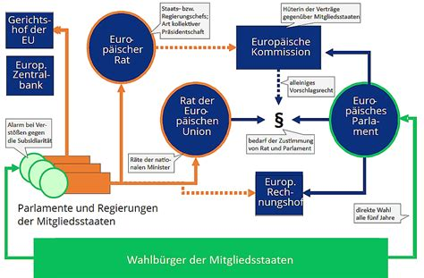
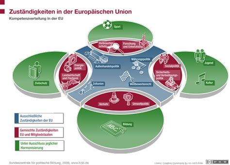

# 08.07.2022 Europarecht

## Geschichte der Europäischen Staatengebilde

einige davon (EURATOM, GASP) sind nur **intergouvernemental**, EG und EU sind supranational 

historisch:
- Ausweitung der Tiefe der Zusammenarbeit
- und Breite der Mitgliedstaaten
- nationales Recht ist heutzutage überformt von EU-Recht

heute: eine Euopäische Union, keine 3  Säulen mehr

## Aufbau der EU

- Staatenverbund aus 27 Ländern
    - 19 in Wirtschafts- und Währungsunion (Euro)
- eigenständige Rechtspersönlichkeit

Ziele:
> **Artikel 3 AEUV:** Ziel der Union ist es, den Frieden, ihre Werte und das Wohlergehen ihrer Völker zu fördern

wichtigste Institutionen
- Ministerrat (auch Rat der EU)
- Europäischer Rat (Regierungschefs)
- Eur. Parlament
- Eur. Kommision



### EuGH
definiert in `Art. 267 AEUV`, entscheidet über:
- Auslegung der Verträge
- Gültigkeit und Auslegung der Handlungen der Organe der Union

Möglichkeiten der Strafe mit Vertragsverletzungsverfahren: `Art. 258 AEUV`:
- bei Verstößem, Nichtumsetzung, ...
- kann zu Zwangsgeld / Geldkürzung führen
## Europarecht

Quellen:
1. Primäres Europarecht: EUV, AEUV, Grundrechtecharta
    - Rechte und Pflichten der MItgliedstaaten gegeneinander
2. Sekundäres Unionsrecht
    - erlassenes Recht der Organe (VO, Richtlinien, Beschlüsse,...)
3. Richterrecht: case law der EuGH

```
das eine supranationale Organisation bindendes Recht erlassen kann ist global einzigartig!
in Form der Verordnungen ohne Ratifizierungen durch MS
```

### Normenhierarchie

|            | Ziel                         | Addressat   | Wirksamkeit             |
|------------|------------------------------|-------------|-------------------------|
| **Verordnung** | verbindliche Rechtsgrundlage | MS + Bürger | unmittelbar             |
| **Richtlinie** | Angleichung von Recht        | MS          | umsetzung in nat. Recht |

### EU und GG

aus deutscher Sicht:
> **Art 23 GG**: zur Verwirklichung eines vereinten Europas wirkt die Bundesrepublik bei der Entwicklung der Europäischen Union mit, die demokratischen, rechtsstaatlichen, sozialen und föderativen Grundsätzen verpflichtet ist

begrenz auch Art. 79 Abs 2 und 3, die **niemals** überschreibbar sind!

aus europäischer Sicht:
> **Art 5 EUV:** für die Abgrenzung der Zustädnigkeiten der Union gilt der **Grundsatz der begrenzten Einzelermächtigung**. Für die Ausübung der Zuständigkeiten gelten die Grundsätze der **Subsidiarität** und **Verhältnismäßigkeit** 

- _begrenzte Einzelermächtigung_: Union kann nur bei abgegebenen Kompetenzen zuständig werden 
- _Subsidiarität:_ EU darf nur tätig werden wenn Ziel besser durch EU als MS verwirklichen kann

### Binnenmarkt

>**Art. 26 AEUV:** 
>(1) die Union erlässt erforderliche Maßnahmen, ... um den Binnenmarkt zu verwirklichen
>(2) der Binnenmarkt umfasst Raum ohne Binnengrenzen

ist das meistverhandelste vor dem EuGH

| Waren                            | Personen                   | Dienstleistung                              | Kapital                                |
|:---------------------------------|:---------------------------|:--------------------------------------------|:---------------------------------------|
| Wegfall Zölle                    | Wegfall Personenkontrollen | Eu-Weites Angebot Dienstleistunge           | gemeinsamer Markt Finanzleistungen<br> |
| Harmonisierung Normen            | Niederlassungsfreiheit     | gemeinsamer Markt Transport, Energie, Komm. | freie Kapitalbewegung                  |
| Gewährleistung freier Wettbewerb | Anerkennung Abschlüsse     |                                             |                                        |

### EU Grundrechte
welchte Freiheiten haben EU-Bürger

1. Grundfreiheiten
    - positive Grundlage Wirtschaftsverfassung
    - Abwehrrechte der EU-Bürger gegen MS
    - Verpflichtete = MS
2.  EU Grundrechte
    - Abwehrrechte der Unionsbürger
    - Verpflichtete = EU-Organe

### Wettbewerbsrecht

Grundlagen: konflikt zwischen GG und EUV:
- GG: wirtschaftspolitische Neutralität (Kapitalismus, Sozialismus, ...)
- EUV: "wettbewerbsfähige soziale Marktwirtschaft"

wozu Wettbewerbsrecht?: 
- keine Bevorteilung einzelner Staaten durch Steuern = **Beihilferecht**
- Verhinderung von Marktversagen = **Kartellrecht**

## Zuständigkeiten der EU
definiert in `Art. 2f AEUV`
gliedern sich nach:
- **ausschließliche** Z.: Außenhandel, Wettbewerb, Währung
- **geteilte** Z.: Verkehr, Energie, Forschung
- **keine** Z: Bildung, Jugend, Sport

Veranschaulichung:



## Übungsfälle
### Fall I: EuGH, Ts. C-184/99, Rudy Grzelczyk, 2001

- Rudy ist Franzose, studiert in Belgien
- Beantragt belgische Existenzsicherung
- dieses nur für Belgier und Arbeitnehmern
verstößt das gegen `Art. 18 + 20 AEUV` ? 

> **Art. 18 AEUV:** Unbeschadet besonderer Bestimmungen der Verträge ist in ihrem Anwendungsbereich jede Diskriminierung aus Gründen der Staatsangehörigkeit verboten.

> **Art. 20 AEUV:** Es wird eine Unionsbürgerschaft eingeführt

Entscheidung des Gerichts:
```
der Unionsbürgerstatus ist ... dazu bestimmt. der grundlegende Status der Angehörigen der Mitgliedsstaaten zu sein, ... und unbeschadet die gleiche rechtliche Behandlung zu genießen
```

- Art. 18 ist also *Lex Generalis*, und der Student fällt darauf zurück
- daraufhin: jeder Staat führte eine Auslandsunterstützung ein (Auslands-Bafög)
- Ziel der EU wurde erreicht
=> der EuGH interpretiert Recht europafreundlich!

### Fall II: Dassonville
- belgischer Importeur bezieht aus Frankfreich schottischen Whiskey
- nach belgischem Gesetz: ohne Ursprungsbescheinigung ist Bezeichnung *scotch* verboten
- importeur sagt versößt gegen `Art. 34 AEUV`

> **Art. 34 AEUV:** Mengenmäßige Einfuhrbeschränkungen sowie alle Maßnahmen gleicher Wirkung sind zwischen den Mitgliedstaaten verboten.

> **Art. 36 Abs. 1** Die Bestimmungen stehen Beschränkungen nicht entgegen, die aus Gründen der
    - öffentlichen Sicherheit
    - Ordnung + Sicherheit
    - Schutz Gesundheit
    - Schutz nationales Kulturgut

**Diskriminierung nach EuGH**: jede Handelsregelung der MS, die geeignet ist, den innergemeinschaftlichen handel tatsächlich oder potenziell zu behindern

Schutzbereich:
- [x] juristische Person in Mitgliedsstaat 
Eingriff:
- [x] beschränkt Handel => Diskriminierung
Rechtfertigung:
- Scotch ist nationales Kulturgut also gerechtfertigt

### Fall III: DocMorris

- DocMorris = niederlandische Versandapotheke
- postalische Lieferung für deutsche Kunden
- deutsche Behörden: Versand von Arzneimittel = verboten

*EuGH 2003*: grenzüberschreitender Arzneimittelversand ist mit Recht vereinbar, aber Verbot verschreibungspflichtiger Arzneimittel erlaubt

daraufhin DocMorris-Apotheke, aber nur Einzelpersonen dürfen Apotheke erlauben (vom EuGH bestätigt), somit wieder verboten hehe:)


