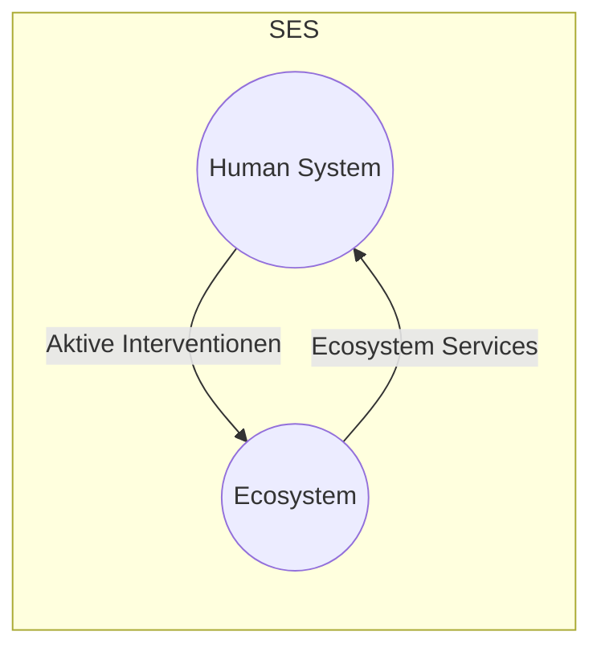

# 17.04.2023 Einführung

## System

- (relativ) abgeschlossene Sammlung
- Einzelelemente, die miteinander interagieren

### Sozial-ökologisches System

Komplexes, adaptives System aus:

- soziales System (Menschen)
- Öko. System (Natur)

Aufbau:

## Eigenschaften

komplexe Betrachtung von Dynamik

aus [Meyers (2018)](https://www.annualreviews.org/doi/pdf/10.1146/annurev-environ-110615-085349)

**a)** komplexe Systeme statt 3 getrennte Säulen

**b)** zwischen Ebenen gibt es auch nach oben Rückwirkung statt Top-Down

- Telecoupling: unsere lokale Aktion betrifft andere Regionen

- unser Fleischkonsum = brasilianischer Regenwald

**c)** Kippunkte statt linearer Zusammenhänge

**d)** Variabilität statt gleichgewichtige Systeme 

### Emergenz

Mikroverhalten + Interaktion => Makrophänomene

> nur ein paar Regeln für Individueen führen schon zu beobachtbarem Verhalten auf Makroebene

Beispiel: [Schwarmverhalten von Vögeln](https://netlogoweb.org/launch#https://netlogoweb.org/assets/modelslib/Sample%20Models/Biology/Flocking.nlogo)

aus individuellen Regeln:

- Cohere: Suche andere Vögel
- Align: versuche in ähnliche Richtung
- Avoid: crashe nicht

Beispiel: [Waldfeuer](https://netlogoweb.org/launch#https://netlogoweb.org/assets/modelslib/Sample%20Models/Earth%20Science/Fire.nlogo)

- Kippunkt von Baumdichte, ab dem Feuer eskaliert
- 58% Dichte: fast nichts verbrennt
- 60% Dichte: fast alles verbrennt

### Heterogenität

*alles ist unterschiedlich*, hier aus Landwirtschaft

natürliche Heterogenität:

- unterschiedliche Landstruktur
- Bspw. Böden

soziale Heterogenität:

- Socio-environmental: Markets, Institution
- Farm-Structural: Kleinfarmen, LPGs, etc

