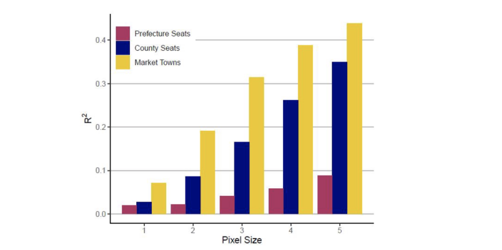

# 17.05.2022 Politische Ökonomie von Städten

## Primärstädte

> **Primärstadt:** größte Stadt des Lanes, oft auch Hauptstadt

Anteil der Bevölkerung in der Primärstadt: 

- 35% in Buenos Aires
- 6% in New York

---

`wodurch erklärt sich der Unterschied?`

Gründe:

- kleine bis mittlere Gesamtbevölkerung 
- wenig Infrastruktur außerhalb des Landes
- Import Beschränkung, wenig freier Handel
    - heimische Produktion profitiert von Agglomerationseffekten und großem Markt
- Tendenziell geringerer Entwicklungsstadt
- **Autokratie**

Autokratie-Erklärung: *nach Ades und Glaeser (1995)*

- mehr Kontrollmacht durch Zentralisierung
- Regime muss Primärstadt-Bewohner zufriedenstellen
    - neue Zuwanderung durch Rent-Seeking
- niedrige Steuern in Stadt

*Empirisch: Primärstädte in Autokratien sind 44% größer als in Dem.*

## Politiv vs. Geographie 

welcher Faktor ist entscheidend?

- Geographie für Lage der Stadt
- Politik für weitere Entwicklung / Wachstum

häufig auch Interaktion von politischen und geographischen Faktoren 

---

Beispiel China: *nach Düben und Krause (2022)*

1. **Prefecture Seats**: politische Zentren einer Präfektur
2. **County Seats:** mittlere Zentren
3. **Market Towns:** reine Handelszentren

wie sehr lässt sich ihre Größe durch geographische Faktoren erklären

- mit Regression und $R^2$ gemessen
- anhand verschiedener Pixelgrößen

Ergebnisse :

- geographische Faktoren können Position von Market Towns besser erklären
- politische Städte weniger, da diese nach anderen Gesichtspunkten geplant werden

## Innerstädtische Politik

Stadt wird durch Stadtplanung geprägt

### kommunale Steuern

Beinflussung der Ansiedlung von Firmen => **Steuerdumping**

- Verfügbarkeit preiswerter Grundstücke
- gebildete Arbeitskräfte

= Rahmenbedingungen für Städte

### Bauvorschriften

*wer* darf *wo was* bauen?

- Abwägungsfragen: Park vs Neubaugebiet 
    - Nachbarn sind NIMBYs (**N**ot **I**n **M**y **B**ack**Y**ard)
- Gebäudehöhen: oft Restriktionen der Höhe
    - Nicht höher als Kirche
- ideologische Entscheidungen
    - Sprengung der Paulinerkirche

### Infrastruktur

öffentlicher vs privater Verkehr

- Parkplätze im Zentrum vs Radwege
- ÖPNV-Anbindung von Vierteln