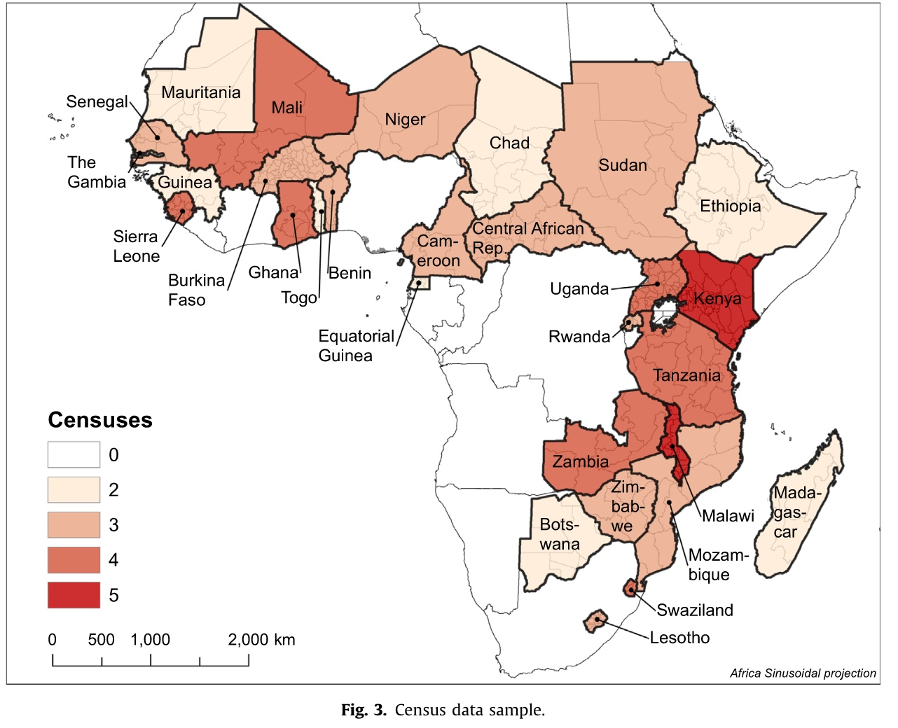
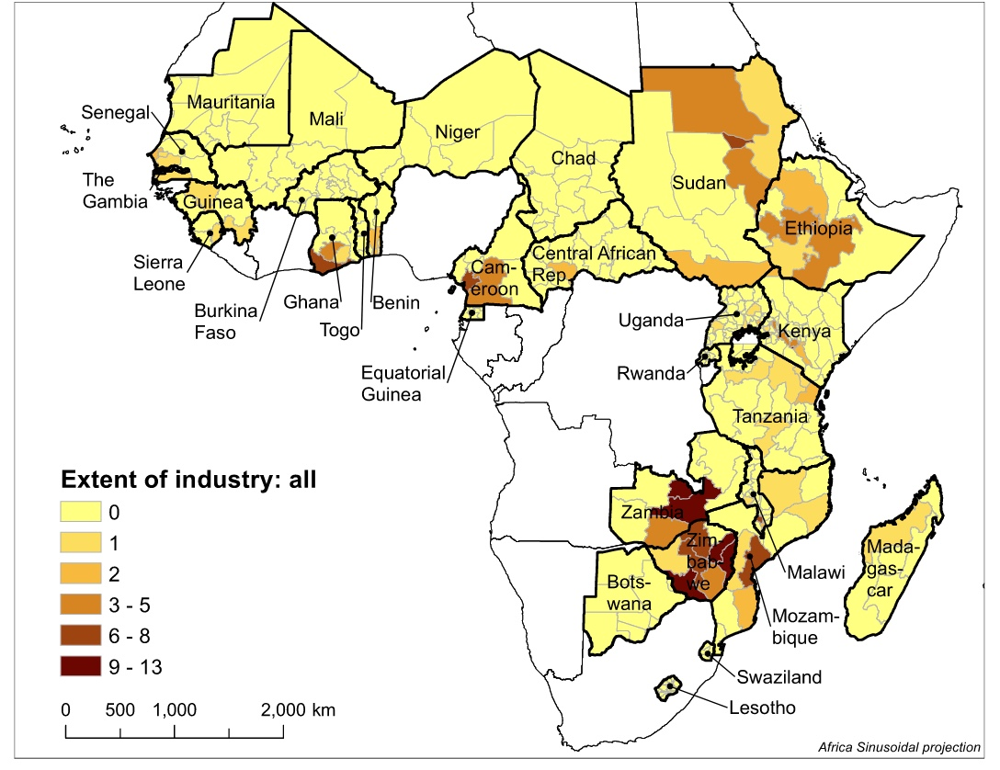
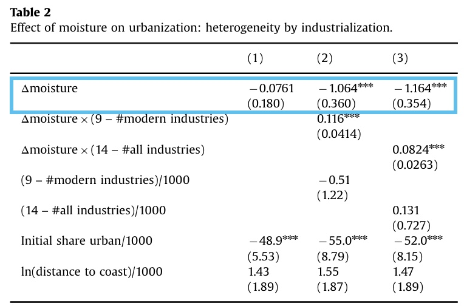
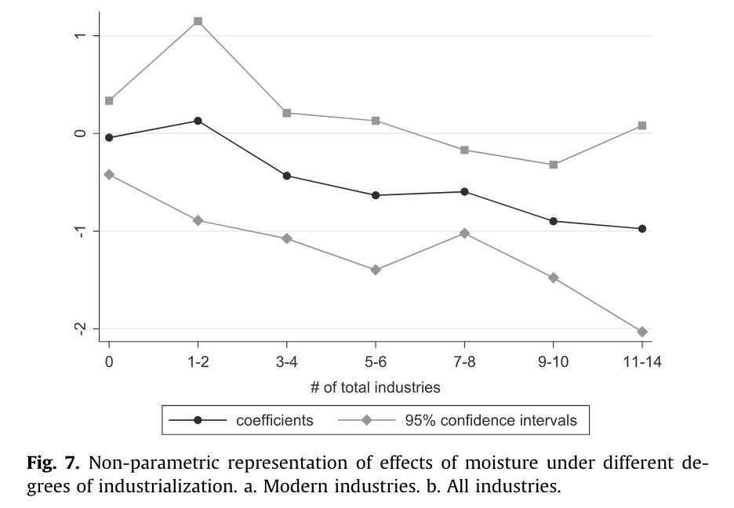
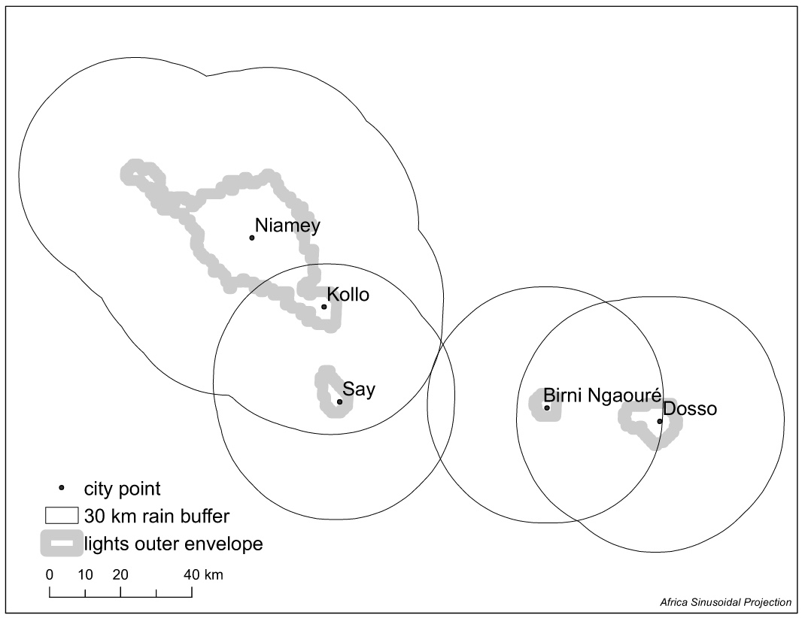
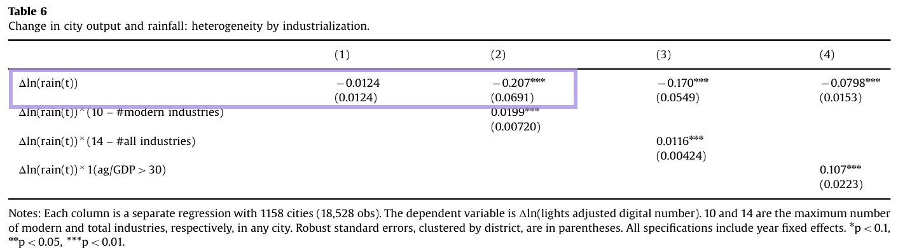

## Überblick

Paper: **Has Climate Change driven Urbanization in Africa?**

Übersetzung: **Hat der Klimawandel die Urbanisierung in Afrika vorangetrieben?**

Veröffentlichung: **Journal of Urban Economics, 2016**

Autoren:

-   J. Henderson (London School of Economics)

    -   bekannter Forscher, schon oft aufgetaucht in diesem Seminar

-   Uwe Deichmann, *World Bank*

-   Adam Storeygard, *Tufts University*

## Hintergrund

### Forschungsfragen

-   Führen ungünstige Klimaveränderungen dazu, dass die Menschen aus den ländlichen Gebieten in die Städte ziehen?

-   Führt dieser Zuzug zu (Gesamt-)Einkommensteigerungen in Städten?

    -   aufgeteilt nach Städten mit industrieller Basis und ohne

*Kann Urbanisierung ein Ausweg in veränderten Klimabedingungen sein?*

### Forschungstand

vergleichsweise dürftiger Stand, trotz extrem wichtiger Frage

Probleme existierender Paper: (zu exakt dieser Frage)

-   Daten auf nationaler Ebene (trotz signifikanter Inlands-Variation)
-   mangelnde Bevölkerungsdaten, die auf stark Interpolierung basieren

Forschung zu Effekt von Klimawandel auf Afrika:

-   Afrika hat sehr diverses Klima (hyperaride Sahara, humide Tropen Zentralafrika)

-   Vorhersagen:

    -   Fläche betroffen von Hitzeextrema steigt auf 45%

    -   extreme Hitzesteigerung in bereits warmen Regionen

    -   sinkende Niederschlagsmengen

        -   Ernteeräge sinken um 8-15%

### Abgrenzung des Papers

-   neue Datenbasis und Beantwortung der Kombination beider Forschungsfragen

    -   Datenbasis später vorgestellt

-   in wenig erforschtem Bereich (Klimawandel \~ Urbanisierung : Afrika)

## 1. Frage: Klimawandel \~ Urbanisierung

### Daten

generelles Problem der Datenlage in afrikanischen Staaten

#### Bevölkerung

-   Bevölkerungsdaten für sub-nationale Distrikte anhand von Bevölkerungszählung / Zensus

-   nur Länder mit 2-5 Zählungen zwischen 1960 und 2010

    -   insgesamt 29 Länder in Sample

-   daraus 369 Distrikte mit durchschnittlikch 41.100 Qkm Fläche

Darstellung: 

#### Klima

-   Messgröße Klimaveränderung: Moisture / Feuchtigkeit

    -   Niederschlag geteilt durch potentielle Verdunstung
    -   Indikator für landwirtschaftliches Nutzungspotential

-   Quelle: University Delaware Climate Data Set

Darstellung: 

#### Industrieller Grad

-   sehr schwache Datenlage

-   Quelle: Oxford Regional Economic Atlas (1965)

    -   sehr intelligente Datenwahl, umfangreiche Kartographierung
    -   kartiert 26 verschiedene Industrien in Afrika
    -   davon 15 "modern" (nicht industrielle Verabreitung landwirtschaftlicher Erzeugnisse wie Destillation)

-   19 der Untersuchten Länder haben min. eine Industre

-   23 % der Distrikte

### Regressionsmodell:

$$
u_{ijt} = \beta_0 w_{ijt} + \beta_1 X_{ij} + \beta_2 X_{ij} \ w_{ijt} + \alpha_{jt}+ \varepsilon _{ijt}
$$

-   Distrikt *i*, land *j*, Jahr *t*

    -   U = Wachstum der städtischen Bevölkerung
    -   w = Feuchtigkeit
    -   x = zeit invariante Kontrollen
    -   a = Fixed Effect für Land und Jahr
    -   e = Fehler Term

Ergebnisse: 

Interpretation: Einfluss einer Feuchtigkeitsveränderung auf Urbane Bevölkerung

*was passiert, wenn die Feuchtigkeit sinkt?*

-   von Interesse ist erste Zeile

-   1 Spalte: Einfluss auf alle Städte im Schnitt

    -   nicht statistisch signifikant
    -   wenn die Feuchtigkeit sinkt, hat das keinen generisierbaren Einfluss auf eine Stadtbevölkerung

-   2 Spalte: auf Städte mit modernen Industrien (nicht landwirtschaftlich)

    -   statistisch signifikant
    -   steigt die Feuchtigkeit, sinkt die Stadtbevölkerung
    -   oder andersrum: Sinkt die Feuchtigkeit (was sie historisch tut), steigt die Stadtbevölkerung

-   3 Spalte: Städte mit Industrie insgesamt

    -   ähnlich zu Spalte 2

nochmal in verständlicher Weise als Graphik: 

=> je mehr Industrien ein Distrikt hat, desto stärker wirkt eine Feuchtigkeitsveränderung auf das Wachstum der Stadtbevölkerung

    Interpretation: Eine Erhöhung der Feuchtigkeit um eine Standardabweichung => steigert die städtische Wachstumsrate um 0.015

Robustness Checks:

-   ob gewaltsame Konflikte einen Einfluss haben

    -   Verschlechterung Landwirtschaft -> Konflikt -> Verstäderunt
    -   keinen Effekt

-   Entfernung zur Küste (weil Einfluss auf Niederschlag)

    -   aber keine Korrelation mit Industriedichte

## 2 Frage: Urbanisierung \~ Einkommen der Stadt

Jetzt: Einfluss der jährlichen Klimaveränderung auf jährliches Gesamteinkommen der Stadt

## Daten

### Einkommen

-   Lichtemissionen aus US Defence Meteorological Satellite Program (DMSP) als Indikator für Einkommen

-   von 1992 - 2008

-   nicht mehr Distrikte, sondern einzelne Städte und ein 30km Umkreis

    -   1158 Städte in 42 Ländern

### Niederschlag

-   von Africa Rainfall Climatology Version 2

    -   genauere Auflösung, aber kürzere Zeitspanne als vorher

### Modell

$$
\ln(light_{it}) = \sum_{j=0}^k \beta_j \ln(rain_{i,t-j}) + \sum_{j=0}^k \gamma_j X_i^` \ln(rain_{i,t-j}) + \phi_i + \lambda_t + a_i t + \epsilon_{it}
$$

-   Lichtindex summiert über Stadt und Jahr
-   Niederschlag in Stadt i, über 3 Jahre geglättet
-   $x$ = time invariant city controls
-   $\phi$ Fixed effects auf Stadt
-   $a_i t$ Stadspezifischer linearer Trend

hier wird nur auf Fluktuation von Jahr zu Jahr geschaut, mit Niederschlagswerten über 3 Jahre gemittelt

kürzere Periode, die später startet

Ergebnisse: 

1.  Spalte: Effekt auf alle Städte
2.  Spalte: Effekt auf industrialisierte Städte (Messung mithilfe der vorangegangen Atlaszahlen)

-   genereller Effekt nicht statistisch signifikant

-   aber Städte mit Industrien:

    -   Steigerung der Niederschlagsmenge => niedrigere Lichtemissionen
    -   oder andersrum: Abschwächung Niederschlag => höhere Lichtemissionen

<!-- -->

    Interpretation Log-Log:
    Eine Erhöhung der Niederschlagsmenge um eine Standardabweichung reduziert Lichtemissionen um 11% und Einkommen um 3.5%

Robustness Checks:

-   gegen Fluten

    -   keinen signifikanten Effekt

-   und Städte, die mit Wasserkraft versorgt werden

    -   aber da meist nationales Stromnetz mit gleichen Preisen irrelevant

## Schlussfolgerung und Bewertung

Bewertung:

-   Paper stellt erweitert den Forschungstand auf jedenfall

-   hochrelevant für aktuelle Zeit

-   leider Verbindung beider Fragen nicht so gut geklappt, aufgrund komplett unterschiedlicher Daten und Zeiträume

-   sehr interessante Quelle für Stand der Industrialisierung

    -   leider etwas veraltet, es hat sich seit den 60ern dann doch etwas getan
    -   betont auch in Einleitung, dass es ein Tip eines guten Kollegen war

Schlussfolgerung:

-   Afrika wird von Klimawandel hart getroffen

-   bereits jetzt nur marginal geeignet für landwirtschaftliche Produktion

-   industrialisierte Distrikte können Klimawandelfolgen entgehen

    -   Jedoch: Afrika wenig strukturelle Transformation
    -   und einhergehend mit intensiver Industrie ist Verschmutzung, die damit nicht übersprungen werden kann (Leapfrogging)

-   Folgen für landwirtschaftliche Produktion können mithilfe von verstärkter Adaption von Dünger und Bewässerung aufgefangen werden

    -   sehr geringe Verbreitung und quasi kein Wachstum seit 80ern

-   Überurbanisierung
