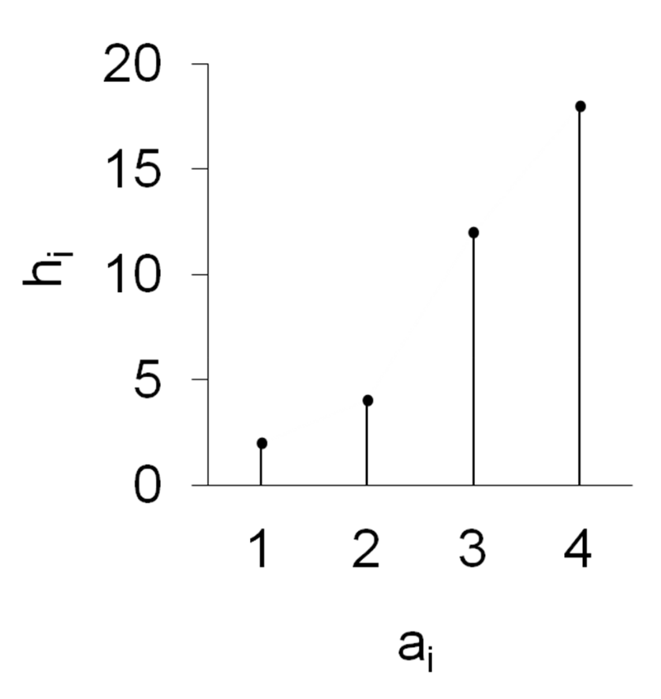
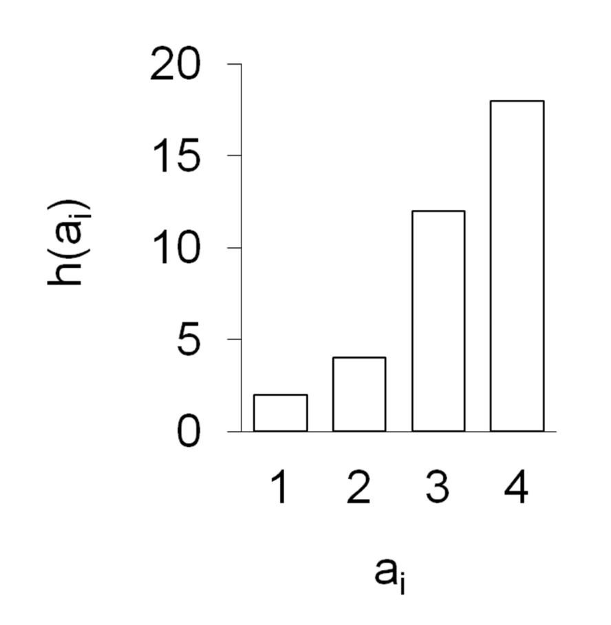
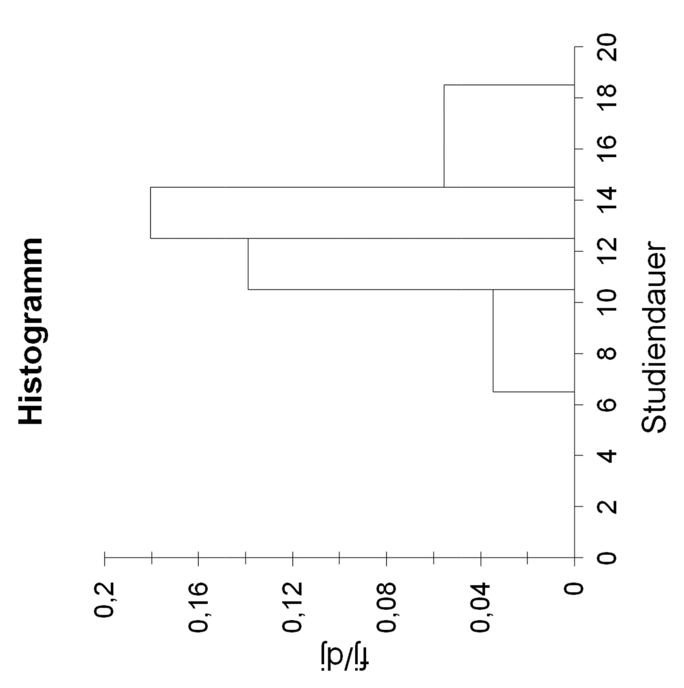

# Statistik 1 Zusammenfassung

## Allgemein

### Merkmale

> **Merkmal:** Untersuchungskategorie mit spezifischer Ausprägung

Notation:
- Merkmal $X,Y,Z$
- Ausprägung $x_1,x_2,...x_n$
- sortiert: $x_{(1)},x_{(2)}, ..., x_{(n)}$

Arten:
1. *nominal*: Namenskategorie
2. *ordinal*: Rangkategorie / Ordnung
3. *kardinal/metrisch*: numerische Ausprägung

### Klassen

> **Klasse:** Zusammenfassung von Ausprägungen in Gruppen

Notation:
- *k* = Anzahl Klassen
- $m_j$ = Klassenmitte
- $n_j$ = Anzahl Beobachtungen in Klasse

Wahl der Klassen (nur Daumenregeln)
- gleichmäßige Verteilung
- gleiche Klassenbreite
- Anzahl Klassen = $\sqrt{n}$  (Wurzel der Anzahl Ausprägungen gesamt)
- offene Randklassen möglich (beispielsweise ins Unendliche)

Wertebereiche
- [0-100] = einschließlich 0 und 100
- (0-100) = auschließlich 0 und 100
- [0-100) = einschließlich 0, auschließlich 100

### Darstellungen

| Stabdiagramm                                    | Säulendiagramm                                               | Histogramm                                                   |
| ----------------------------------------------- | ------------------------------------------------------------ | ------------------------------------------------------------ |
|  |               |             |
| **längentreu:** Länge der Stäbe = Information   | **längentreu:** Länge der Balken; alle gleiche Breite + gleicher Abstand | **flächentreu:** Fläche der Balken = Information; Breite = Klassenbreite |

### Kumulierte Häufigkeitsverteilung

> **Empirische Verteilungsfunktion:** Berechnung der Anteile ober/unterhalb von bestimmter Grenze: $F(x)= \sum_j^i n(x_j)$

- für Merkmal X mit $x_1,...,x_n$
    - für jedes *x* Anteil der Werte < x

Beispiel:

| $a_j$  | $h_j$       |           $f_j$ | $kum \ f_j$     |
| ------ | ----------- | --------------: | --------------- |
| cool   | 10          | 10/30 = *0.333* | 0.333           |
| uncool | 20          | 20/30 = *0.666* | 0.333+0.666 = 1 |
|        | $\sum = 30$ |               1 |                 |

# Lagemaße

> Indikatoren zur Beschreibung der Lage eines Datensatzes

### Arithm. Mittel

- benötigt metrisches Skalenniveau
    - Urliste: $\frac{1}{n} \sum x_i$
    - Unklassierte Verteilung: $\frac{1}{n} \sum a_j * h_j$
    - klassierte Verteilung: $\frac{1}{n} \sum m_j * n_j$

### Geometrisches Mittel

- zur Berechnung von Wachstum
- benötigt metrische Merkmale > 0
    - Wachstumsrate $r_t = \frac{x_1-x_0}{x_0}$
    - Wachstumsfaktor $w_t = 1+ Rate$
    - Durchschnittlicher Wachstumsfaktor $\bar{w}_{geom} = (\frac{x_n}{x_0})^\frac{1}{n}$ 
        - n = Anzahl Zeitperioden
