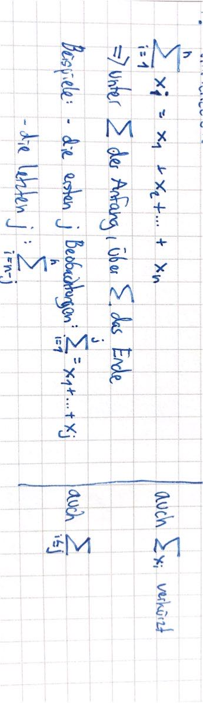
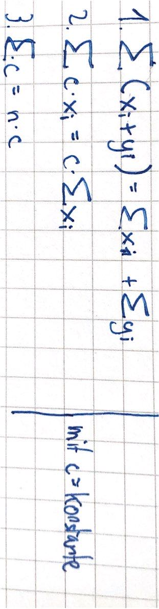

# 18.10.21 erste Übung

Wiederholung wichtiger Rechenregeln

### Indizes

bei einer Beobachtung (oft in Form einer *Urliste)*: zu jeder Beobachtungseinheit liegt ein Wert vor

- BSP: Person 1(Beobachtungseinheit Mensch) = 156cm  (Wert der Körpergröße)

auch genannt **Index** und **Variable** 
$$
Beispiel \\
x_1 = 145cm \\
x_2 = 180cm \\
x_3 = 170cm \\
x_4 = 145cm
$$

#### Notation:

- Buchstabe *i* beschreibt Index
- letzter Wert = $x_n$
- wenn Variablen nach Größe geordnet => Indizes in Klammern mit dem letzten Wert als größten
    - $Beispiel \\
        x_{(1)} = 145cm \\
        x_{(2)} = 145cm \\
        x_{(3)} = 170cm \\
        x_{(4)} = 180cm
        $

#### Zusammenfassungen

wenn Daten zusammengefasst werden (klassiert oder unglasiert)

=> Buchstabe *j* beschreibt dann den Index

>  **Unklassierte Zusammenfassung:**
Werte werden getrennt in Wert und Häufigkeit des Auftauchens, dann ist
$a_j$ die Ausprägung und
$h_j$ die Häufigkeit

$Beispiel \\
a_1 = 145 , h_1 = 2\\
a_2 = 180cm , h_2 =1 \\
a_3 = 170cm , h_3 = 3 $

auch noch erweiterbar um relative Ausprägung $f_i=f(a_i)=h(a_1)/n$ 

> **Klassierte Zusammenfassung:**
> Werte werden in Klassen (Bereiche) zusammengefasst
> 
> *k* = die Anzahl der Klassen,
> $m_j$ die Klassenmitte und
> $n_j$ die Anzahl an Beobachtungen in der Klasse

$Beispiel (k=3) \\
Klasse 1: 130 < x ≤ 150 , m_1 = 140, n_1 = 2\\
Klasse 2: 150 < x ≤ 170 , m_2 = 160, n_2 = 1\\
Klasse 3: 170 < x ≤ 190 , m_3 = 180, n_3 = 1$

Klassennotation: 

- mit [100-400] für einschließlich = 100-400
- mit () für auschließlich = 101-399
- BSP: [100,400) heißt hier einschließlich 100,...,399

### Summenzeichen

Bei Summierung vieler Messwerte => *Summenzeichen* $\sum$

$\sum_{i=1}^n = x_1+x_2+...+x_n$

Regeln:

### Produktzeichen

funktioniert ähnlich wie Summenzeichen, nur halt multipliziert

$$\prod_{i=1}^n x_i  = x_1 * x_2 * ... x_n$$

### Logarithmus

wenn $a^x = b $ dann ist $ x = \log_a(b)$ 

Sonderform natürlicher Logarithmus *ln()*: 

- Basis ist *e* = Eulersche Zahl: $e^x = b \implies x = \ln(b)$

Rechenregeln:

$ln(b*c) = ln(b) * ln(c) \\
ln(b/c) = ln(b) - ln(c) \\
ln(b^c) = c * ln(b) \\  
\\
e^a * e^b = e^{a+b} \\
(e^a)^b = e^{a+b} \\
e^{-a} = \frac{1}{e^a} \\
ln(e^a) = a
$

### weitere Rechenregeln

**Abrundungsfunktion** / Gaußklammer *[ ]*: $[3.34] = 3$

**Fakultät**: produkt aller natürlichen Zahlen bis *n* ist *n!* 

- BSP: $4! = \prod_{i=1}^4 i = 1 * 2 *3 * 4 = 24$
- *1! = 1* und *0! = 1*

**Binomialkoeffizient**: $\binom{n}{k} = \frac{n!}{k!(n - k)!}$

