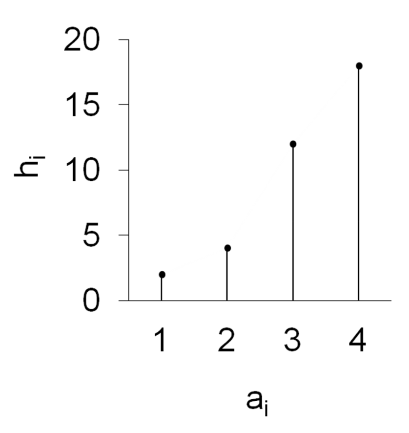
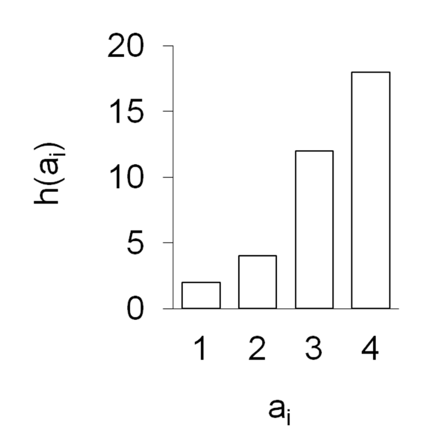
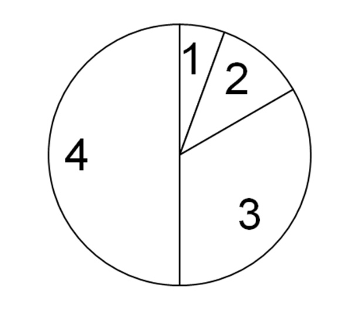
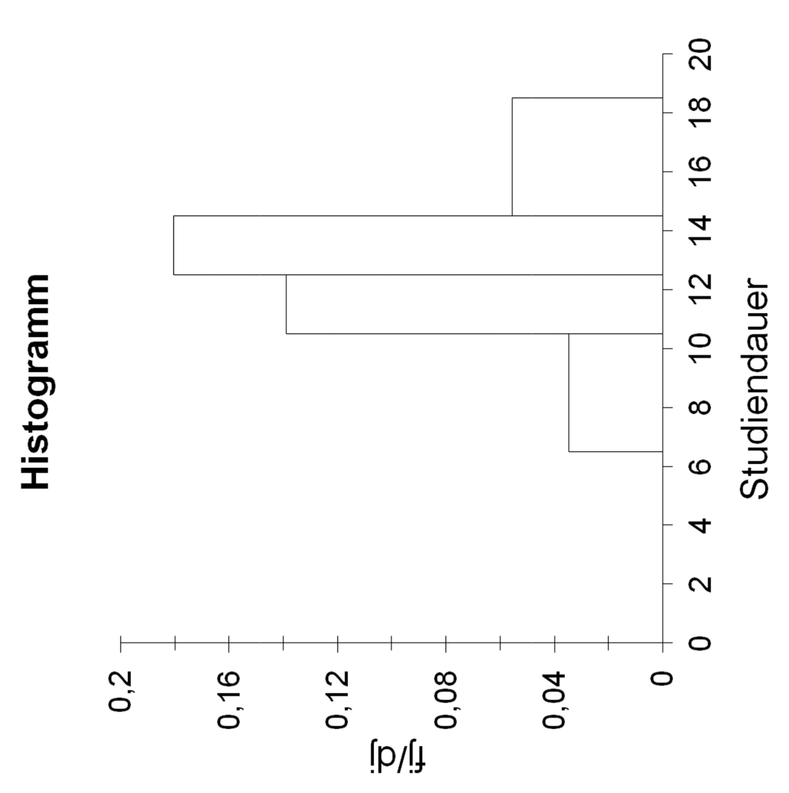
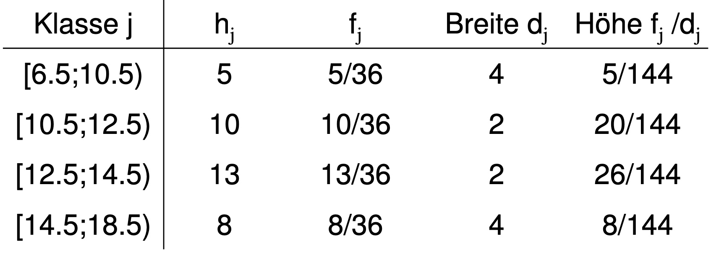

# 27.10.2021  Darstellungen

---

### Absolventenstudie

Uni München Absolventen des Soziologie-Studiengangs wurden nach einigen Jahren befragt.

Fragen an 36 von ihnen:

- Geschlecht G (1=w, 2=m) = **Nominal**
- Studiendauer S (semester) = **metrisch**
- fachliches Engagement E (1=sehr-5=nicht) = **ordinal**
- Ausrichtung Diplomarbeit D (1-4) = **nominal**
- Gesamtnote Diplomprüfung N = **ordinal**

---

### Klassenwahl

wenn möglich beachten:

- gleichmäßige Verteilung auf Klassen
- $\sqrt{n}$-Regel ("Daumenregel")
- oft : gleiche Klassenbreite 
- vollständige Klassen (jeder Wert hat eine Klasse)
- offene Randklassen möglich

### Darstellungen

Tabellarisch vs. Graphische Abbildung

Tabellen: von sich aus verständlich, mit Vorspalte, Tabellenkopf 

Graphische Abbildungen nach Art:

- Längentreue = Länge der Objekte ausschlaggebend
    - Stabdiagramm
    - Säulen / Balkendiagramm
- Flächentreue = Fläche der Objekte ausschlaggebend
    - Kreisdiagramm
    - Histogramm (nur stetige Merkmale in Klassenform)

| Art                                     | Beispiel                                          | Bemerkungen                                                                              |
|-----------------------------------------|---------------------------------------------------|------------------------------------------------------------------------------------------|
| Stabdiagramm                            |    | Länge der Stäbe = hier absolute Häufigkeit ; Punkt am Ende nur graphisch                 |
| Säulendiagramm                          |    | Höhe der Säulen = hier absolute Häufigkeit ; Säulen alle gleich breit + gleiche Abstände |
| Erweiterung: Gestapeltes Säulendiagramm | ---                                               | Säulen werden noch einmal aufgeteilt                                                     |
| Kreisdiagramm                           |  | Anordnung irrelevant, Winkel zum Berechnen                                               |
| Histogramm                              |  | Säulen muss nicht gleich breit sein, Breite entspricht Klassenbreite                     |
| Weitere:                                | Kartendarstellungen, Piktogramme, ...             |                                                                                          |

Tabelle zu Histogramm: 

